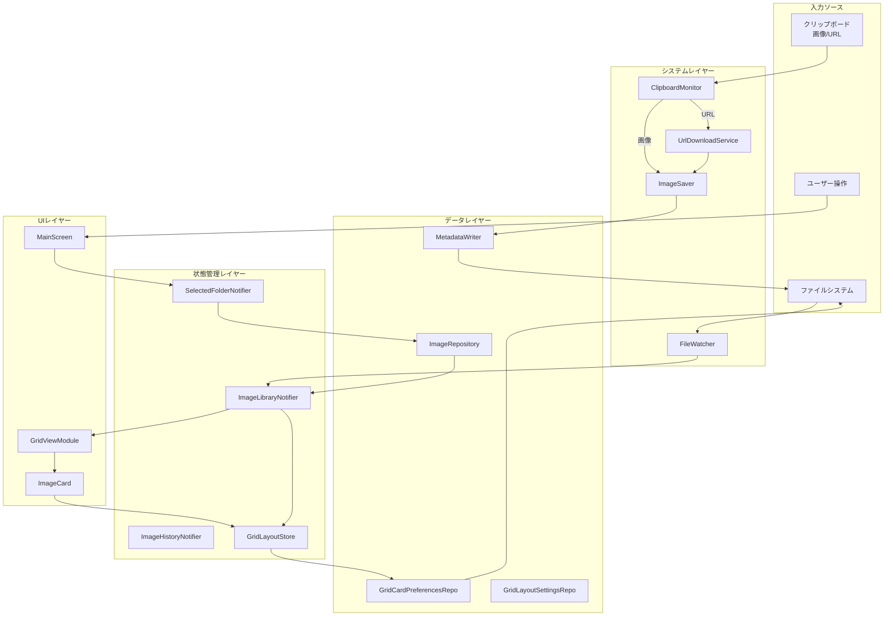
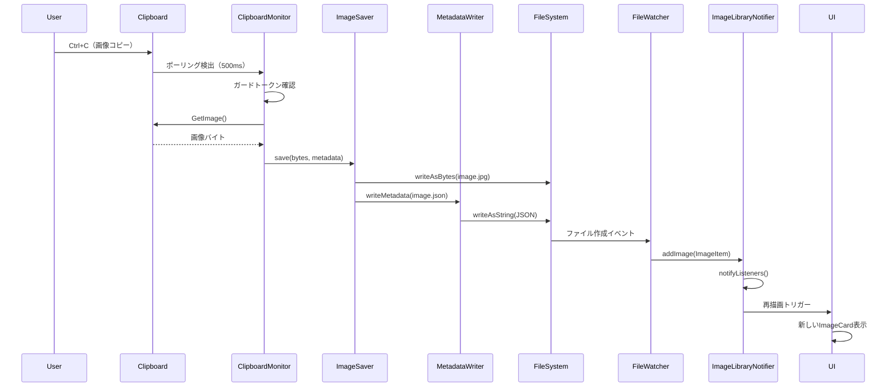
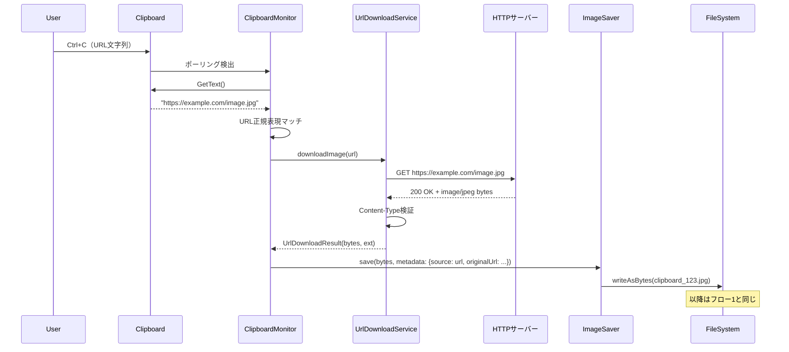
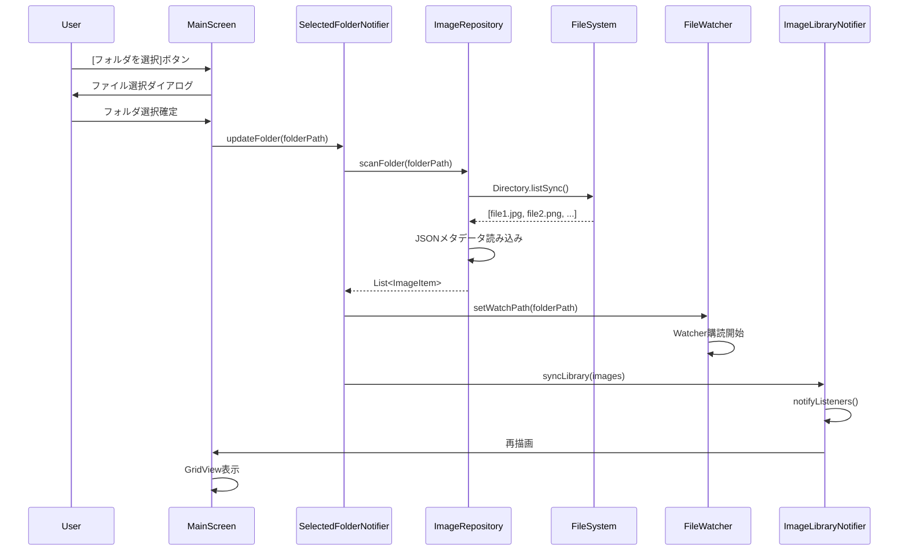
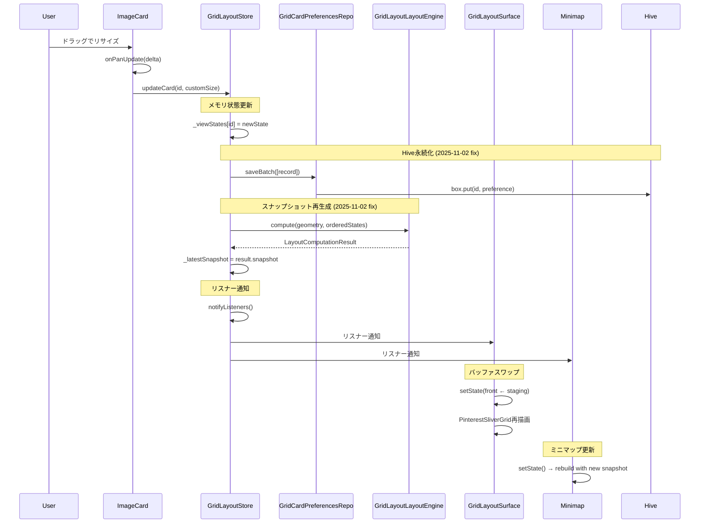
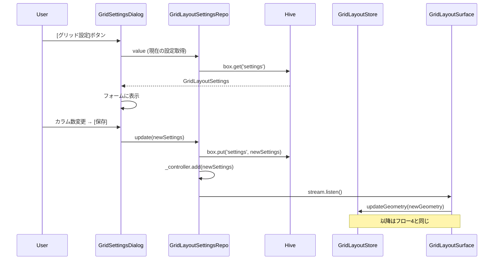
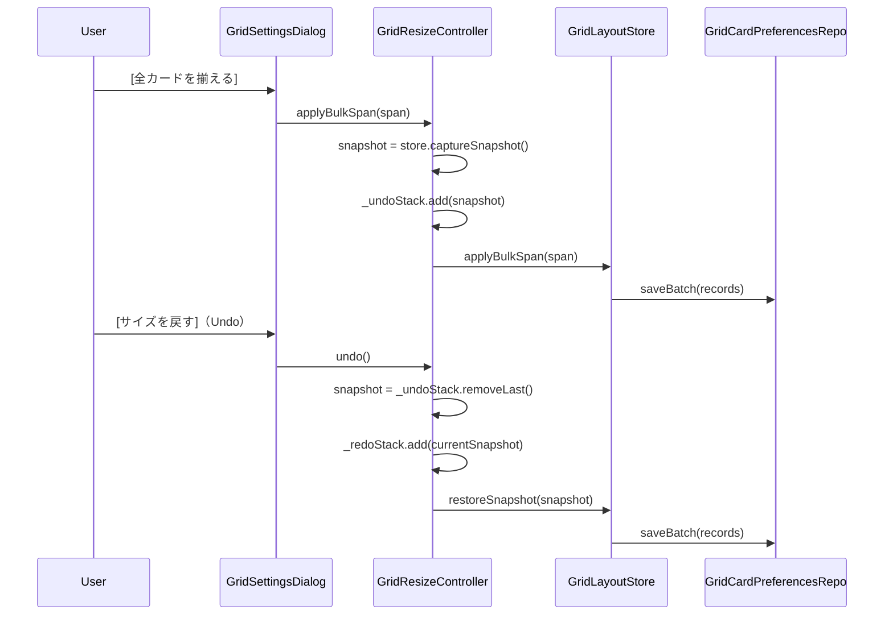
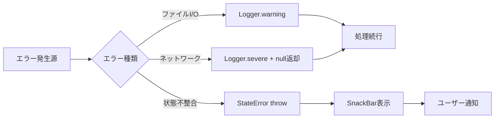

# データフロー

**作成日**: 2025-10-28
**最終更新**: 2025-11-02
**ステータス**: 実装完了

## 全体データフロー



## フロー1: クリップボード画像保存



## フロー2: URL画像ダウンロード



## フロー3: フォルダ選択とスキャン



## フロー4: カードリサイズ (2025-11-02更新)



### 重要な改善 (2025-11-02)

**以前の実装では**:
1. `updateCard()`が`_invalidateSnapshot()`を呼び出し
2. `_latestSnapshot = null`にセット
3. ミニマップが`latestSnapshot`を参照すると古い`_previousSnapshot`が返される
4. **結果**: ミニマップが更新されない

**現在の実装では**:
1. `updateCard()`が`_layoutEngine.compute()`を呼び出し
2. 新しいスナップショットを生成して`_latestSnapshot`にセット
3. ミニマップが最新のスナップショットを取得
4. **結果**: ミニマップが即座に更新される

```dart
// lib/system/state/grid_layout_store.dart:503-524
void updateCard({required String id, ...}) {
  _viewStates[id] = nextState;
  await _persistence.saveBatch([_recordFromState(nextState)]);

  // スナップショット再生成（updateGeometry()と同じパターン）
  final geometry = _geometry;
  if (geometry != null) {
    final result = _layoutEngine.compute(
      geometry: geometry,
      states: orderedStates,
    );
    _previousSnapshot = _latestSnapshot;
    _latestSnapshot = result.snapshot;  // ← 新しいスナップショット
  }

  notifyListeners();
}
```

## フロー5: グリッド設定変更



## フロー6: Undo/Redo



## データ永続化タイミング

### リアルタイム保存

| アクション | 保存先 | タイミング |
|-----------|--------|-----------|
| 画像保存 | FS (image.jpg + .json) | 即座 |
| カードリサイズ | Hive (grid_card_prefs) | ドラッグ終了時 |
| フォルダ選択 | Hive (app_state) | 選択確定時 |
| グリッド設定変更 | Hive (grid_layout) | [保存]ボタン押下時 |

### バッチ保存

```dart
// 一括リサイズ時
await gridLayoutStore.applyBulkSpan(span: 3);
// → 全カードのpreferencesを1回のHive.putAllで保存
```

## 状態同期パターン

### パターン1: File → State (FileWatcher)

```dart
// FileWatcher検出
_watcher.events.listen((event) {
  if (event.type == ChangeType.ADD) {
    final imageItem = ImageItem.fromPath(event.path);
    _imageLibraryNotifier.addImage(imageItem);
  }
});
```

### パターン2: State → Hive (Repository)

```dart
// GridLayoutStore
await updateCard(id: id, customSize: size);
// ↓
_viewStates[id] = newState;
await _persistence.saveBatch([_recordFromState(newState)]);
notifyListeners();
```

### パターン3: Hive → State (起動時復元)

```dart
// アプリ起動時
final settings = GridLayoutSettingsRepository().value;
final selectedFolder = Hive.box('app_state').get('folder');
// → Providerに注入して初期化
```

## エラー伝播



### エラーハンドリング戦略

1. **回復可能**: ログ出力のみ、処理続行（例: メタデータ読み込み失敗）
2. **ユーザー通知必要**: SnackBar表示（例: フォルダアクセス拒否）
3. **致命的**: エラーダイアログ + アプリ終了（例: Hive初期化失敗）

## パフォーマンス特性

### メモリフットプリント

| コンポーネント | メモリ使用量 | 備考 |
|---------------|-------------|------|
| ImageLibraryNotifier | カード数 × 1KB | ImageItemリスト |
| GridLayoutStore | カード数 × 200B | viewStatesマップ |
| Hive (grid_card_prefs) | カード数 × 100B | 永続化データ |
| LayoutSnapshot | カード数 × 150B | Rectとメタデータ |

### I/O最適化

- **バッチ書き込み**: `Hive.putAll()` で複数レコードを1回のI/Oで保存
- **遅延読み込み**: フォルダ選択時のみImageRepository.scanFolder実行
- **デバウンス**: ウィンドウリサイズ時の設定保存（200ms）

## 関連ドキュメント

- [State Management Flow](./state_management_flow.md) - 状態管理の詳細
- [Grid Rendering Pipeline](./grid_rendering_pipeline.md) - レンダリングフロー
- [Repositories](../data/repositories.md) - データアクセス層
