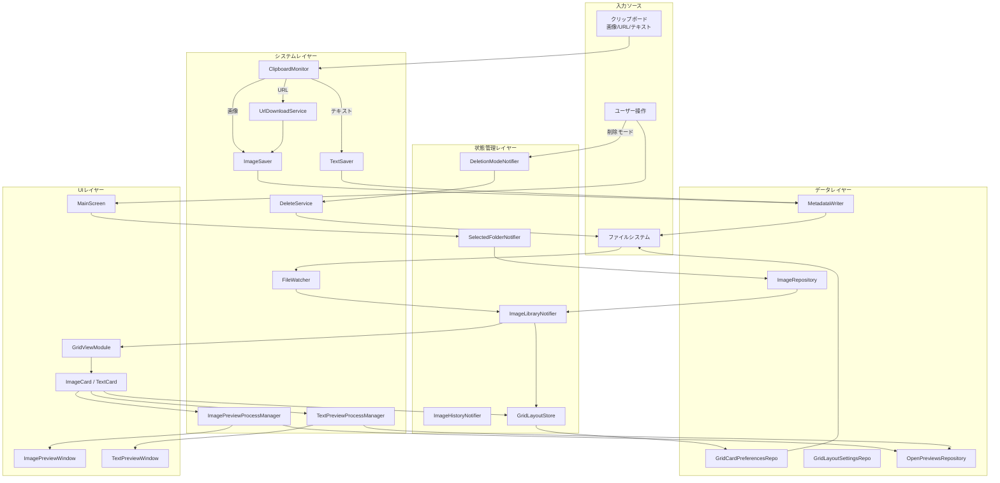
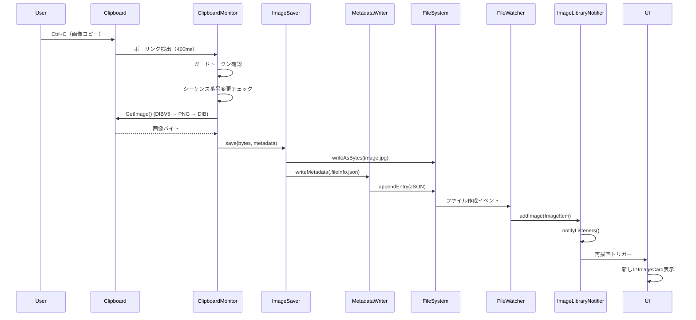
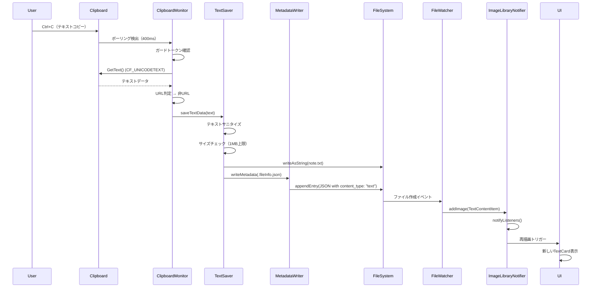
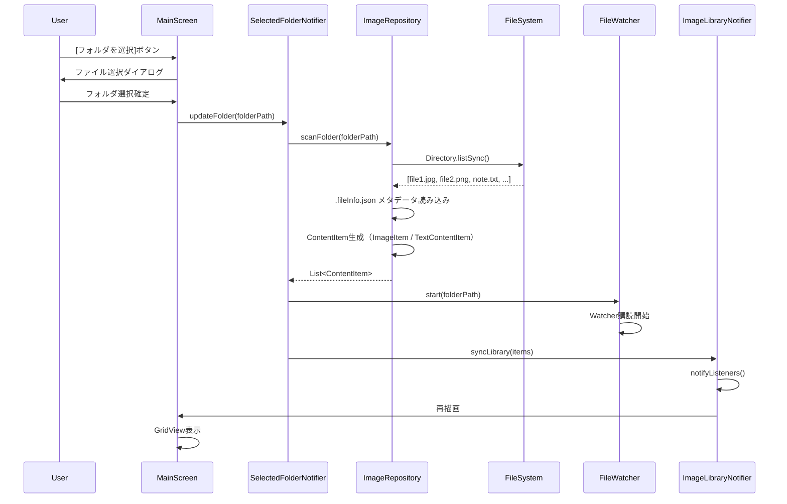
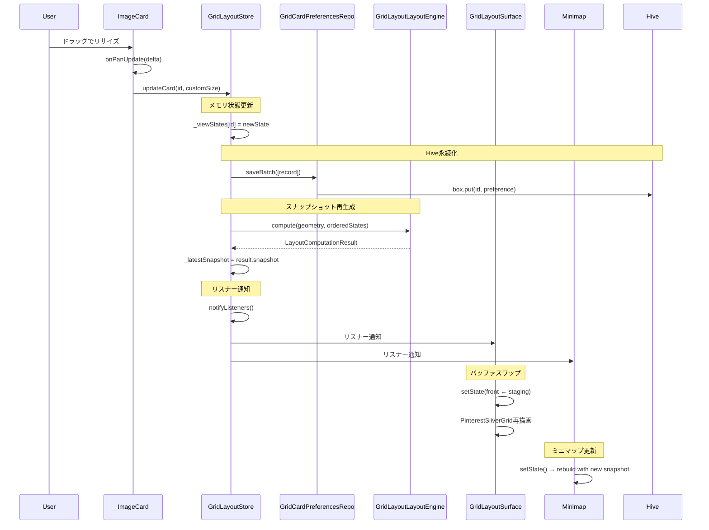
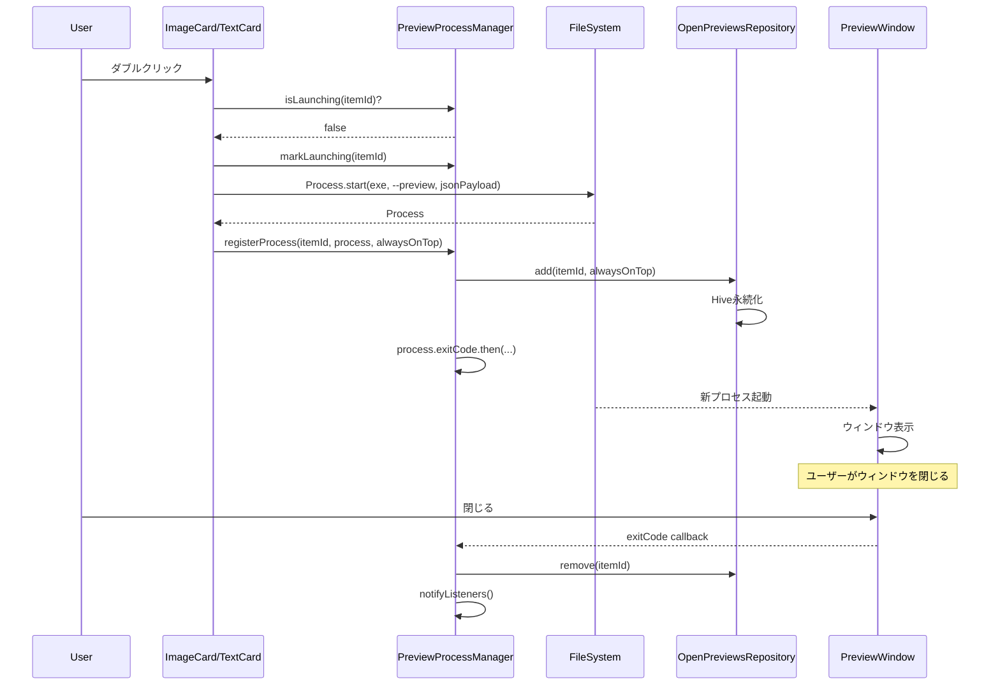
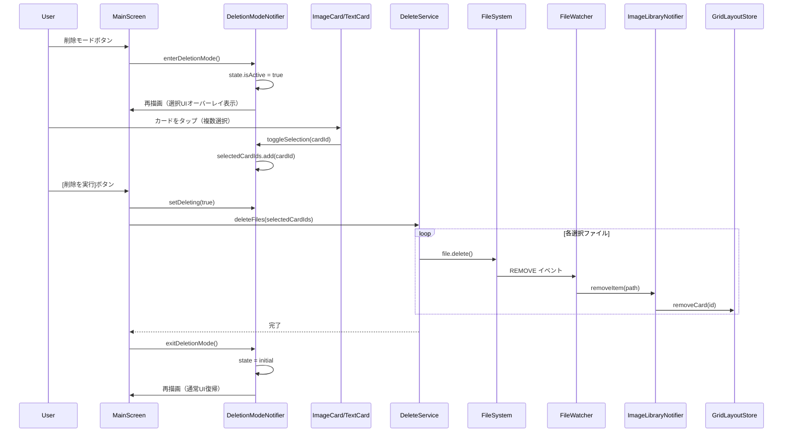
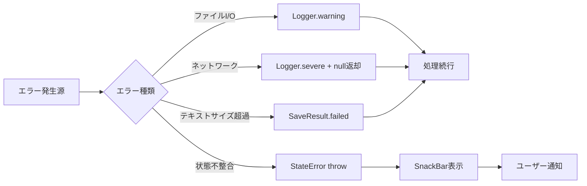

# データフロー

**作成日**: 2025-10-28
**最終更新**: 2025-11-27
**ステータス**: 実装完了

## 全体データフロー



## フロー1: クリップボード画像保存



## フロー2: URL画像ダウンロード


## フロー3: クリップボードテキスト保存 (2025-11-27追加)



## フロー4: フォルダ選択とスキャン



## フロー5: カードリサイズ



## フロー6: プレビューウィンドウ起動 (2025-11-27追加)



## フロー7: 一括削除 (2025-11-27追加)



## フロー8: グリッド設定変更


## フロー9: Undo/Redo


## データ永続化タイミング

### リアルタイム保存

| アクション | 保存先 | タイミング |
|-----------|--------|-----------|
| 画像保存 | FS (image.jpg + .fileInfo.json) | 即座 |
| テキスト保存 | FS (note.txt + .fileInfo.json) | 即座 |
| カードリサイズ | Hive (grid_card_prefs) | ドラッグ終了時 |
| フォルダ選択 | Hive (app_state) | 選択確定時 |
| グリッド設定変更 | Hive (grid_layout) | [保存]ボタン押下時 |
| プレビューウィンドウ起動 | Hive (open_previews) | 即座 |
| プレビューウィンドウ終了 | Hive (open_previews) | 即座 |

### バッチ保存

```dart
// 一括リサイズ時
await gridLayoutStore.applyBulkSpan(span: 3);
// → 全カードのpreferencesを1回のHive.putAllで保存
```

## 状態同期パターン

### パターン1: File → State (FileWatcher)

```dart
// FileWatcher検出
_watcher.events.listen((event) {
  if (event.type == ChangeType.ADD) {
    final contentItem = ContentItem.fromPath(event.path);
    _imageLibraryNotifier.addItem(contentItem);
  }
});
```

### パターン2: State → Hive (Repository)

```dart
// GridLayoutStore
await updateCard(id: id, customSize: size);
// ↓
_viewStates[id] = newState;
await _persistence.saveBatch([_recordFromState(newState)]);
notifyListeners();
```

### パターン3: Hive → State (起動時復元)

```dart
// アプリ起動時
final settings = GridLayoutSettingsRepository().value;
final selectedFolder = Hive.box('app_state').get('folder');
final openPreviews = OpenPreviewsRepository().getAll();
// → Providerに注入して初期化
```

## エラー伝播



### エラーハンドリング戦略

1. **回復可能**: ログ出力のみ、処理続行（例: メタデータ読み込み失敗）
2. **ユーザー通知必要**: SnackBar表示（例: フォルダアクセス拒否）
3. **サイズ制限**: SaveResult.failed 返却（例: テキスト1MB超過）
4. **致命的**: エラーダイアログ + アプリ終了（例: Hive初期化失敗）

## パフォーマンス特性

### メモリフットプリント

| コンポーネント | メモリ使用量 | 備考 |
|---------------|-------------|------|
| ImageLibraryNotifier | カード数 × 1KB | ContentItemリスト |
| GridLayoutStore | カード数 × 200B | viewStatesマップ |
| Hive (grid_card_prefs) | カード数 × 100B | 永続化データ |
| LayoutSnapshot | カード数 × 150B | Rectとメタデータ |
| PreviewProcessManager | プロセス数 × 50B | プロセス参照のみ |

### I/O最適化

- **バッチ書き込み**: `Hive.putAll()` で複数レコードを1回のI/Oで保存
- **遅延読み込み**: フォルダ選択時のみImageRepository.scanFolder実行
- **デバウンス**: ウィンドウリサイズ時の設定保存（200ms）
- **統合メタデータ**: 個別JSONファイルを廃止、`.fileInfo.json` に統合

## 関連ドキュメント

- [State Management Flow](./state_management_flow.md) - 状態管理の詳細
- [Grid Rendering Pipeline](./grid_rendering_pipeline.md) - レンダリングフロー
- [Repositories](../data/repositories.md) - データアクセス層
- [TextSaver](../system/text_saver.md) - テキスト保存サービス
- [ClipboardMonitor](../system/clipboard_monitor.md) - クリップボード監視

## 変更履歴

| 日付 | 内容 |
|------|------|
| 2025-11-27 | TEXT保存フロー、プレビューウィンドウフロー、削除フロー追加 |
| 2025-11-02 | カードリサイズフロー、ミニマップ更新パターン更新 |
| 2025-10-28 | 初版作成 |
