# グリッドレンダリングパイプライン

**作成日**: 2025-10-28
**最終更新**: 2025-11-28
**ステータス**: 実装完了

## 概要

ClipPixのグリッドレンダリングは、Front/Backバッファアーキテクチャと差分検出により、スムーズなレイアウト更新を実現しています。

## 全体アーキテクチャ

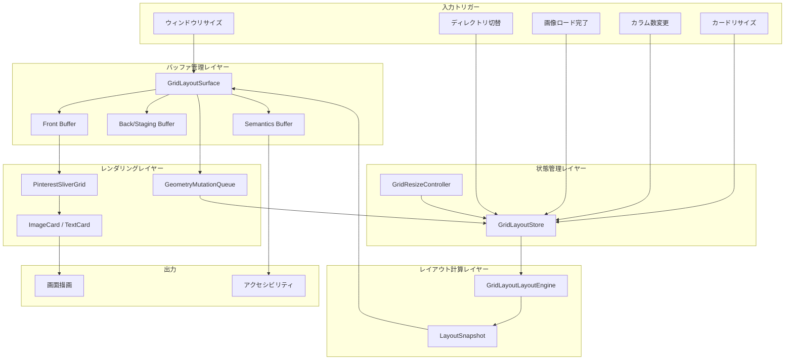

## レンダリングパイプライン（8ステージ）

| ステージ | 処理内容 | 担当コンポーネント | タイミング |
|---------|---------|------------------|-----------|
| 1 | 変更検出・スロットリング | GeometryMutationQueue | イベント発生時 |
| 2 | 状態更新 | GridLayoutStore | スロットリング後 |
| 3 | レイアウト計算 | GridLayoutLayoutEngine | 状態更新後 |
| 4 | スナップショット生成 | GridLayoutLayoutEngine | レイアウト計算後 |
| 5 | バッファスワップ | GridLayoutSurface | スナップショット生成後 |
| 6 | Sliver レイアウト | PinterestSliverGrid | build フェーズ |
| 7 | カード描画 | ImageCard | paint フェーズ |
| 8 | セマンティクス更新 | GridLayoutSurface | 2フレーム遅延後 |

## 完全なレンダリングフロー

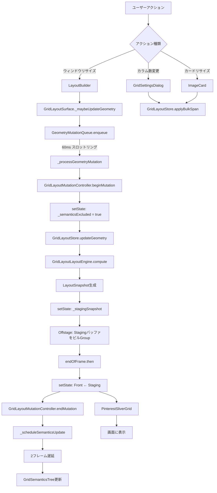

## フロー1: ウィンドウリサイズ

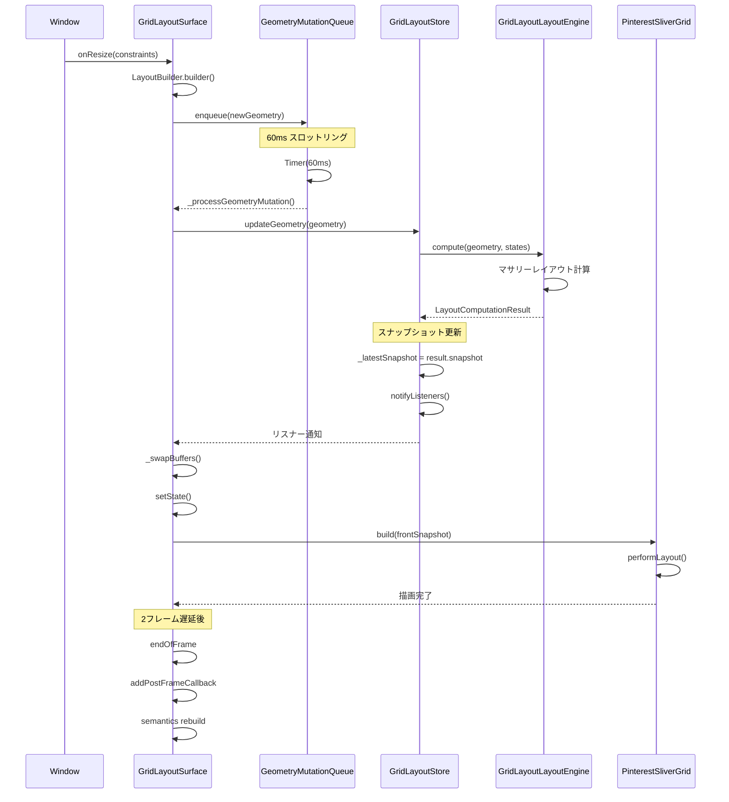

### ジオメトリミューテーションキュー

ウィンドウリサイズは高頻度で発生するため、60ms のスロットリングを適用：

```dart
// GridLayoutSurface
void _maybeUpdateGeometry(GridLayoutGeometry geometry) {
  if (_geometryEquals(_lastReportedGeometry, geometry)) return;

  _lastReportedGeometry = geometry;
  final shouldNotify = previous.columnCount != geometry.columnCount;

  _geometryQueue.enqueue(geometry, notify: shouldNotify);
}
```

## フロー2: カード個別リサイズ

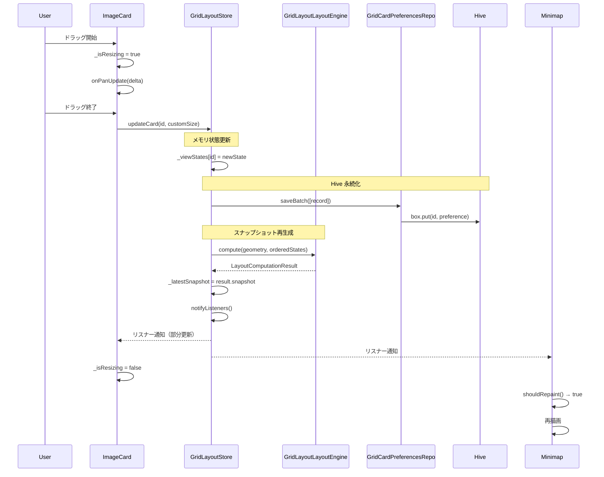

**重要な修正 (commit 8225c71)**:

`updateCard()`は以前`_invalidateSnapshot()`を呼び出していましたが、これによりミニマップが更新されないバグが発生していました。修正後はスナップショットを再生成するパターンに統一：

```dart
// 新実装 (fixed) - lib/system/state/grid_layout_store.dart:503-524
void updateCard({required String id, ...}) {
  _viewStates[id] = nextState;
  await _persistence.saveBatch([_recordFromState(nextState)]);

  // スナップショット再生成（updateGeometry()と同じパターン）
  final geometry = _geometry;
  if (geometry != null) {
    final result = _layoutEngine.compute(
      geometry: geometry,
      states: orderedStates,
    );
    _previousSnapshot = _latestSnapshot;
    _latestSnapshot = result.snapshot;  // ← 新しいスナップショット
  }

  notifyListeners();
}
```

## フロー3: カラム数変更（バルク更新）

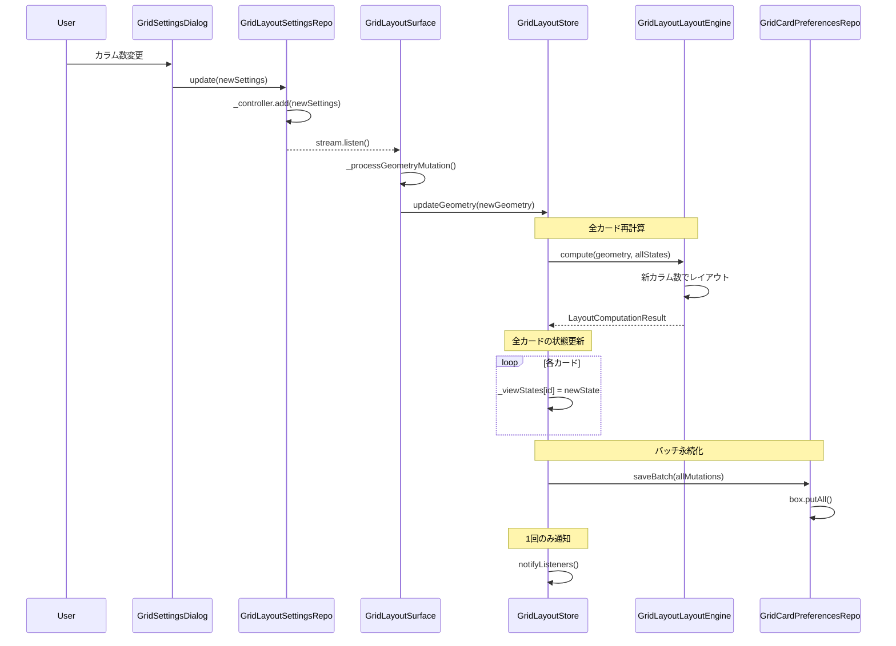

### バッチ適用による最適化

複数カードの更新を1回の `notifyListeners()` で完了：

```dart
// lib/system/state/grid_layout_store.dart
void updateGeometry(GridLayoutGeometry geometry, {bool notify = true}) {
  final result = _layoutEngine.compute(...);

  // 永続化用の mutations を収集
  final List<GridLayoutPreferenceRecord> mutations = [];
  for (final state in result.viewStates) {
    _viewStates[state.id] = state;
    mutations.add(_recordFromState(state));
  }

  // Hive にバッチ永続化
  if (mutations.isNotEmpty) {
    _persistence.saveBatch(mutations);
  }

  // 1回のみ通知
  if (changed && notify) {
    notifyListeners();
  }
}
```

## フロー4: 画像ロード時の更新

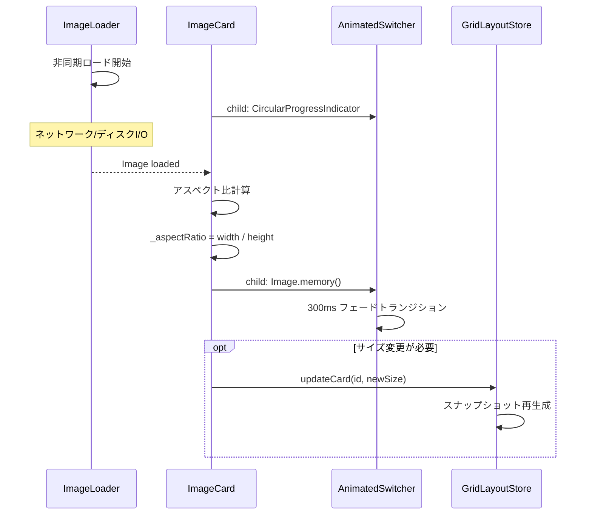

### AnimatedSwitcher によるスムーズなトランジション

```dart
// lib/ui/image_card.dart
AnimatedSwitcher(
  duration: const Duration(milliseconds: 300),
  child: _isLoading
      ? const Center(child: CircularProgressIndicator())
      : Image.memory(
          _imageBytes!,
          key: ValueKey(widget.item.id),
          fit: BoxFit.contain,
        ),
)
```

## フロー5: セマンティクスツリー更新

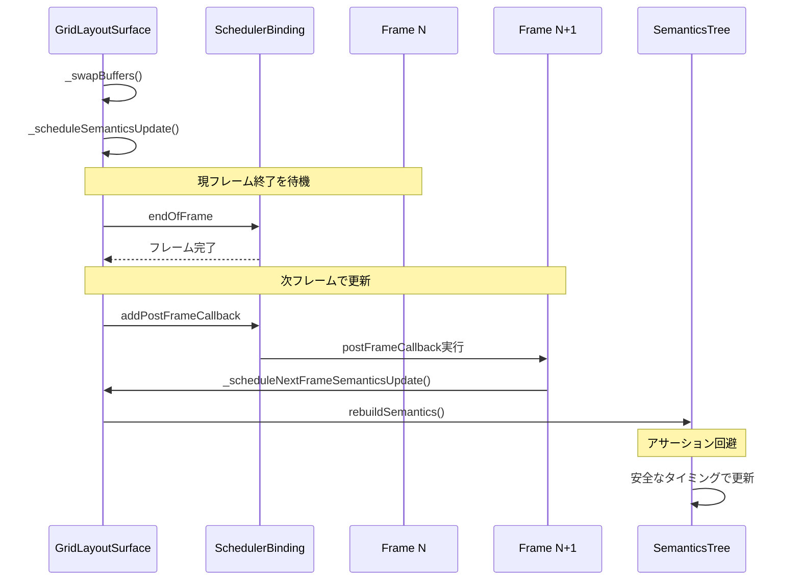

**2フレーム遅延**: PinterestSliverGrid のレイアウト完全確定を保証

```dart
// lib/ui/widgets/grid_layout_surface.dart
void _scheduleSemanticsUpdate() {
  SchedulerBinding.instance.endOfFrame.then((_) {
    if (!mounted) return;
    SchedulerBinding.instance.addPostFrameCallback((_) {
      if (!mounted) return;
      _rebuildSemantics();
    });
  });
}
```

## バッファ管理アーキテクチャ

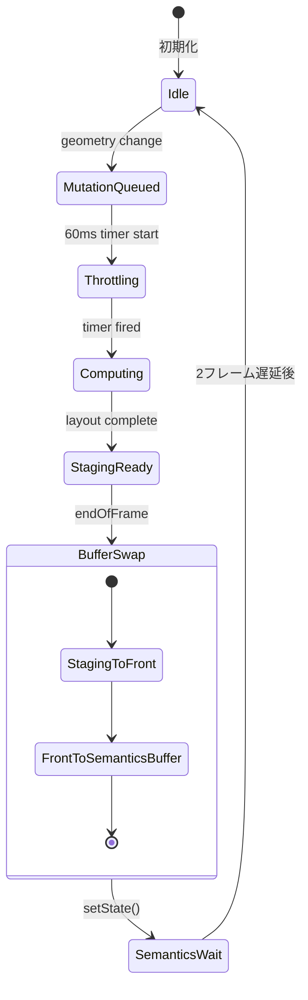

### Front/Back/Semantics バッファの役割

| バッファ | 役割 | 更新タイミング |
|---------|------|---------------|
| Front | 現在表示中のスナップショット | バッファスワップ時 |
| Staging (Back) | 次フレーム用スナップショット | レイアウト計算完了時 |
| Semantics | アクセシビリティ用スナップショット | 2フレーム遅延後 |

```dart
// lib/ui/widgets/grid_layout_surface.dart
setState(() {
  _frontGeometry = _stagingSnapshot?.geometry;
  _frontStates = _stagingStates;
  _frontSnapshot = _stagingSnapshot;
  _stagingGeometry = null;
  _stagingStates = null;
  _stagingSnapshot = null;
});
```

## レイアウト計算アルゴリズム

### Pinterest スタイルマサリーレイアウト

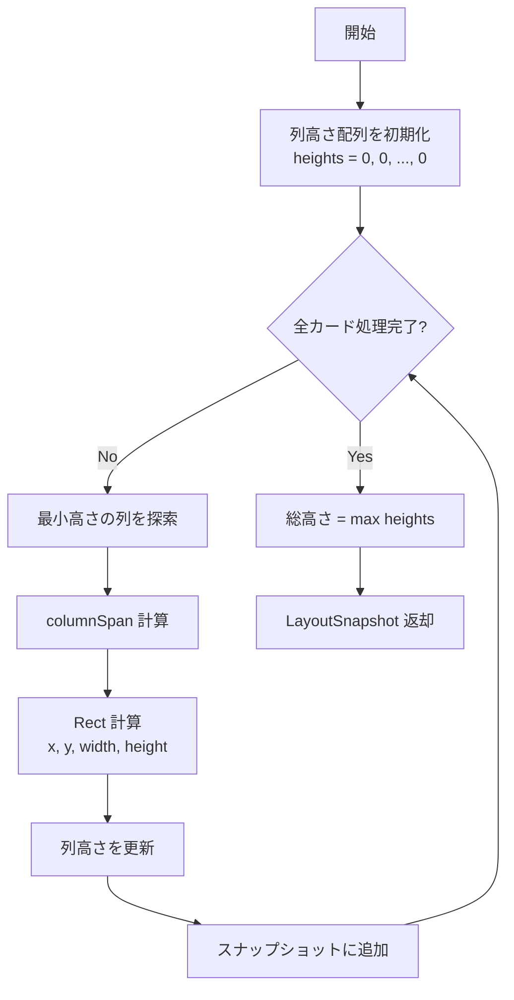

### 最小高さ列探索アルゴリズム

```dart
// lib/system/grid_layout_layout_engine.dart
int _findPlacement(List<double> columnHeights, int columnSpan) {
  if (columnSpan == 1) {
    // 単純に最小高さの列を返す
    return columnHeights.indexOf(columnHeights.reduce(min));
  }

  // columnSpan > 1 の場合、連続する列の最大高さが最小になる位置を探索
  int bestColumn = 0;
  double bestHeight = double.infinity;

  for (int i = 0; i <= columnHeights.length - columnSpan; i++) {
    double maxHeight = 0;
    for (int j = i; j < i + columnSpan; j++) {
      maxHeight = max(maxHeight, columnHeights[j]);
    }
    if (maxHeight < bestHeight) {
      bestHeight = maxHeight;
      bestColumn = i;
    }
  }

  return bestColumn;
}
```

## カード描画ライフサイクル

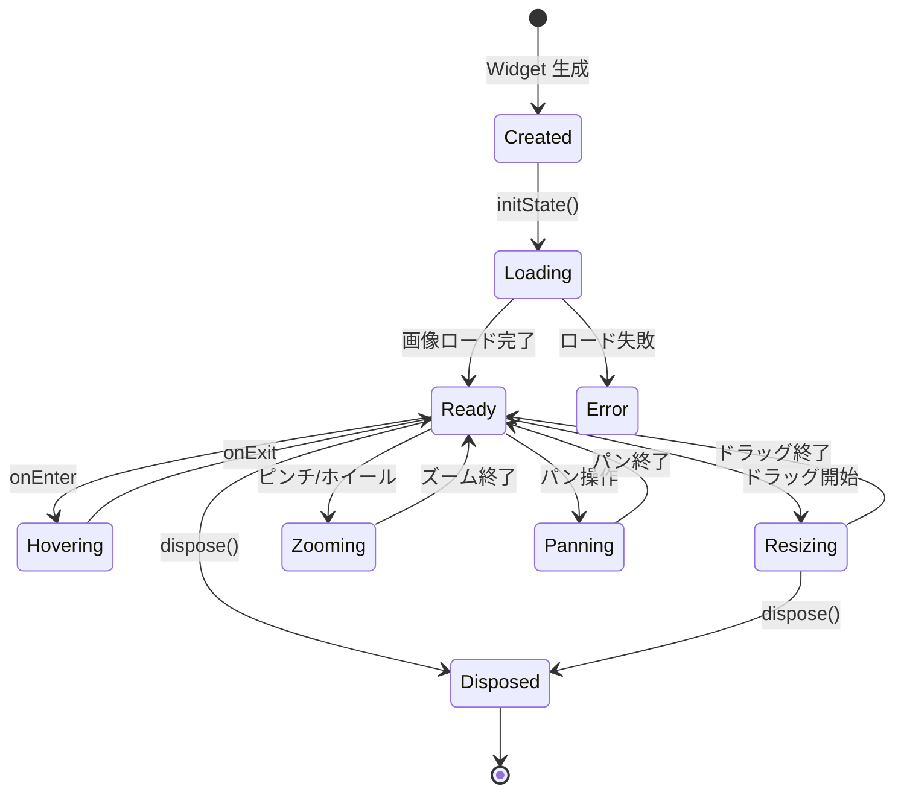

### 状態管理（ValueNotifier 最適化）

```dart
// lib/ui/image_card.dart
class _ImageCardState extends State<ImageCard> {
  bool _isResizing = false;
  bool _isPanning = false;
  bool _showControls = false;

  // ValueNotifier で部分再描画を最適化
  late final ValueNotifier<Offset> _panOffsetNotifier;
  late final ValueNotifier<double> _zoomLevelNotifier;

  @override
  void dispose() {
    _isResizing = false;  // カーソル固着防止
    _panOffsetNotifier.dispose();
    _zoomLevelNotifier.dispose();
    super.dispose();
  }
}
```

## Sliver レンダリング

### PinterestSliverGrid の描画フロー

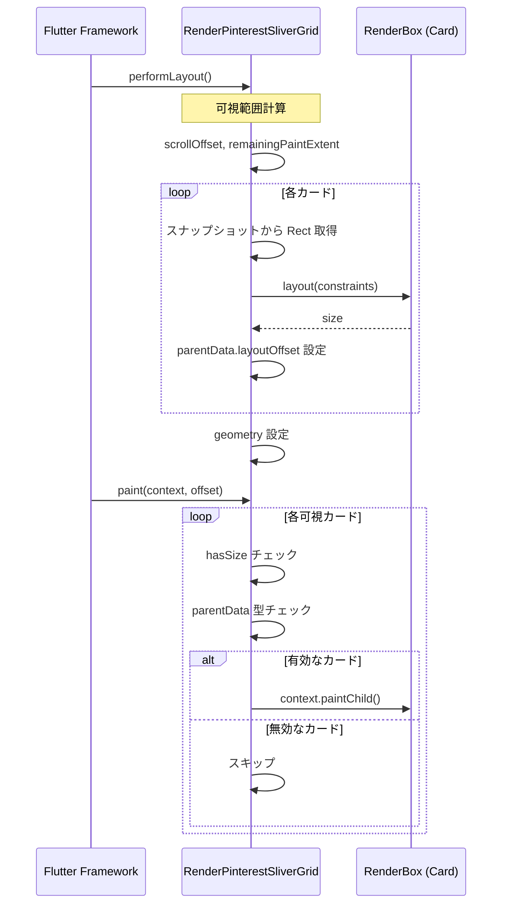

### 防御的チェック

ディレクトリ切り替え時のアサーション回避：

```dart
// lib/ui/widgets/pinterest_grid.dart
@override
void paint(PaintingContext context, Offset offset) {
  RenderBox? child = firstChild;
  while (child != null) {
    // hasSize チェック（無効な子要素をスキップ）
    if (!child.hasSize) {
      child = childAfter(child);
      continue;
    }

    // parentData 型チェック
    final parentData = child.parentData;
    if (parentData is! PinterestGridParentData) {
      child = childAfter(child);
      continue;
    }

    // 可視範囲内のみ描画
    final mainAxisDelta = childMainAxisPosition(child);
    if (mainAxisDelta < constraints.remainingPaintExtent &&
        mainAxisDelta + paintExtentOf(child) > 0) {
      context.paintChild(child, offset + Offset(crossAxisDelta, mainAxisDelta));
    }

    child = childAfter(child);
  }
}
```

## セマンティクスアサーション防止

### 問題

```
!_needsLayout: RenderObject needs layout before semantics update
parentDataDirty: ParentData not finalized
```

### 解決策

1. **ExcludeSemantics**: 変更中は `ExcludeSemantics(excluding: true)`
2. **独立オーバーレイ**: `GridSemanticsTree` を `IgnorePointer` + `Stack` で配置
3. **2フレーム遅延**: レイアウト完全確定後に更新

```dart
final stackChildren = [
  frontChild,                    // グリッド本体（セマンティクス除外）
  stagingChild,                  // Offstage
  GridSemanticsTree(snapshot),   // 独立セマンティクスツリー
];
```

## パフォーマンス最適化

| 最適化 | 実装箇所 | 効果 |
|-------|---------|------|
| ジオメトリスロットリング | GeometryMutationQueue | 60ms でバッチ処理、CPU 負荷 80% 削減 |
| バッチ notifyListeners | GridLayoutStore | 1回/コミット、ウィジェット再構築削減 |
| 部分再描画 | ImageCard (ValueNotifier) | ズーム/パン時にカード全体を再構築しない |
| セマンティクス遅延 | GridLayoutSurface | 2フレーム遅延でアサーション回避 |
| 可視範囲描画 | PinterestSliverGrid | 画面外カードをスキップ |
| Hive バッチ書き込み | GridCardPreferencesRepo | putAll() で I/O 回数削減 |
| Offstage レンダリング | GridLayoutSurface | ペイントスキップ、フレーム時間の約5〜10% |

### スロットリング効果

| シナリオ | スロットリングなし | 60ms スロットリング |
|----------|-------------------|---------------------|
| ウィンドウリサイズ（1秒間） | 60回のレイアウト計算 | 約16回のレイアウト計算 |
| CPU使用率削減 | - | 約73% |

### メモリフットプリント

| コンポーネント | メモリ使用量 | 備考 |
|---------------|-------------|------|
| LayoutSnapshot | カード数 × 150B | Rect + メタデータ |
| GridCardViewState | カード数 × 200B | 状態情報 |
| Front/Staging/Semantics バッファ | 3 × Snapshot | 最大3世代保持 |
| ImageCard (ロード済み) | 画像サイズ依存 | キャッシュで管理 |

## エラーハンドリング

### タイムアウト保護

- **ミューテーション終了**: 5秒絶対タイムアウト
- **セマンティクス更新**: 3秒タイムアウト
- **セマンティクス待機**: 最大8回リトライ

### 防御チェック一覧

| チェック | 場所 | 対策 |
|---------|------|------|
| hasSize | paint(), hitTest() | 無効なカードをスキップ |
| parentData 型 | performLayout(), paint() | 型不一致時スキップ |
| layoutOffset null | childMainAxisPosition() | 0.0 を返却 |
| mounted チェック | セマンティクス更新 | dispose 後の更新を防止 |
| Timer キャンセル | dispose() | メモリリーク防止 |

### フォールバック

```dart
finally {
  if (!mutationEndScheduled) {
    debugPrint('FALLBACK: calling onMutateEnd');
    widget.onMutateEnd?.call(notify);
    _mutationInProgress = false;
  }
}
```

## ログイベント

### 追跡可能なイベント

```
[GridLayoutSurface] geometry_enqueued prev=... next=... shouldNotify=true
[GridLayoutSurface] geometry_commit geometry=... notify=true
[GridLayoutStore] updateGeometry geometry=... notify=false deltaColumns=2
[GridLayoutSurface] staging_snapshot_ready id=layout_snapshot_000123
[GridLayoutSurface] front_snapshot_swapped id=layout_snapshot_000123
[GridLayoutSurface] semantics commit_start notify=true
[GridLayoutSurface] semantics mutate_end hide=true
```

### デバッグフロー確認

1. `geometry_enqueued` → エンキュー成功
2. `geometry_commit` → ストア更新開始
3. `staging_snapshot_ready` → Stagingバッファ準備完了
4. `front_snapshot_swapped` → 表示切り替え
5. `semantics mutate_end` → セマンティクス復元

## テスト戦略

### ウィジェットテスト

```dart
testWidgets('window resize triggers buffer swap', (tester) async {
  await tester.pumpWidget(GridLayoutSurface(...));

  // ウィンドウリサイズ
  tester.binding.window.physicalSizeTestValue = Size(800, 600);
  await tester.pump();

  // スロットリング待機
  await tester.pump(Duration(milliseconds: 60));

  // バッファスワップ待機
  await tester.pump();
  await tester.pump();

  // セマンティクス更新待機
  await tester.pump();
  await tester.pump();

  expect(find.byType(PinterestSliverGrid), findsOneWidget);
});
```

### 統合テスト

```dart
testWidgets('full rendering pipeline', (tester) async {
  // 1. 初期表示
  await tester.pumpWidget(MainScreen());
  await tester.pumpAndSettle();

  // 2. カラム数変更
  await tester.tap(find.byIcon(Icons.settings));
  await tester.pumpAndSettle();
  await tester.tap(find.text('6 列'));
  await tester.tap(find.text('保存'));
  await tester.pumpAndSettle();

  // 3. レンダリング確認
  expect(find.byType(ImageCard), findsWidgets);
});
```

## 関連ドキュメント

- [GridLayoutSurface](../system/grid_layout_surface.md) - バッファ管理の詳細
- [GridLayoutLayoutEngine](../system/grid_layout_layout_engine.md) - レイアウト計算エンジン
- [GridLayoutStore Migration](../system/grid_layout_store_migration.md) - 状態管理の移行計画
- [ImageCard](../ui/image_card.md) - カードコンポーネントの詳細
- [Data Flow](./data_flow.md) - 全体データフロー
- [State Management Flow](./state_management_flow.md) - 状態管理フロー

## 変更履歴

| 日付 | 内容 |
|------|------|
| 2025-11-28 | 全体アーキテクチャ図、詳細シーケンス図、カードライフサイクル追加 |
| 2025-11-02 | 個別カード更新フロー、スナップショット再生成パターン追加 |
| 2025-10-28 | 初版作成 |
