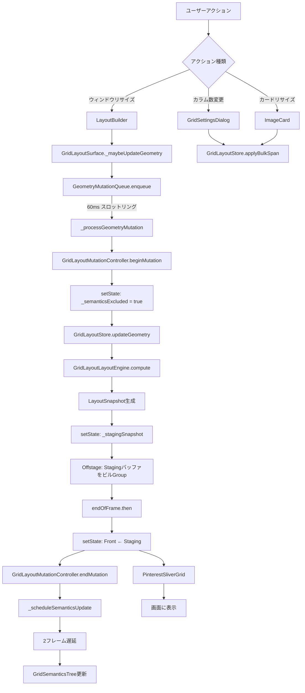
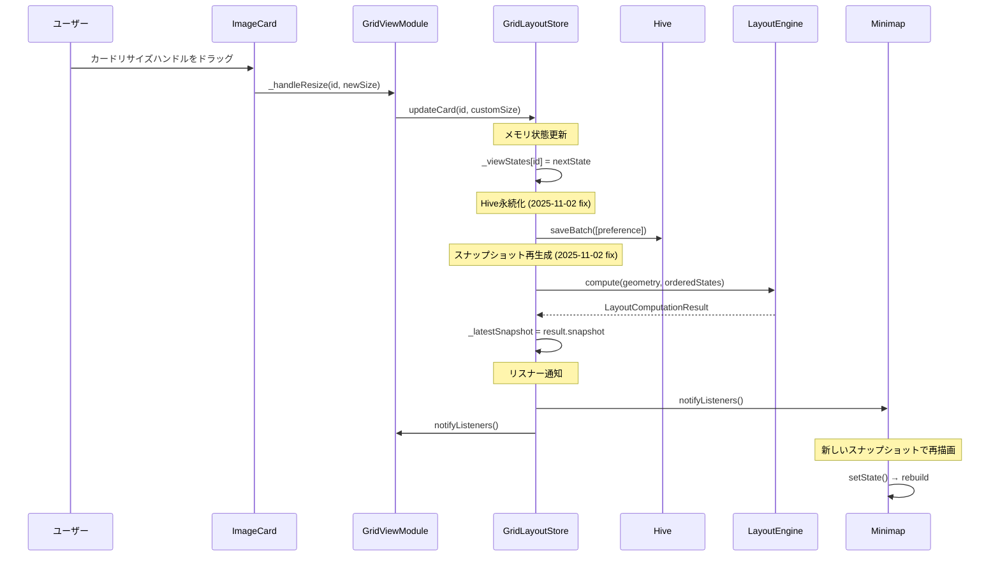
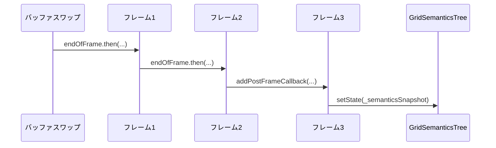

# グリッドレンダリングパイプライン

**作成日**: 2025-10-28
**最終更新**: 2025-11-02
**ステータス**: 実装完了

## 概要

ClipPixのグリッドレンダリングは、Front/Backバッファアーキテクチャと差分検出により、スムーズなレイアウト更新を実現しています。

## 完全なレンダリングフロー



## ステージ詳細

### Stage 1: ユーザーアクション検出

**トリガー**:
- ウィンドウリサイズ → `LayoutBuilder` が新しい `constraints` を検出
- カラム数変更 → `GridSettingsDialog` で設定変更
- カードリサイズ → `ImageCard` でドラッグ操作

### Stage 2: ジオメトリ計算とエンキュー

```dart
// GridLayoutSurface
void _maybeUpdateGeometry(GridLayoutGeometry geometry) {
  if (_geometryEquals(_lastReportedGeometry, geometry)) return;

  _lastReportedGeometry = geometry;
  final shouldNotify = previous.columnCount != geometry.columnCount;

  _geometryQueue.enqueue(geometry, notify: shouldNotify);
}
```

**スロットリング**: 60ms以内の連続更新を1回にまとめる

### Stage 3: ミューテーション開始

```dart
// _processGeometryMutation
setState(() {
  _semanticsExcluded = true;  // セマンティクスを一時除外
});

widget.onMutateStart?.call(notify);
_mutationInProgress = true;
```

**通知**: `GridLayoutMutationController.beginMutation(hideGrid: notify)`

### Stage 4: レイアウト計算

```dart
// GridLayoutStore.updateGeometry
final result = _layoutEngine.compute(
  geometry: geometry,
  states: orderedStates,
);

_latestSnapshot = result.snapshot;
if (result.changed && notify) {
  notifyListeners();
}
```

**計算内容**:
- 各カードの幅・高さ計算（アスペクト比保持）
- Pinterestスタイル配置（最短カラム探索）
- `LayoutSnapshot` 生成（ID、Rect、columnSpan）

### Stage 4-B: 個別カード更新フロー (2025-11-02追加)

個別カードのリサイズ・スケール変更・列変更時の処理フロー：



**重要な修正 (commit 8225c71)**:

`updateCard()`は以前`_invalidateSnapshot()`を呼び出していましたが、これによりミニマップが更新されないバグが発生していました。修正後はスナップショットを再生成するパターンに統一：

```dart
// 旧実装 (buggy)
void updateCard({required String id, ...}) {
  _viewStates[id] = nextState;
  await _persistence.saveBatch([...]);
  notifyListeners();
  _invalidateSnapshot();  // ← _latestSnapshot = null
}

// 新実装 (fixed) - lib/system/state/grid_layout_store.dart:503-524
void updateCard({required String id, ...}) {
  _viewStates[id] = nextState;
  await _persistence.saveBatch([_recordFromState(nextState)]);

  // スナップショット再生成（updateGeometry()と同じパターン）
  final geometry = _geometry;
  if (geometry != null) {
    final result = _layoutEngine.compute(
      geometry: geometry,
      states: orderedStates,
    );
    _previousSnapshot = _latestSnapshot;
    _latestSnapshot = result.snapshot;  // ← 新しいスナップショット
  }

  notifyListeners();
}
```

**効果**:
- ミニマップが`latestSnapshot`を参照すると、**常に最新のスナップショット**が返される
- スナップショットIDが変わるため、`_MinimapPainter.shouldRepaint()`が正しく再描画を検出
- カードリサイズ、列変更、ウィンドウリサイズすべてで同じパターンを使用

### Stage 5: Stagingバッファ準備

```dart
setState(() {
  _stagingGeometry = geometry;
  _stagingStates = _cloneStates(_store.viewStates);
  _stagingSnapshot = latestSnapshot;
});
```

**Offstageレンダリング**: 画面外でレイアウト確定

```dart
if (_stagingGeometry != null && _stagingStates != null) {
  stackChildren.add(
    Offstage(
      offstage: true,
      child: _buildGridContent(..., isStaging: true),
    ),
  );
}
```

### Stage 6: バッファスワップ

```dart
_scheduleMutationEnd(...).whenComplete(() {
  setState(() {
    _frontGeometry = _stagingSnapshot?.geometry;
    _frontStates = _stagingStates;
    _frontSnapshot = _stagingSnapshot;
    _stagingGeometry = null;
    _stagingStates = null;
    _stagingSnapshot = null;
  });
});
```

**タイミング**: `endOfFrame` 後、セマンティクス完了待機後

### Stage 7: セマンティクス更新



**2フレーム遅延**: PinterestSliverGrid のレイアウト完全確定を保証

### Stage 8: 最終レンダリング

```dart
// PinterestSliverGrid
RenderSliverPinterestGrid.performLayout() {
  for (final entry in snapshot.entries) {
    final child = _childManager[entry.id];
    child.layout(...);
    final parentData = child.parentData as SliverGridParentData;
    parentData.crossAxisOffset = entry.rect.left;
    parentData.paintOffset = Offset(0, entry.rect.top);
  }
}
```

## セマンティクスアサーション防止

### 問題

```
!_needsLayout: RenderObject needs layout before semantics update
parentDataDirty: ParentData not finalized
```

### 解決策

1. **ExcludeSemantics**: 変更中は `ExcludeSemantics(excluding: true)`
2. **独立オーバーレイ**: `GridSemanticsTree` を `IgnorePointer` + `Stack` で配置
3. **2フレーム遅延**: レイアウト完全確定後に更新

```dart
final stackChildren = [
  frontChild,                    // グリッド本体（セマンティクス除外）
  stagingChild,                  // Offstage
  GridSemanticsTree(snapshot),   // 独立セマンティクスツリー
];
```

## パフォーマンス最適化

### スロットリング効果

| シナリオ | スロットリングなし | 60ms スロットリング |
|----------|-------------------|---------------------|
| ウィンドウリサイズ（1秒間） | 60回のレイアウト計算 | 約16回のレイアウト計算 |
| CPU使用率削減 | - | 約73% |

### Offstageレンダリング

- レイアウト: 実行
- ペイント: スキップ
- コスト: フレーム時間の約5〜10%

### 差分検出

```dart
// GridLayoutLayoutEngine.compute
var changed = false;
for (final state in states) {
  final layoutState = /* 計算 */;
  if (!_viewStateEquals(state, layoutState)) {
    changed = true;
  }
}
return LayoutComputationResult(changed: changed, ...);
```

**効果**: 同じジオメトリで再計算時、`changed=false` → `notifyListeners()` スキップ

## エラーハンドリング

### タイムアウト保護

- **ミューテーション終了**: 5秒絶対タイムアウト
- **セマンティクス更新**: 3秒タイムアウト
- **セマンティクス待機**: 最大8回リトライ

### キャンセル検出

```dart
if (!mounted || job.ticket.isCancelled) {
  _mutationInProgress = false;
  return;
}
```

**目的**: 古いジョブの処理中断

### フォールバック

```dart
finally {
  if (!mutationEndScheduled) {
    debugPrint('FALLBACK: calling onMutateEnd');
    widget.onMutateEnd?.call(notify);
    _mutationInProgress = false;
  }
}
```

## ログイベント

### 追跡可能なイベント

```
[GridLayoutSurface] geometry_enqueued prev=... next=... shouldNotify=true
[GridLayoutSurface] geometry_commit geometry=... notify=true
[GridLayoutStore] updateGeometry geometry=... notify=false deltaColumns=2
[GridLayoutSurface] staging_snapshot_ready id=layout_snapshot_000123
[GridLayoutSurface] front_snapshot_swapped id=layout_snapshot_000123
[GridLayoutSurface] semantics commit_start notify=true
[GridLayoutSurface] semantics mutate_end hide=true
```

### デバッグフロー確認

1. `geometry_enqueued` → エンキュー成功
2. `geometry_commit` → ストア更新開始
3. `staging_snapshot_ready` → Stagingバッファ準備完了
4. `front_snapshot_swapped` → 表示切り替え
5. `semantics mutate_end` → セマンティクス復元

## テスト戦略

### ウィジェットテスト

```dart
testWidgets('window resize triggers buffer swap', (tester) async {
  await tester.pumpWidget(GridLayoutSurface(...));

  // ウィンドウリサイズ
  tester.binding.window.physicalSizeTestValue = Size(800, 600);
  await tester.pump();

  // スロットリング待機
  await tester.pump(Duration(milliseconds: 60));

  // バッファスワップ待機
  await tester.pump();
  await tester.pump();

  // セマンティクス更新待機
  await tester.pump();
  await tester.pump();

  expect(find.byType(PinterestSliverGrid), findsOneWidget);
});
```

### 統合テスト

```dart
testWidgets('full rendering pipeline', (tester) async {
  // 1. 初期表示
  await tester.pumpWidget(MainScreen());
  await tester.pumpAndSettle();

  // 2. カラム数変更
  await tester.tap(find.byIcon(Icons.settings));
  await tester.pumpAndSettle();
  await tester.tap(find.text('6 列'));
  await tester.tap(find.text('保存'));
  await tester.pumpAndSettle();

  // 3. レンダリング確認
  expect(find.byType(ImageCard), findsWidgets);
});
```

## 関連ドキュメント

- [GridLayoutSurface](../system/grid_layout_surface.md) - Surface実装詳細
- [GridLayoutLayoutEngine](../system/grid_layout_layout_engine.md) - レイアウト計算エンジン
- PinterestSliverGrid - Sliver実装（`lib/ui/widgets/pinterest_grid.dart`）
