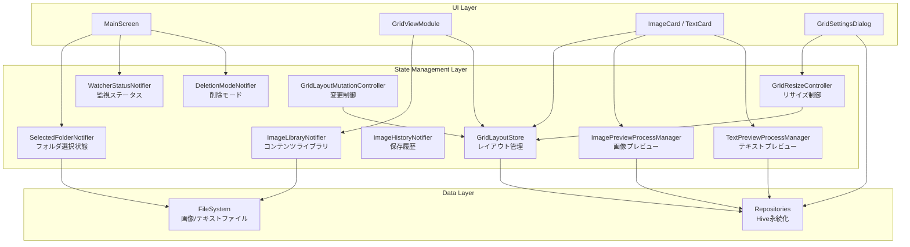
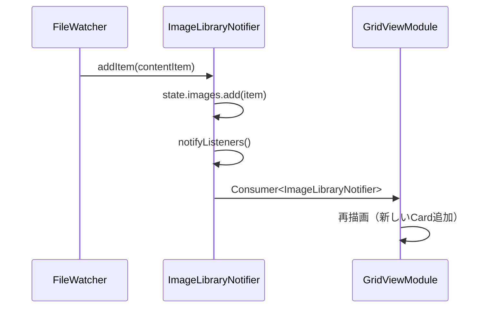
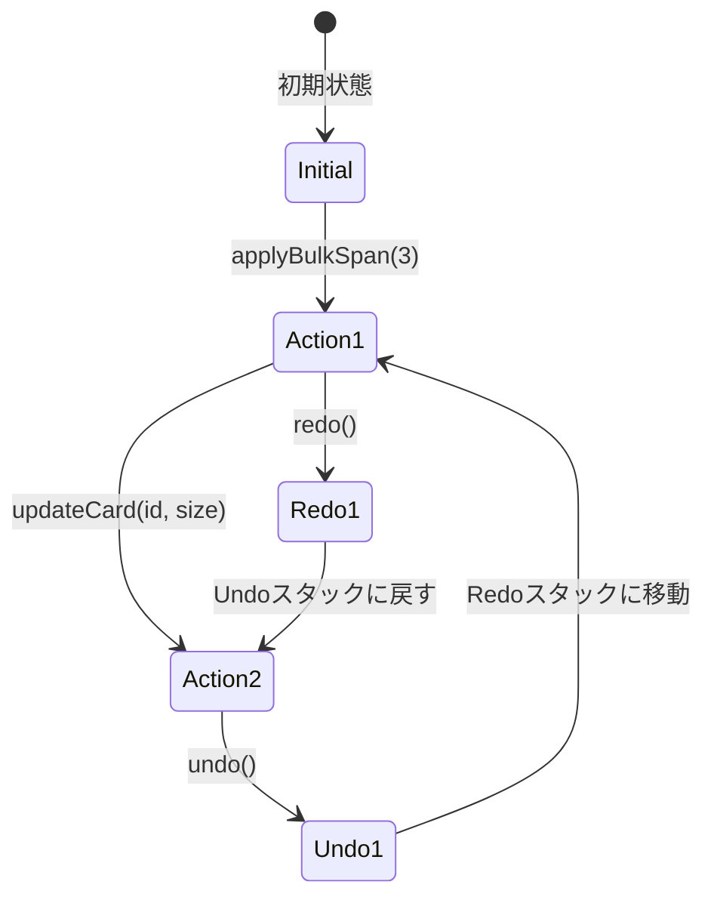

# 状態管理フロー

**作成日**: 2025-10-28
**最終更新**: 2025-11-27
**ステータス**: 実装完了

## 状態管理アーキテクチャ

ClipPixは**Provider + StateNotifier**パターンを採用し、層ごとに責務を分離しています。



## 状態管理クラス詳細

### 1. SelectedFolderNotifier

**責務**: 選択中のフォルダとビューモード管理

```dart
class SelectedFolderState {
  final Directory? current;           // 選択中のディレクトリ
  final List<String> recentFolders;   // 最近使用（最大3件）
  final FolderViewMode viewMode;      // root or subfolder
  final String? currentTab;           // サブフォルダ名
  final double scrollOffset;          // スクロール位置
}
```

#### 主要メソッド

```dart
Future<void> updateFolder(Directory folder)
void changeViewMode(FolderViewMode mode)
void setCurrentTab(String? tab)
void updateScrollOffset(double offset)
void addToRecent(String path)
```

#### 永続化

Hive box `app_state` に `SelectedFolderState` を保存。

### 2. WatcherStatusNotifier

**責務**: ClipboardMonitorとFileWatcherのON/OFF状態管理

```dart
class WatcherStatusState {
  final bool clipboardActive;     // クリップボード監視中
  final bool fileWatcherActive;   // ファイル監視中
  final String? error;            // エラーメッセージ
}
```

#### 主要メソッド

```dart
void setClipboardActive(bool isActive)    // 監視状態設定
void setFileWatcherActive(bool isActive)  // ファイル監視状態設定
void setError(String? message)            // エラー設定
void clearError()                         // エラークリア
```

#### UI連携

```dart
// MainScreen AppBar / GridSettingsDialog
Consumer<WatcherStatusNotifier>(
  builder: (context, notifier, _) {
    return Switch(
      value: notifier.state.clipboardActive,
      onChanged: (value) => notifier.setClipboardActive(value),
    );
  },
)
```

### 3. ImageLibraryNotifier

**責務**: 現在のフォルダのコンテンツリスト管理（画像 + テキスト）

```dart
class ImageLibraryState {
  final Directory? activeDirectory;   // 現在のディレクトリ
  final List<ContentItem> images;     // コンテンツリスト（ImageItem / TextContentItem）
  final bool isLoading;               // ロード中フラグ
  final String? error;                // エラーメッセージ
}
```

#### 主要メソッド

```dart
Future<void> loadFolder(Directory directory)
void addItem(ContentItem item)        // FileWatcherからの追加
void updateItem(String id, ContentItem item)  // 更新
void removeItem(String id)            // 削除
void clear()                          // クリア
```

#### 更新フロー



### 4. ImageHistoryNotifier

**責務**: 最近保存されたコンテンツの履歴（最大20件）

```dart
class ImageHistoryState {
  final Queue<ImageEntry> history;  // FIFO Queue
  final int maxEntries = 20;
}
```

#### 主要メソッド

```dart
void addEntry(ImageEntry entry)
void clear()
```

#### 用途

MainScreenの「最近保存した画像」ストリップ表示。

### 5. DeletionModeNotifier (2025-11-27追加)

**責務**: 一括削除モードの管理

```dart
class DeletionModeState {
  final bool isActive;              // 削除モード有効
  final Set<String> selectedCardIds;  // 選択中のカードID
  final bool isDeleting;            // 削除処理中
}
```

#### 主要メソッド

```dart
void enterDeletionMode()            // 削除モード開始
void exitDeletionMode()             // 削除モード終了（選択クリア）
void toggleSelection(String cardId)  // カード選択トグル
void clearSelection()               // 選択クリア
void setDeleting(bool isDeleting)   // 削除処理中フラグ設定
```

#### 便利プロパティ

```dart
bool get hasSelection => selectedCardIds.isNotEmpty;
int get selectedCount => selectedCardIds.length;
bool isSelected(String cardId) => selectedCardIds.contains(cardId);
```

### 6. GridLayoutStore ⭐

**責務**: グリッドレイアウトの中央集約管理

```dart
class GridLayoutStore extends ChangeNotifier implements GridLayoutSurfaceStore {
  Map<String, GridCardViewState> _viewStates;  // カード状態
  List<String> _orderedIds;                    // 表示順序
  GridLayoutGeometry? _geometry;               // ジオメトリ
  LayoutSnapshot? _latestSnapshot;             // 最新スナップショット
}
```

#### 主要メソッド

```dart
void syncLibrary(List<ContentItem> items)  // ライブラリ同期
void updateGeometry(GridLayoutGeometry geometry)  // ジオメトリ更新
Future<void> updateCard({String id, Size? customSize, int? columnSpan, Offset? panOffset})  // カード更新
Future<void> applyBulkSpan({required int span})  // 一括リサイズ
GridLayoutSnapshot captureSnapshot()  // Undo用スナップショット
Future<void> restoreSnapshot(GridLayoutSnapshot snapshot)  // 復元
```

#### 通知戦略

```dart
void updateGeometry(GridLayoutGeometry geometry, {bool notify = true}) {
  // レイアウト計算
  final result = _layoutEngine.compute(geometry: geometry, states: states);

  // 差分検出
  if (result.changed && notify) {
    notifyListeners();  // 変更時のみ通知
  }
}
```

**最適化**: 差分がない場合は `notifyListeners()` をスキップ

### 7. GridResizeController

**責務**: Undo/Redo履歴管理

```dart
class GridResizeController extends ChangeNotifier {
  final List<GridLayoutSnapshot> _undoStack;  // 最大3件
  final List<GridLayoutSnapshot> _redoStack;

  bool get canUndo => _undoStack.isNotEmpty;
  bool get canRedo => _redoStack.isNotEmpty;
}
```

#### 主要メソッド

```dart
Future<void> applyBulkSpan(int span)  // 一括リサイズ（履歴追加）
Future<void> undo()  // 取り消し
Future<void> redo()  // やり直し
```

#### 履歴管理フロー



### 8. GridLayoutMutationController

**責務**: グリッド変更中の表示制御

```dart
class GridLayoutMutationController extends ChangeNotifier {
  int _depth = 0;  // ネストレベル
  int _hideDepth = 0;  // 非表示深さ

  bool get isMutating => _depth > 0;
  bool get shouldHideGrid => _hideDepth > 0;
}
```

#### 主要メソッド

```dart
void beginMutation({bool hideGrid = true})
void endMutation({bool? hideGrid})
void resetIfInconsistent()  // 不整合リセット
```

#### 使用例

```dart
// GridLayoutSurface
GridLayoutSurface(
  onMutateStart: (hideGrid) {
    mutationController.beginMutation(hideGrid: hideGrid);
  },
  onMutateEnd: (hideGrid) {
    mutationController.endMutation(hideGrid: hideGrid);
  },
)

// 別のウィジェット
Consumer<GridLayoutMutationController>(
  builder: (context, controller, child) {
    if (controller.shouldHideGrid) {
      return SizedBox.shrink();  // グリッド非表示
    }
    return GridContent();
  },
)
```

### 9. ImagePreviewProcessManager (2025-11-27追加)

**責務**: 画像プレビューウィンドウプロセス管理

```dart
class ImagePreviewProcessManager extends ChangeNotifier {
  final Map<String, Process> _processes;  // 実行中プロセス
  final Set<String> _launching;           // 起動中フラグ
  final OpenPreviewsRepository? _repository;
}
```

#### 主要メソッド

```dart
bool isLaunching(String itemId)           // 起動中か確認
bool isRunning(String itemId)             // 実行中か確認
void markLaunching(String itemId)         // 起動中としてマーク
Future<void> registerProcess(String itemId, Process process, {bool alwaysOnTop})
void removeLaunching(String itemId)       // 起動フラグ削除
Future<void> killProcess(String itemId)   // プロセス終了
Future<void> killAll()                    // 全プロセス終了
List<dynamic> getOpenPreviews()           // 復元用リスト取得
```

#### プロセスライフサイクル

```dart
// 起動
manager.markLaunching(itemId);
final process = await Process.start(exe, ['--preview', json]);
await manager.registerProcess(itemId, process, alwaysOnTop: true);

// 終了時（自動コールバック）
process.exitCode.then((exitCode) {
  _handleProcessExit(itemId);  // 内部で _repository.remove() 呼び出し
});
```

### 10. TextPreviewProcessManager (2025-11-27追加)

**責務**: テキストプレビューウィンドウプロセス管理

ImagePreviewProcessManager と同じAPIを持つ。`--preview-text` フラグで起動。

```dart
class TextPreviewProcessManager extends ChangeNotifier {
  // ImagePreviewProcessManager と同じ構造
}
```

## Providerツリー構造

**ファイル**: `lib/system/state/app_state_provider.dart`, `lib/main.dart`

```dart
MultiProvider(
  providers: [
    // シングルトンサービス
    Provider(create: (_) => ClipboardMonitor(...)),
    Provider(create: (_) => FileWatcherService(...)),
    Provider(create: (_) => ImageSaver(...)),
    Provider(create: (_) => TextSaver(...)),
    Provider(create: (_) => UrlDownloadService(...)),
    Provider(create: (_) => DeleteService(...)),

    // リポジトリ
    Provider(create: (_) => GridLayoutSettingsRepository()),
    Provider(create: (_) => GridCardPreferencesRepository()),
    Provider(create: (_) => OpenPreviewsRepository()),

    // 状態管理
    StateNotifierProvider(create: (_) => SelectedFolderNotifier()),
    StateNotifierProvider(create: (_) => WatcherStatusNotifier()),
    StateNotifierProvider(create: (_) => ImageLibraryNotifier()),
    StateNotifierProvider(create: (_) => ImageHistoryNotifier()),
    StateNotifierProvider(create: (_) => DeletionModeNotifier()),
    ChangeNotifierProvider(create: (_) => GridLayoutStore(...)),
    ChangeNotifierProvider(create: (_) => GridResizeController(...)),
    ChangeNotifierProvider(create: (_) => GridLayoutMutationController()),
    ChangeNotifierProvider(create: (_) => ImagePreviewProcessManager(...)),
    ChangeNotifierProvider(create: (_) => TextPreviewProcessManager(...)),
  ],
  child: MaterialApp(...),
)
```

## 状態監視パターン

### パターン1: Consumer (StateNotifier)

```dart
Consumer<ImageLibraryNotifier>(
  builder: (context, notifier, child) {
    if (notifier.state.isLoading) {
      return CircularProgressIndicator();
    }
    return GridView(items: notifier.state.images);
  },
)
```

**用途**: StateNotifierの状態をウィジェットで監視

### パターン2: context.watch (ChangeNotifier)

```dart
Widget build(BuildContext context) {
  final store = context.watch<GridLayoutStore>();
  return GridView(snapshot: store.latestSnapshot);
}
```

**用途**: ChangeNotifierをbuild内で直接参照

### パターン3: context.read

```dart
onPressed: () {
  context.read<ImageLibraryNotifier>().loadFolder(directory);
}
```

**用途**: イベントハンドラでの状態変更（再描画不要）

### パターン4: Selector

```dart
Selector<GridLayoutStore, int>(
  selector: (_, store) => store.viewStates.length,
  builder: (context, count, child) {
    return Text('$count items');
  },
)
```

**用途**: 特定のプロパティのみ監視（最適化）

### パターン5: StateNotifier.state

```dart
// DeletionModeNotifier
final state = context.watch<DeletionModeNotifier>().state;
if (state.isActive && state.isSelected(cardId)) {
  return SelectedOverlay(child: cardContent);
}
```

**用途**: StateNotifier.state の個別フィールドアクセス

## 状態変更フロー例

### カラム数変更の完全フロー


## エラー状態管理

### エラー伝播パターン

```dart
// ImageLibraryNotifier
Future<void> loadFolder(Directory directory) async {
  state = state.copyWith(isLoading: true, clearError: true);

  try {
    final items = await _repository.scanFolder(directory);
    state = state.copyWith(
      images: items,
      isLoading: false,
      activeDirectory: directory,
    );
  } catch (error) {
    state = state.copyWith(
      isLoading: false,
      error: error.toString(),
    );
  }
}
```

### UI でのエラー表示

```dart
Consumer<ImageLibraryNotifier>(
  builder: (context, notifier, child) {
    final state = notifier.state;
    if (state.error != null) {
      return ErrorCard(message: state.error!);
    }
    // ...
  },
)
```

## パフォーマンス最適化

### 不要な再描画防止

#### 1. Selectorで部分監視

```dart
Selector<GridLayoutStore, List<String>>(
  selector: (_, store) => store.orderedIds,
  shouldRebuild: (prev, next) => !listEquals(prev, next),
  builder: (context, ids, child) {
    return GridView(itemCount: ids.length);
  },
)
```

#### 2. 差分検出

```dart
// GridLayoutLayoutEngine
if (_viewStateEquals(oldState, newState)) {
  continue;  // 変更なし → スキップ
}
changed = true;
```

#### 3. バッチ更新

```dart
// GridLayoutStore
Future<void> applyBulkSpan({required int span}) async {
  // 全カード更新を1回のnotifyListeners()で通知
  for (final id in _orderedIds) {
    _viewStates[id] = newState;  // notifyListeners()なし
  }
  await _persistence.saveBatch(batch);
  notifyListeners();  // 最後に1回だけ
}
```

## テスト戦略

### StateNotifierのテスト

```dart
test('ImageLibraryNotifier loads items', () async {
  final notifier = ImageLibraryNotifier(repository: mockRepo);

  when(mockRepo.scanFolder(any)).thenAnswer((_) async => [imageItem, textItem]);

  await notifier.loadFolder(testDirectory);

  expect(notifier.state.images.length, 2);
  expect(notifier.state.isLoading, false);
});
```

### DeletionModeNotifierのテスト

```dart
test('DeletionModeNotifier tracks selection', () {
  final notifier = DeletionModeNotifier();

  notifier.enterDeletionMode();
  expect(notifier.state.isActive, true);

  notifier.toggleSelection('card1');
  notifier.toggleSelection('card2');
  expect(notifier.state.selectedCount, 2);

  notifier.toggleSelection('card1');
  expect(notifier.state.selectedCount, 1);
  expect(notifier.state.isSelected('card1'), false);

  notifier.exitDeletionMode();
  expect(notifier.state.selectedCount, 0);
});
```

### Providerインテグレーションテスト

```dart
testWidgets('GridView updates when library changes', (tester) async {
  await tester.pumpWidget(
    MultiProvider(
      providers: [
        StateNotifierProvider(create: (_) => ImageLibraryNotifier(...)),
      ],
      child: MaterialApp(home: GridViewModule()),
    ),
  );

  final notifier = tester.read<ImageLibraryNotifier>();
  notifier.addItem(newItem);
  await tester.pump();

  expect(find.byType(ImageCard), findsNWidgets(1));
});
```

## 関連ドキュメント

- [Grid Rendering Pipeline](./grid_rendering_pipeline.md) - レンダリングとの統合
- [Data Flow](./data_flow.md) - データフロー全体像
- [GridLayoutStore](../system/state_management.md) - レイアウトストア詳細
- [DeletionModeNotifier](../system/state_management.md#deletion-mode) - 削除モード詳細

## 変更履歴

| 日付 | 内容 |
|------|------|
| 2025-11-27 | DeletionModeNotifier、PreviewProcessManager追加、ContentItem対応 |
| 2025-10-28 | 初版作成 |
