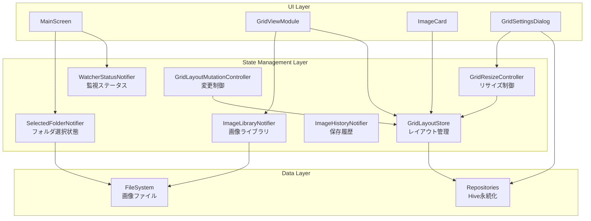
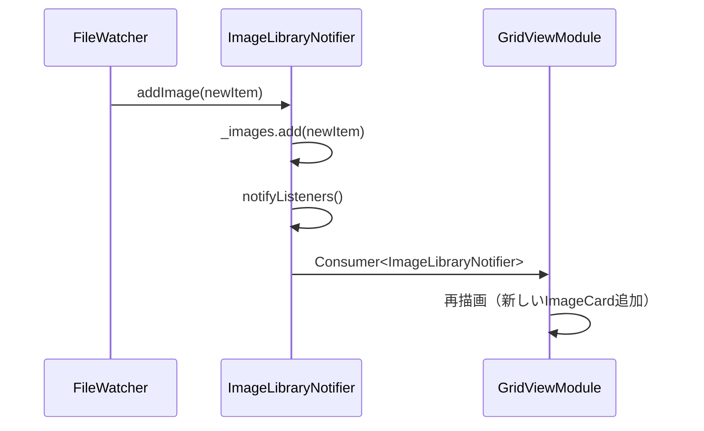
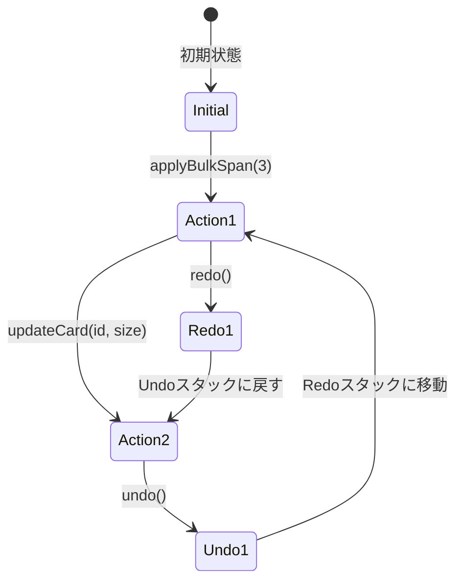
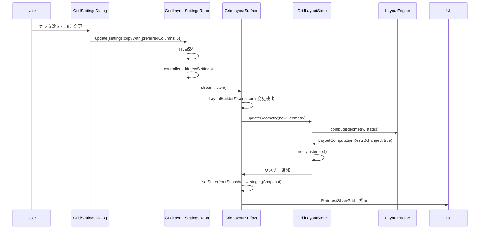

# 状態管理フロー

**作成日**: 2025-10-28
**ステータス**: 実装完了

## 状態管理アーキテクチャ

ClipPixは**Provider + StateNotifier**パターンを採用し、層ごとに責務を分離しています。



## 状態管理クラス詳細

### 1. SelectedFolderNotifier

**責務**: 選択中のフォルダとビューモード管理

```dart
class SelectedFolderState {
  final String? folderPath;         // 選択中のフォルダ
  final List<String> recentFolders;  // 最近使用（最大3件）
  final FolderViewMode viewMode;    // root or subfolder
  final String? currentTab;          // サブフォルダ名
  final double scrollOffset;         // スクロール位置
}
```

#### 主要メソッド

```dart
Future<void> updateFolder(String folderPath)
Future<void> changeViewMode(FolderViewMode mode)
void updateScrollOffset(double offset)
```

#### 永続化

Hive box `app_state` に `SelectedFolderState` を保存。

### 2. WatcherStatusNotifier

**責務**: ClipboardMonitorとFileWatcherのON/OFF状態管理

```dart
class WatcherStatusState {
  final bool clipboardEnabled;  // クリップボード監視
  final bool fileWatcherEnabled;  // ファイル監視
  final String? error;  // エラーメッセージ
}
```

#### 主要メソッド

```dart
void toggleClipboard()  // ON/OFFトグル
void setError(String message)  // エラー設定
void clearError()  // エラークリア
```

#### UI連携

```dart
// MainScreen AppBar
Switch(
  value: watcherStatus.clipboardEnabled,
  onChanged: (_) => watcherStatus.toggleClipboard(),
)
```

### 3. ImageLibraryNotifier

**責務**: 現在のフォルダの画像リスト管理

```dart
class ImageLibraryState {
  final List<ImageItem> images;  // 画像リスト
  final bool isLoading;  // ロード中フラグ
  final String? error;  // エラーメッセージ
}
```

#### 主要メソッド

```dart
Future<void> loadFolder(String folderPath)
void addImage(ImageItem item)  // FileWatcherからの追加
void updateImage(String id, ImageItem item)  // 更新
void removeImage(String id)  // 削除
```

#### 更新フロー



### 4. ImageHistoryNotifier

**責務**: 最近保存された画像の履歴（最大20件）

```dart
class ImageHistoryState {
  final Queue<ImageEntry> history;  // FIFO Queue
  final int maxEntries = 20;
}
```

#### 主要メソッド

```dart
void addEntry(ImageEntry entry)
void clear()
```

#### 用途

MainScreenの「最近保存した画像」ストリップ表示。

### 5. GridLayoutStore ⭐

**責務**: グリッドレイアウトの中央集約管理

```dart
class GridLayoutStore extends ChangeNotifier {
  Map<String, GridCardViewState> _viewStates;  // カード状態
  List<String> _orderedIds;  // 表示順序
  GridLayoutGeometry? _geometry;  // ジオメトリ
  LayoutSnapshot? _latestSnapshot;  // 最新スナップショット
}
```

#### 主要メソッド

```dart
void syncLibrary(List<ImageItem> items)  // ライブラリ同期
void updateGeometry(GridLayoutGeometry geometry)  // ジオメトリ更新
Future<void> updateCard({String id, Size? customSize, int? columnSpan})  // カード更新
Future<void> applyBulkSpan({required int span})  // 一括リサイズ
GridLayoutSnapshot captureSnapshot()  // Undo用スナップショット
Future<void> restoreSnapshot(GridLayoutSnapshot snapshot)  // 復元
```

#### 通知戦略

```dart
void updateGeometry(GridLayoutGeometry geometry, {bool notify = true}) {
  // レイアウト計算
  final result = _layoutEngine.compute(geometry: geometry, states: states);

  // 差分検出
  if (result.changed && notify) {
    notifyListeners();  // 変更時のみ通知
  }
}
```

**最適化**: 差分がない場合は `notifyListeners()` をスキップ

### 6. GridResizeController

**責務**: Undo/Redo履歴管理

```dart
class GridResizeController {
  final List<GridLayoutSnapshot> _undoStack;  // 最大3件
  final List<GridLayoutSnapshot> _redoStack;

  bool get canUndo => _undoStack.isNotEmpty;
  bool get canRedo => _redoStack.isNotEmpty;
}
```

#### 主要メソッド

```dart
Future<void> applyBulkSpan(int span)  // 一括リサイズ（履歴追加）
Future<void> undo()  // 取り消し
Future<void> redo()  // やり直し
```

#### 履歴管理フロー



### 7. GridLayoutMutationController

**責務**: グリッド変更中の表示制御

```dart
class GridLayoutMutationController extends ChangeNotifier {
  int _depth = 0;  // ネストレベル
  int _hideDepth = 0;  // 非表示深さ

  bool get isMutating => _depth > 0;
  bool get shouldHideGrid => _hideDepth > 0;
}
```

#### 主要メソッド

```dart
void beginMutation({bool hideGrid = true})
void endMutation({bool? hideGrid})
void resetIfInconsistent()  // 不整合リセット
```

#### 使用例

```dart
// GridLayoutSurface
GridLayoutSurface(
  onMutateStart: (hideGrid) {
    mutationController.beginMutation(hideGrid: hideGrid);
  },
  onMutateEnd: (hideGrid) {
    mutationController.endMutation(hideGrid: hideGrid);
  },
)

// 別のウィジェット
Consumer<GridLayoutMutationController>(
  builder: (context, controller, child) {
    if (controller.shouldHideGrid) {
      return SizedBox.shrink();  // グリッド非表示
    }
    return GridContent();
  },
)
```

## Providerツリー構造

**ファイル**: `lib/system/state/app_state_provider.dart`, `lib/main.dart`

```dart
MultiProvider(
  providers: [
    // シングルトンサービス
    Provider(create: (_) => ClipboardMonitor(...)),
    Provider(create: (_) => FileWatcher(...)),
    Provider(create: (_) => ImageSaver(...)),
    Provider(create: (_) => UrlDownloadService(...)),

    // リポジトリ
    Provider(create: (_) => GridLayoutSettingsRepository()),
    Provider(create: (_) => GridCardPreferencesRepository()),

    // 状態管理
    ChangeNotifierProvider(create: (_) => SelectedFolderNotifier()),
    ChangeNotifierProvider(create: (_) => WatcherStatusNotifier()),
    ChangeNotifierProvider(create: (_) => ImageLibraryNotifier()),
    ChangeNotifierProvider(create: (_) => ImageHistoryNotifier()),
    ChangeNotifierProxyProvider<GridCardPreferencesRepository, GridLayoutStore>(
      create: (_) => GridLayoutStore(persistence: ..., ratioResolver: ...),
      update: (_, repo, store) => store ?? GridLayoutStore(...),
    ),
    ChangeNotifierProxyProvider<GridLayoutStore, GridResizeController>(
      create: (_) => GridResizeController(store: ...),
      update: (_, store, controller) => controller ?? GridResizeController(...),
    ),
    ChangeNotifierProvider(create: (_) => GridLayoutMutationController()),
  ],
  child: MaterialApp(...),
)
```

## 状態監視パターン

### パターン1: Consumer

```dart
Consumer<ImageLibraryNotifier>(
  builder: (context, library, child) {
    if (library.isLoading) {
      return CircularProgressIndicator();
    }
    return GridView(images: library.images);
  },
)
```

**用途**: ウィジェット再描画が必要な場合

### パターン2: context.watch

```dart
Widget build(BuildContext context) {
  final library = context.watch<ImageLibraryNotifier>();
  return GridView(images: library.images);
}
```

**用途**: build内で状態を直接参照

### パターン3: context.read

```dart
onPressed: () {
  context.read<ImageLibraryNotifier>().loadFolder(path);
}
```

**用途**: イベントハンドラでの状態変更（再描画不要）

### パターン4: Selector

```dart
Selector<GridLayoutStore, int>(
  selector: (_, store) => store.viewStates.length,
  builder: (context, count, child) {
    return Text('$count images');
  },
)
```

**用途**: 特定のプロパティのみ監視（最適化）

## 状態変更フロー例

### カラム数変更の完全フロー



## エラー状態管理

### エラー伝播パターン

```dart
// ImageLibraryNotifier
Future<void> loadFolder(String path) async {
  state = ImageLibraryState(isLoading: true, error: null);
  notifyListeners();

  try {
    final images = await _repository.scanFolder(path);
    state = ImageLibraryState(images: images, isLoading: false);
  } catch (error) {
    state = ImageLibraryState(
      isLoading: false,
      error: error.toString(),
    );
  }
  notifyListeners();
}
```

### UI でのエラー表示

```dart
Consumer<ImageLibraryNotifier>(
  builder: (context, library, child) {
    if (library.error != null) {
      return ErrorCard(message: library.error!);
    }
    // ...
  },
)
```

## パフォーマンス最適化

### 不要な再描画防止

#### 1. Selectorで部分監視

```dart
Selector<GridLayoutStore, List<String>>(
  selector: (_, store) => store.viewStates.map((s) => s.id).toList(),
  shouldRebuild: (prev, next) => !listEquals(prev, next),
  builder: (context, ids, child) {
    return GridView(itemCount: ids.length);
  },
)
```

#### 2. 差分検出

```dart
// GridLayoutLayoutEngine
if (_viewStateEquals(oldState, newState)) {
  continue;  // 変更なし → スキップ
}
changed = true;
```

#### 3. バッチ更新

```dart
// GridLayoutStore
Future<void> applyBulkSpan({required int span}) async {
  // 全カード更新を1回のnotifyListeners()で通知
  for (final id in _orderedIds) {
    _viewStates[id] = newState;  // notifyListeners()なし
  }
  await _persistence.saveBatch(batch);
  notifyListeners();  // 最後に1回だけ
}
```

## テスト戦略

### StateNotifierのテスト

```dart
test('ImageLibraryNotifier loads images', () async {
  final notifier = ImageLibraryNotifier(repository: mockRepo);

  when(mockRepo.scanFolder(any)).thenAnswer((_) async => [imageItem1, imageItem2]);

  await notifier.loadFolder('/path');

  expect(notifier.state.images.length, 2);
  expect(notifier.state.isLoading, false);
});
```

### Providerインテグレーションテスト

```dart
testWidgets('GridView updates when library changes', (tester) async {
  await tester.pumpWidget(
    MultiProvider(
      providers: [
        ChangeNotifierProvider(create: (_) => ImageLibraryNotifier(...)),
      ],
      child: MaterialApp(home: GridViewModule()),
    ),
  );

  final notifier = tester.read<ImageLibraryNotifier>();
  notifier.addImage(newItem);
  await tester.pump();

  expect(find.byType(ImageCard), findsNWidgets(1));
});
```

## 関連ドキュメント

- [Grid Rendering Pipeline](./grid_rendering_pipeline.md) - レンダリングとの統合
- [Data Flow](./data_flow.md) - データフロー全体像
- [GridLayoutStore](../system/state_management.md) - レイアウトストア詳細
