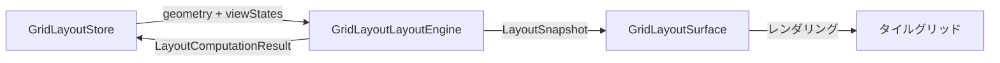
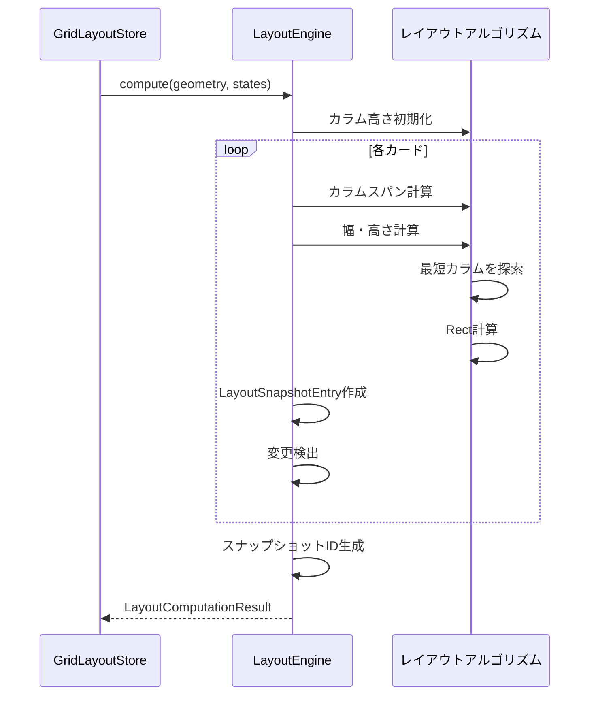
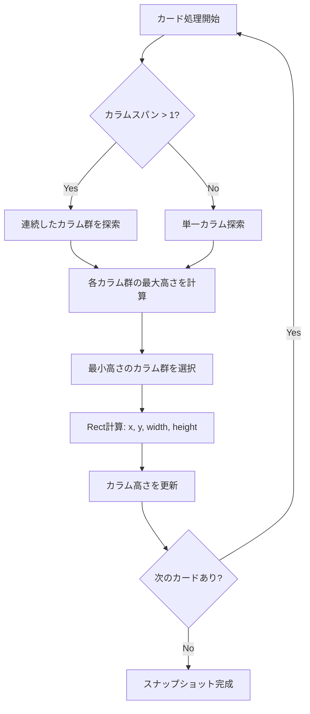
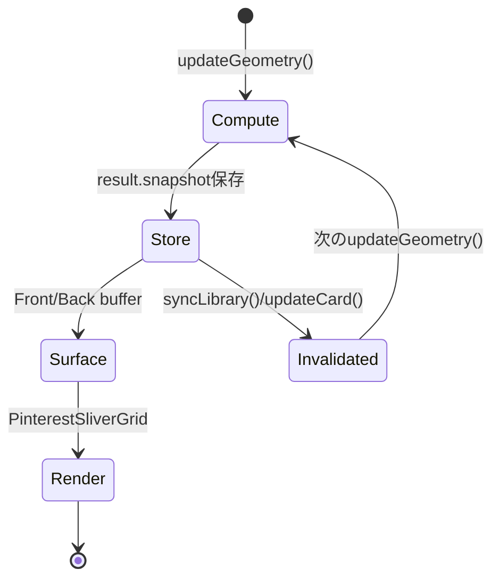

# GridLayoutLayoutEngine

**実装ファイル**: `lib/system/grid_layout_layout_engine.dart`
**作成日**: 2025-10-28
**ステータス**: 実装完了

## 概要

`GridLayoutLayoutEngine` は、タイル風のマソンリーレイアウトを計算する純粋な計算エンジンです。状態管理から分離された設計により、レイアウト計算のテスタビリティと再利用性を実現しています。

### 設計原則

1. **純粋関数**: 副作用なし、同じ入力に対して常に同じ出力を返す
2. **状態管理からの分離**: `GridLayoutStore` から独立したレイアウト計算
3. **差分検出**: ビューステートの変更を検出し、不要なレンダリングを回避
4. **柔軟なID生成**: テスト用にモック可能な `LayoutSnapshotIdProvider`

### アーキテクチャ上の役割



## 主要API

### 1. compute()

ジオメトリとビューステートからレイアウトを計算し、変更検出を行います。

#### シグネチャ

```dart
LayoutComputationResult compute({
  required GridLayoutGeometry geometry,
  required Iterable<GridCardViewState> states,
})
```

#### パラメータ

- **geometry**: グリッドジオメトリ（カラム数、カラム幅、ギャップ）
- **states**: カードのビューステートリスト（ID、幅、高さ、スケール、カラムスパン）

#### 戻り値: LayoutComputationResult

```dart
class LayoutComputationResult {
  final LayoutSnapshot snapshot;      // レイアウトスナップショット
  final List<GridCardViewState> viewStates;  // 計算後のビューステート
  final bool changed;                  // 変更フラグ
}
```

#### 処理フロー



#### 実装詳細

1. **カラム数の正規化**: `max(1, geometry.columnCount)` で0を回避
2. **カラムスパンのクランプ**: `columnSpan.clamp(1, effectiveColumnCount)`
3. **幅計算**: `columnWidth * span + gap * (span - 1)`
4. **高さ計算**: 既存のアスペクト比を保持（`height / width`）
5. **配置アルゴリズム**: `_findPlacement()` で最短カラムを探索
6. **変更検出**: イプシロン（0.0001）で浮動小数点比較

### 2. buildSnapshot()

簡易版のレイアウト計算。変更検出なし、現在のビューステートをそのまま使用します。

#### シグネチャ

```dart
LayoutSnapshot buildSnapshot({
  required GridLayoutGeometry geometry,
  required Iterable<GridCardViewState> states,
})
```

#### 用途

- 初期レンダリング
- 強制的なレイアウト再計算（変更検出不要の場合）

#### compute() との違い

| 項目 | compute() | buildSnapshot() |
|------|-----------|-----------------|
| 変更検出 | あり | なし |
| ビューステート更新 | あり（アスペクト比再計算） | なし（既存値使用） |
| 戻り値 | LayoutComputationResult | LayoutSnapshot |
| 用途 | 通常のレイアウト更新 | 初期化、強制再計算 |

## データ構造

### LayoutSnapshot

レイアウト計算の結果スナップショット。

```dart
class LayoutSnapshot {
  final String id;                          // スナップショットID（例: "layout_snapshot_000001"）
  final GridLayoutGeometry geometry;        // 使用したジオメトリ
  final List<LayoutSnapshotEntry> entries;  // カードエントリー
}
```

#### スナップショットID

- `LayoutSnapshotIdProvider.nextId()` で生成
- デフォルト: `_IncrementalSnapshotIdProvider`（シーケンシャル番号）
- テスト用にモック可能（コンストラクタでインジェクション）

### LayoutSnapshotEntry

個別カードのレイアウト情報。

```dart
class LayoutSnapshotEntry {
  final String id;           // カードID（ImageItem.id）
  final Rect rect;           // 描画位置とサイズ（x, y, width, height）
  final int columnSpan;      // カラムスパン数
}
```

### GridLayoutGeometry

グリッドの幾何情報（GridLayoutStore から渡される）。

```dart
class GridLayoutGeometry {
  final int columnCount;      // カラム数
  final double columnWidth;   // カラム幅（ピクセル）
  final double gap;           // カード間ギャップ（ピクセル）
}
```

### GridCardViewState

カードのビュー状態（GridLayoutStore が管理）。

```dart
class GridCardViewState {
  final String id;             // カードID
  final double width;          // 幅（ピクセル）
  final double height;         // 高さ（ピクセル）
  final double scale;          // スケール倍率
  final int columnSpan;        // カラムスパン数
  final double? customHeight;  // カスタム高さ（ドラッグリサイズ時に設定）
  final double offsetDx;       // パンオフセットX（レイアウトエンジンでは未使用）
  final double offsetDy;       // パンオフセットY（レイアウトエンジンでは未使用）
}
```

**注意**: `offsetDx`/`offsetDy` はレイアウトエンジンでは使用されません。詳細は「制限事項」セクションを参照。

## レイアウトアルゴリズム

### タイルスタイル配置

カードを最短のカラムに配置していく「マソンリーレイアウト」アルゴリズム。

#### アルゴリズムフロー



#### _findPlacement() の実装詳細

```dart
_Placement _findPlacement(
  List<double> columnHeights,  // 各カラムの現在の高さ
  int span,                     // カラムスパン数
  double gap,                   // ギャップサイズ
  double height,                // カードの高さ
)
```

**処理ステップ**:

1. **カラムスパンのクランプ**: `clamp(1, columnCount)`
2. **候補位置の探索**: `start = 0` から `columnCount - span` まで
3. **各候補の最大高さ計算**: `max(columnHeights[start..start+span])`
4. **最小高さの候補を選択**: イプシロン（0.001）で比較
5. **カラム高さ更新**: `newHeight = bestOffset + height + gap`
6. **配置情報を返す**: `_Placement(bestStart, bestOffset)`

#### カラム高さ更新のルール

- 最後のカラム（`nextIndex == columnCount - 1`）: ギャップを追加しない
- その他のカラム: `newHeight + gap` で次のカードとの間隔を確保

### 幅・高さ計算

#### _computeWidth()

カラムスパンに基づいた幅を計算。

```dart
double _computeWidth(GridLayoutGeometry geometry, int span) {
  final gapCount = max(0, span - 1);
  final gapWidth = geometry.gap * gapCount;
  return geometry.columnWidth * span + gapWidth;
}
```

**計算式**: `width = columnWidth × span + gap × (span - 1)`

#### _computeHeight()

既存のアスペクト比を保持した高さを計算。

```dart
double _computeHeight(GridCardViewState state, double width) {
  if (width <= 0.0001) return width;

  final ratio = (state.width > 0 && state.height > 0)
      ? state.height / state.width
      : 1.0;

  if (!ratio.isFinite || ratio <= 0) return width;

  return width * ratio;
}
```

**処理**:
1. 幅が極小（0.0001以下）の場合: 幅をそのまま返す
2. アスペクト比計算: `ratio = height / width`
3. 不正な比率（無限大、0以下）の場合: 正方形（width）を返す
4. 正常な場合: `height = width × ratio`

### 変更検出

#### _viewStateEquals()

2つのビューステートを比較し、変更があるかチェック。

```dart
bool _viewStateEquals(GridCardViewState a, GridCardViewState b) {
  const epsilon = 0.0001;
  return a.id == b.id &&
      a.columnSpan == b.columnSpan &&
      (a.customHeight == null && b.customHeight == null ||
          (a.customHeight != null &&
              b.customHeight != null &&
              (a.customHeight! - b.customHeight!).abs() < epsilon)) &&
      (a.scale - b.scale).abs() < epsilon &&
      (a.width - b.width).abs() < epsilon &&
      (a.height - b.height).abs() < epsilon;
}
```

**比較項目**:
- `id`: 完全一致
- `columnSpan`: 完全一致
- `customHeight`: nullチェック + イプシロン比較
- `scale`, `width`, `height`: イプシロン比較（0.0001）

**イプシロンの必要性**:
- 浮動小数点演算の誤差を吸収
- 幅計算のわずかな差異を無視（例: 200.0000001 vs 200.0）

## GridLayoutStoreとの統合

### 呼び出しパターン

#### updateGeometry() での使用

```dart
// GridLayoutStore.updateGeometry() より
final result = _layoutEngine.compute(
  geometry: geometry,
  states: orderedStates,
);

// 変更検出
var changed = result.changed;
final geometryChanged = /* ジオメトリ比較 */;
changed = changed || geometryChanged;

// ビューステート更新
for (final state in result.viewStates) {
  _viewStates[state.id] = state;
}

// スナップショット保存
_latestSnapshot = result.snapshot;

// 通知
if (changed && notify) {
  notifyListeners();
}
```

#### スナップショットのライフサイクル



### エラーハンドリング

#### 入力値の正規化

- **カラム数が0以下**: `max(1, columnCount)` で1に正規化
- **カラムスパンが範囲外**: `clamp(1, effectiveColumnCount)` でクランプ
- **幅がゼロ**: 高さもゼロに設定
- **不正なアスペクト比**: 1.0（正方形）にフォールバック

#### 無限大・NaNの防止

- `isFinite` チェック
- `ratio <= 0` のガード
- `bestOffset` が無限大の場合は0にリセット

## パフォーマンス特性

### 時間計算量

- **compute()**: O(n × m)
  - n: カード数
  - m: カラム数（配置探索のループ）
- **buildSnapshot()**: O(n × m)（同上）

### 最適化手法

1. **カラム高さ配列の再利用**: `List.filled(effectiveColumnCount, 0)` でプリアロケーション
2. **growable: false**: リストサイズ固定でメモリ効率向上
3. **イプシロン比較**: 不要な変更通知を抑制
4. **早期リターン**: `_findPlacement()` で最初の最小値を発見時に即リターン

### メモリフットプリント

- **LayoutSnapshot**: カード数に比例（各カードに1つの `LayoutSnapshotEntry`）
- **カラム高さ配列**: カラム数に比例（通常1〜10カラム）
- **viewStates**: カード数に比例（`compute()` で生成）

## テストガイドライン

### ユニットテストの観点

1. **正常系**:
   - 単一カラム、複数カラムでの配置
   - カラムスパン1〜最大値での配置
   - アスペクト比の保持

2. **境界値**:
   - カラム数0（1に正規化される）
   - カラムスパンがカラム数を超える場合
   - 幅・高さが0の場合

3. **エッジケース**:
   - 空のステートリスト
   - 不正なアスペクト比（無限大、NaN、負の値）
   - 浮動小数点誤差（イプシロン境界）

4. **変更検出**:
   - 同じ入力で `changed = false` になるか
   - ジオメトリ変更時に `changed = true` になるか
   - ビューステート変更時に `changed = true` になるか

### モックの使い方

```dart
class MockIdProvider implements LayoutSnapshotIdProvider {
  int _counter = 0;

  @override
  String nextId() => 'mock_${_counter++}';
}

final engine = GridLayoutLayoutEngine(idProvider: MockIdProvider());
```

## 実装履歴

- **2025-10-26**: 初期実装
- **2025-10-27**: Front/Backバッファとの統合
- **2025-10-28**: ドキュメント作成

## 関連ドキュメント

- [GridLayoutStore](./state_management.md#gridlayoutstore) - レイアウトエンジンを使用する状態管理
- [GridLayoutSurface](./grid_layout_surface.md) - スナップショットのレンダリング
- PinterestSliverGrid - マソンリーレイアウトの実装（`lib/ui/widgets/pinterest_grid.dart`）

## 制限事項

### パンオフセットの非追跡

`GridLayoutLayoutEngine`はパンオフセット（`offsetDx`/`offsetDy`）を追跡しません。
これはレイアウト計算（カード配置位置）とは独立したUI状態であるためです。

**影響**:
- `compute()`が返す`result.viewStates`にはオフセットが含まれない（常に0）
- `GridLayoutStore.updateGeometry()`で`_viewStates`を更新する際、既存のオフセット値を保持する必要がある

**対応** (commit f716f23, 2025-11-25):
`updateGeometry()`内で`result.viewStates`をマージする際、既存の`offsetDx`/`offsetDy`を保持：

```dart
final preservedState = existing != null
    ? GridCardViewState(
        id: state.id,
        width: state.width,
        height: state.height,
        scale: state.scale,
        columnSpan: state.columnSpan,
        customHeight: state.customHeight,
        offsetDx: existing.offsetDx,  // ← 既存値を保持
        offsetDy: existing.offsetDy,
      )
    : state;
```

## 今後の拡張

### 考えられる改善点

1. **レイアウトキャッシュ**: 同じジオメトリ+ステートに対する計算結果をキャッシュ
2. **並列計算**: 大量のカード（1000+）に対する並列処理（Isolate）
3. **増分更新**: カード追加時に全体再計算ではなく、追加分のみ計算
4. **レイアウトバリエーション**: グリッド型、リスト型など複数のレイアウトアルゴリズム対応

### 破壊的変更の可能性

現時点では、APIは安定しており破壊的変更の予定はありません。新機能は以下のパターンで追加可能：

- 新しい `LayoutSnapshotIdProvider` 実装（カスタムID生成）
- `GridLayoutGeometry` への追加プロパティ（下位互換性維持）
