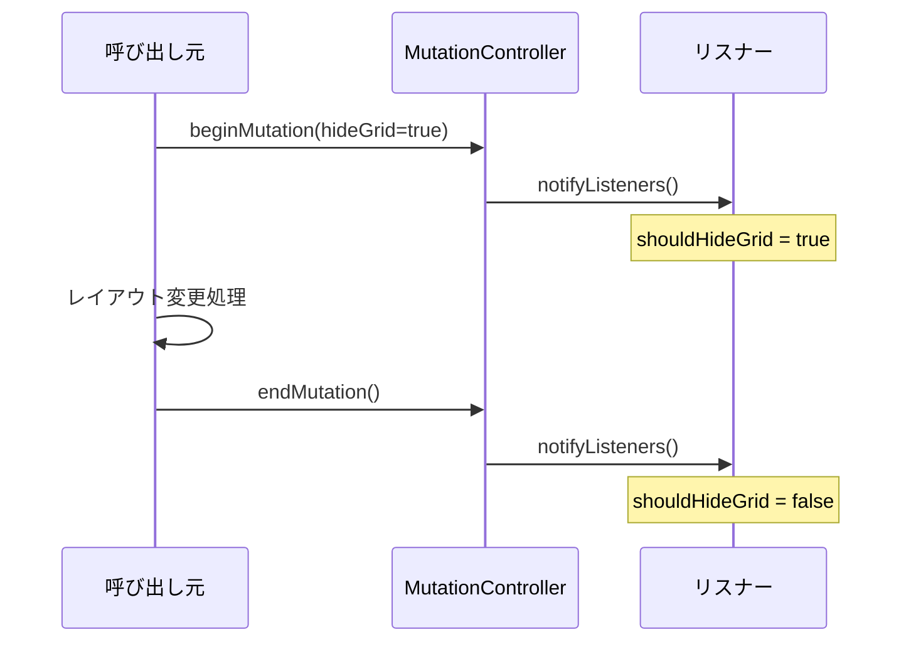
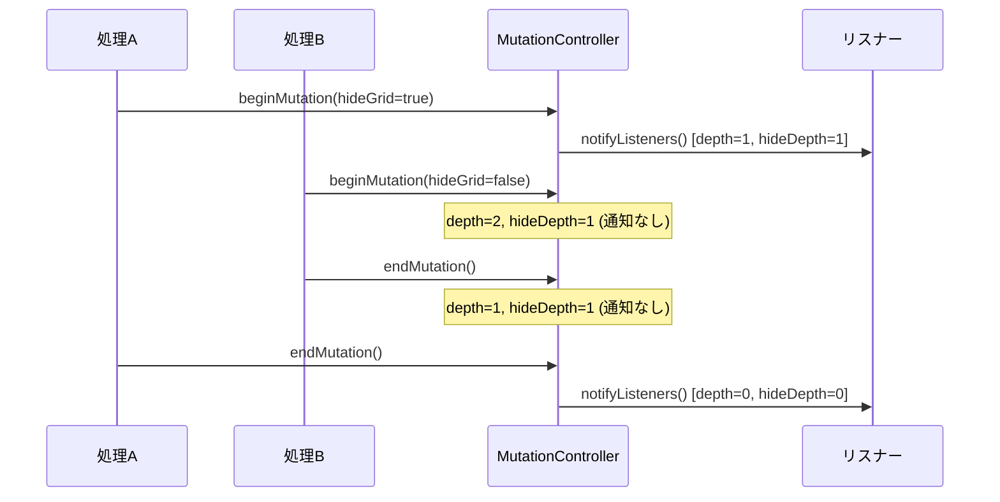

# GridLayoutMutationController

**実装ファイル**: `lib/system/state/grid_layout_mutation_controller.dart`
**作成日**: 2025-10-28
**最終更新**: 2025-11-25
**ステータス**: 実装完了

## 概要

`GridLayoutMutationController` は、グリッドレイアウトの変更（ミューテーション）のライフサイクルを管理する `ChangeNotifier` です。カラム数変更などの大規模なレイアウト変更時に、グリッドを一時的に非表示にする制御を提供します。

### 設計原則

1. **ネスト対応**: 複数の変更が同時に発生する場合のネスト管理
2. **hideGrid フラグ**: 変更の種類に応じた表示制御
3. **不整合検出**: begin/end の呼び出し不一致を検出して自動リセット
4. **デバッグロギング**: 詳細なログ出力で問題追跡を支援

### 解決した問題

- カラム数変更時のレイアウトちらつき
- 複数の変更が同時進行する際の制御
- begin/endの不一致による状態不整合
- ディレクトリ切り替え時の操作不能バグ（2025-11-25修正）

## 主要API

### プロパティ

```dart
bool get isMutating => _depth > 0;
bool get shouldHideGrid => _hideDepth > 0;
bool get debugLoggingEnabled;
set debugLoggingEnabled(bool value);
```

- **isMutating**: ミューテーション中かどうか（深さ > 0）
- **shouldHideGrid**: グリッドを非表示にすべきか（hideDepth > 0）
- **debugLoggingEnabled**: デバッグログの有効/無効

### beginMutation()

ミューテーションの開始を通知します。

#### シグネチャ

```dart
void beginMutation({bool hideGrid = true})
```

#### パラメータ

- **hideGrid**: グリッド全体を非表示にするか
  - `true`: カラム数変更などの大規模変更（デフォルト）
  - `false`: カラム幅のみの変更など、グリッドは表示したまま

#### 処理フロー

```dart
void beginMutation({bool hideGrid = true}) {
  _depth += 1;  // ネストレベルを増加
  _hideStack.add(hideGrid);  // フラグをスタックに保存
  if (hideGrid) {
    _hideDepth += 1;  // 非表示深さを増加
  }

  // フレーム番号トラッキング
  if (_depth == 1) {
    _activeFrameNumber = currentFrameTimeStamp;
    _concurrentFrameBegins = 1;
  } else if (_activeFrameNumber == currentFrameTimeStamp) {
    _concurrentFrameBegins += 1;
  }

  // リスナーに通知（最初のbeginまたは最初のhideGridのみ）
  if (_depth == 1 || (hideGrid && _hideDepth == 1)) {
    notifyListeners();
  }
}
```

### endMutation()

ミューテーションの終了を通知します。

#### シグネチャ

```dart
void endMutation({bool? hideGrid})
```

#### パラメータ

- **hideGrid**: オプショナル。指定時にスタック値と一致チェック

#### 処理フロー

```dart
void endMutation({bool? hideGrid}) {
  resetIfInconsistent();  // 不整合チェック

  if (_depth == 0) return;  // 既に終了済み

  // スタックからフラグを取得
  bool hideFlag = _hideStack.removeLast();

  // 不一致警告（デバッグ時）
  if (hideGrid != null && hideFlag != hideGrid && _debugLoggingEnabled) {
    debugPrint('end mismatched hide flag');
  }

  // 深さを減少
  if (hideFlag && _hideDepth > 0) {
    _hideDepth -= 1;
  }
  _depth -= 1;

  // リスナーに通知（最後のendまたは最後のhideGridのみ）
  if (_depth == 0 || (hideFlag && _hideDepth == 0)) {
    _activeFrameNumber = null;
    _concurrentFrameBegins = 0;
    notifyListeners();
  }
}
```

### resetIfInconsistent()

状態が不整合になっている場合に強制リセットします。

#### 不整合判定基準

```dart
if (_depth > 3 || _hideDepth > 2) {
  // 異常な深さ → リセット
}
```

**通常の使用**: depth は 1〜2 程度、hideDepth は 1 程度
**異常パターン**: begin が連続して3回以上呼ばれている

> **Note (2025-11-25)**: 閾値を `10/5` から `3/2` に下げ、ディレクトリ切り替え時の不整合を早期にリセットするように変更。

### forceReset()

ディレクトリ切り替え時などに呼ばれる強制リセット。不整合状態を即座にクリアして操作不能を防ぎます。

#### シグネチャ

```dart
void forceReset()
```

#### 処理フロー

```dart
void forceReset() {
  if (_depth > 0 || _hideDepth > 0) {
    print(
      '[GridLayoutMutationController] forceReset: '
      'depth=$_depth hideDepth=$_hideDepth',
    );
    _depth = 0;
    _hideDepth = 0;
    _hideStack.clear();
    _activeFrameNumber = null;
    _concurrentFrameBegins = 0;
    notifyListeners();
  }
}
```

#### 使用例

```dart
// main_screen.dart の _ensureDirectorySync() で使用
final mutationController = context.read<GridLayoutMutationController>();
mutationController.forceReset();
```

**追加日**: 2025-11-25
**目的**: GridLayoutSurface の dispose 時にレースコンディションで `endMutation()` が呼ばれないケースへの対策

#### リセット処理

```dart
_depth = 0;
_hideDepth = 0;
_hideStack.clear();
_activeFrameNumber = null;
_concurrentFrameBegins = 0;
notifyListeners();
```

## ミューテーションライフサイクル

### 基本パターン



### ネストパターン



### GridLayoutSurface との統合

```dart
// GridLayoutSurface.dart より
final _mutationController = context.watch<GridLayoutMutationController>();

GridLayoutSurface(
  store: store,
  onMutateStart: (hideGrid) {
    _mutationController.beginMutation(hideGrid: hideGrid);
  },
  onMutateEnd: (hideGrid) {
    _mutationController.endMutation(hideGrid: hideGrid);
  },
)

// リスナー（別のウィジェット）
if (_mutationController.shouldHideGrid) {
  return SizedBox.shrink();  // グリッドを非表示
}
return GridContent();  // グリッド表示
```

## デバッグ機能

### ログ出力

> **Note (2025-11-25)**: `debugPrint` は呼ばれないことがあるため、すべてのログ出力を `print` に変更しました。

すべてのミューテーション操作（`beginMutation`、`endMutation`、`forceReset`、`resetIfInconsistent`）は常にログを出力します。

### ログ出力例

#### beginMutation のログ

```
[GridLayoutMutationController] begin depth=1 frameTime=123456789 concurrentBegins=1 hide=true hideDepth=1 phase=transientCallbacks transientCallbacks=0 time=2025-10-28T10:30:00.000
```

**ログ項目**:
- `depth`: 現在のネストレベル
- `frameTime`: フレームタイムスタンプ（マイクロ秒）
- `concurrentBegins`: 同一フレーム内のbegin回数
- `hide`: hideGridフラグ
- `hideDepth`: 非表示深さ
- `phase`: SchedulerBindingのフェーズ
- `transientCallbacks`: トランジェントコールバック数

#### endMutation のログ

```
[GridLayoutMutationController] end depth=0 frameTime=123456789 hide=true hideDepth=0 phase=postFrameCallbacks transientCallbacks=0 time=2025-10-28T10:30:00.100
```

#### 不整合検出ログ

```
[GridLayoutMutationController] INCONSISTENT STATE DETECTED: depth=4 hideDepth=3 beginCount=4 endCount=0; forcing reset
```

#### forceReset ログ

```
[GridLayoutMutationController] forceReset: depth=1 hideDepth=1
```

### デバッグカウンタ

```dart
int debugBeginCount = 0;  // beginMutation()の累積呼び出し回数
int debugEndCount = 0;    // endMutation()の累積呼び出し回数
```

**用途**: テストやデバッグ時に呼び出し回数を確認

## フレームトラッキング

### activeFrameNumber

現在のミューテーションが開始されたフレームのタイムスタンプ。

```dart
int? _activeFrameNumber;
int _concurrentFrameBegins = 0;
```

**目的**: 同一フレーム内での複数beginを検出

### 使用例

```dart
// フレーム1: 最初のbegin
beginMutation(hideGrid: true);
// _activeFrameNumber = 123456789, _concurrentFrameBegins = 1

// フレーム1: 同じフレームでの2回目のbegin
beginMutation(hideGrid: false);
// _activeFrameNumber = 123456789, _concurrentFrameBegins = 2

// フレーム2: 次のフレームでのbegin
beginMutation(hideGrid: true);
// _activeFrameNumber = 123456900, _concurrentFrameBegins = 1
```

## 通知戦略

### notifyListeners() を呼ぶタイミング

#### beginMutation時

- `_depth == 1`: 最初のbegin
- `hideGrid && _hideDepth == 1`: 最初のhideGrid=true

#### endMutation時

- `_depth == 0`: 最後のend（全ミューテーション終了）
- `hideFlag && _hideDepth == 0`: 最後のhideGrid=true（非表示状態解除）

### 通知の最適化

ネストした変更の途中では通知を抑制し、最初と最後のみ通知することで、不要な再描画を削減します。

```dart
// 例: 3つのネストした変更
beginMutation(hideGrid: true);   // 通知: depth 0→1, hideDepth 0→1
  beginMutation(hideGrid: false); // 通知なし: depth 1→2, hideDepth 1
    beginMutation(hideGrid: true); // 通知なし: depth 2→3, hideDepth 1→2
    endMutation();                 // 通知なし: depth 3→2, hideDepth 2→1
  endMutation();                  // 通知なし: depth 2→1, hideDepth 1
endMutation();                    // 通知: depth 1→0, hideDepth 1→0
```

## エラーハンドリング

### begin/end 不一致

#### 問題パターン

```dart
beginMutation(hideGrid: true);
beginMutation(hideGrid: false);
endMutation(hideGrid: false);  // OK: スタックから取得
endMutation(hideGrid: true);   // ミスマッチ警告（但し動作は継続）
```

#### 検出方法

`endMutation(hideGrid: ...)` のパラメータとスタック値を比較：

```dart
if (hideGrid != null && hideFlag != hideGrid && _debugLoggingEnabled) {
  debugPrint('[GridLayoutMutationController] end mismatched hide flag detected provided=$hideGrid stack=$hideFlag');
}
```

**影響**: 警告ログのみ。スタック値を優先して処理継続

### 深さ異常

`resetIfInconsistent()` が自動的に検出してリセット：

- `_depth > 10`: begin が異常に多い
- `_hideDepth > 5`: hideGrid=true が異常に多い

## パフォーマンス特性

### メモリ使用

- **固定フィールド**: int型 × 6、List × 1（軽量）
- **hideStack**: ネストレベルに比例（通常1〜3要素）

### 計算量

- **beginMutation**: O(1)
- **endMutation**: O(1)
- **resetIfInconsistent**: O(1)

### ChangeNotifier通知

- ネスト中は通知を抑制（効率的）
- 最初と最後のみ通知

## テストガイドライン

### ユニットテストの観点

1. **基本動作**:
   - beginで isMutating = true
   - endで isMutating = false
   - hideGrid=trueで shouldHideGrid = true

2. **ネスト動作**:
   - 複数beginに対応
   - 正しいスタック動作

3. **通知タイミング**:
   - 最初のbeginで通知
   - 最後のendで通知
   - 途中では通知なし

4. **不整合リセット**:
   - depth > 10で自動リセット
   - リセット後にnotifyListeners呼び出し

### テスト例

```dart
test('nested mutations notify only at boundaries', () {
  final controller = GridLayoutMutationController();
  var notifyCount = 0;
  controller.addListener(() => notifyCount++);

  controller.beginMutation(hideGrid: true);  // notifyCount = 1
  expect(controller.isMutating, true);
  expect(controller.shouldHideGrid, true);

  controller.beginMutation(hideGrid: false); // notifyCount = 1 (no change)
  expect(controller.isMutating, true);
  expect(controller.shouldHideGrid, true);

  controller.endMutation();                  // notifyCount = 1 (no change)
  expect(controller.isMutating, true);

  controller.endMutation();                  // notifyCount = 2
  expect(controller.isMutating, false);
  expect(controller.shouldHideGrid, false);

  expect(notifyCount, 2);
});
```

## 実装履歴

- **2025-10-26**: 初期実装（グリッド表示制御）
- **2025-10-27**: フレームトラッキング、不整合検出追加
- **2025-10-28**: ドキュメント作成
- **2025-11-25**: ディレクトリ切り替え時の操作不能バグ修正
  - `forceReset()` メソッド追加
  - `resetIfInconsistent()` の閾値を `10/5` → `3/2` に変更
  - `debugPrint` を `print` に変更（確実なログ出力のため）

## 関連ドキュメント

- [GridLayoutSurface](./grid_layout_surface.md) - ミューテーションコントローラーを使用するSurface
- [Grid Rendering Pipeline](../architecture/grid_rendering_pipeline.md) - ミューテーションの全体フロー
- [State Management](./state_management.md) - 状態管理の全体像

## 今後の拡張

### 考えられる改善点

1. **ミューテーション種別の拡張**: hideGrid 以外の制御フラグ（例: disableScrolling）
2. **タイムアウト検出**: 異常に長いミューテーションを検出
3. **統計情報**: 平均ミューテーション時間、最大ネスト深さなど

### 破壊的変更の可能性

現時点では、APIは安定しており破壊的変更の予定はありません。
