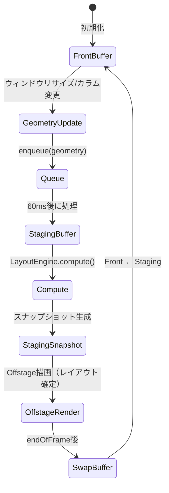
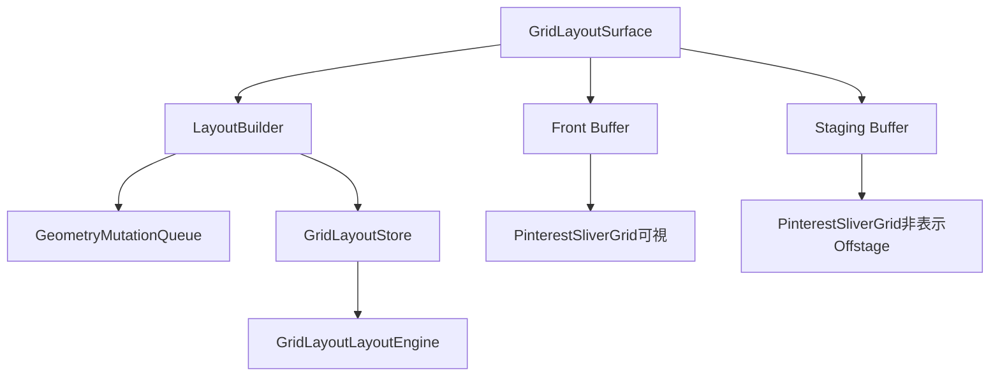
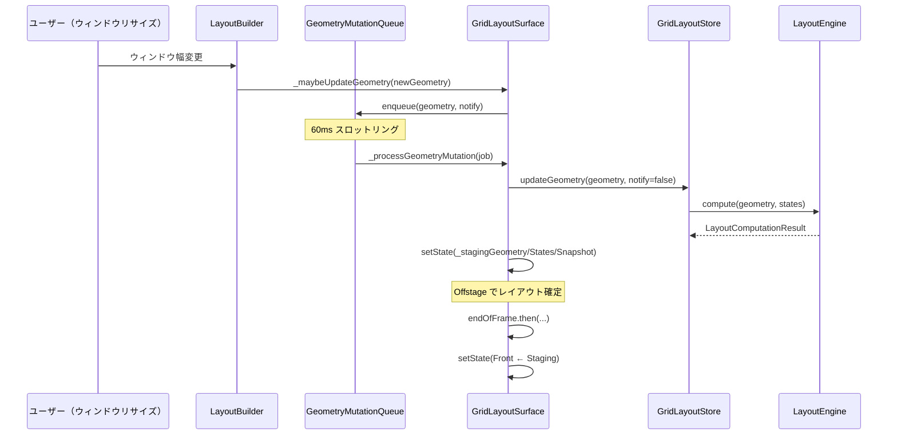
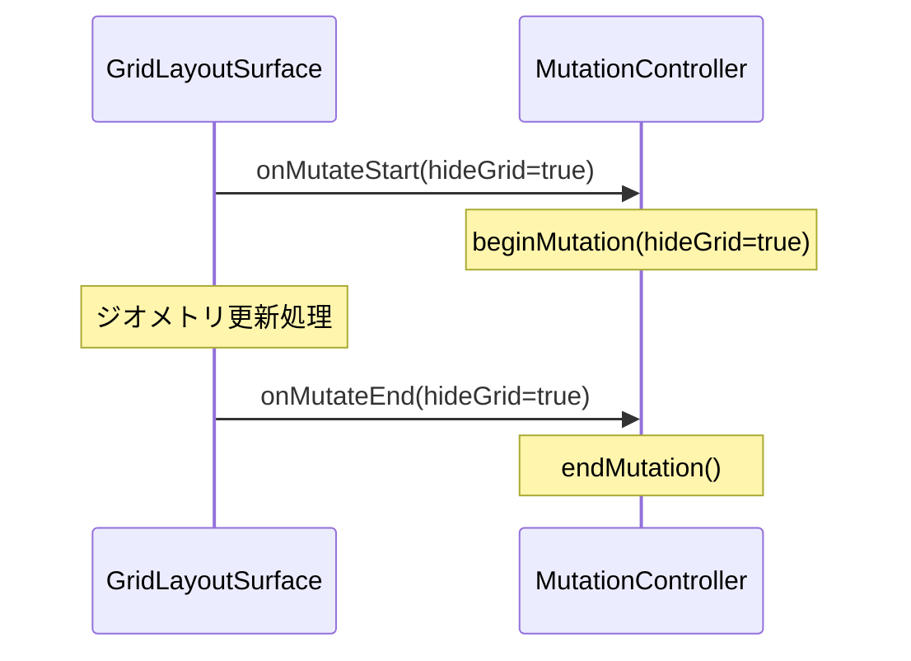

# GridLayoutSurface

**実装ファイル**: `lib/ui/widgets/grid_layout_surface.dart`
**作成日**: 2025-10-28
**最終更新**: 2025-11-28
**ステータス**: 実装完了

## 概要

`GridLayoutSurface` は、グリッドレイアウトのレンダリングを管理するSurfaceレイヤーのウィジェットです。Front/Stagingダブルバッファアーキテクチャを採用し、ジオメトリ変更時のスムーズな遷移を実現しています。

> **Recent Updates (2025-11-28)**: アクセシビリティ機能（セマンティクス）を完全に削除しました。イラストレーター向けアプリのため、スクリーンリーダー対応は不要と判断。コードベースを簡素化し、レンダリングパフォーマンスを向上させました。

> **Recent Updates (2025-11-02)**: スナップショット再生成はSurface層ではなく、GridLayoutStore層（`lib/system/state/grid_layout_store.dart`）で実施されます。`updateCard()`および`updateGeometry()`メソッドが新しいスナップショットを生成し、Surfaceはそれを受け取ってレンダリングします。詳細は`docs/system/grid_layout_store_migration.md#snapshot-regeneration-pattern-2025-11-02`を参照してください。

### 設計原則

1. **ダブルバッファリング**: Front/Stagingバッファによるスムーズなレイアウト更新
2. **スロットリング**: 60msのスロットリングでウィンドウリサイズ時のパフォーマンス最適化
3. **ステートレスレンダリング**: スナップショットベースの純粋な描画

### 解決した問題

このアーキテクチャは以下の問題を解決します：

- **ウィンドウリサイズ時のパフォーマンス**: 連続的なジオメトリ更新の最適化
- **レイアウトのちらつき**: バッファスワップによるスムーズな遷移
- **ディレクトリ切り替え時の操作不能**: ミューテーションフラグのレースコンディション（2025-11-25修正）

## アーキテクチャ概要

### ダブルバッファパターン



### コンポーネント構成



## 主要API

### コンストラクタ

```dart
const GridLayoutSurface({
  Key? key,
  required GridLayoutSurfaceStore store,
  required GridLayoutChildBuilder childBuilder,
  required double columnGap,
  required EdgeInsets padding,
  required GridColumnCountResolver resolveColumnCount,
  void Function(bool hideGrid)? onMutateStart,
  void Function(bool hideGrid)? onMutateEnd,
  bool geometryQueueEnabled = true,
})
```

#### パラメータ

- **store**: `GridLayoutStore` インスタンス（状態管理）
- **childBuilder**: グリッドコンテンツをビルドするコールバック
- **columnGap**: カード間のギャップ（ピクセル）
- **padding**: グリッド全体のパディング
- **resolveColumnCount**: 利用可能幅からカラム数を決定する関数
- **onMutateStart**: ジオメトリ変更開始時のコールバック
- **onMutateEnd**: ジオメトリ変更終了時のコールバック
- **geometryQueueEnabled**: ジオメトリキュー（スロットリング）の有効化（デフォルト: true）

### GridLayoutChildBuilder

```dart
typedef GridLayoutChildBuilder = Widget Function(
  BuildContext context,
  GridLayoutGeometry geometry,
  List<GridCardViewState> states,
  LayoutSnapshot? snapshot,
  {bool isStaging}
);
```

**役割**: Front/StagingバッファそれぞれでPinterestSliverGridをビルド

### GridColumnCountResolver

```dart
typedef GridColumnCountResolver = int Function(double availableWidth);
```

**役割**: ウィンドウ幅に応じたカラム数の動的決定

## Front/Stagingバッファシステム

### バッファ変数

#### Frontバッファ（表示中）

```dart
GridLayoutGeometry? _frontGeometry;
List<GridCardViewState>? _frontStates;
LayoutSnapshot? _frontSnapshot;
```

**用途**: 現在ユーザーに表示されているレイアウト

#### Stagingバッファ（準備中）

```dart
GridLayoutGeometry? _stagingGeometry;
List<GridCardViewState>? _stagingStates;
LayoutSnapshot? _stagingSnapshot;
```

**用途**: 次フレームでスワップする準備中のレイアウト（Offstageで描画）

### バッファスワップフロー



## ジオメトリ更新処理

### _maybeUpdateGeometry()

ウィンドウリサイズ時にジオメトリ変更を検知し、キューに追加します。

#### 処理フロー

```dart
void _maybeUpdateGeometry(GridLayoutGeometry geometry) {
  final previous = _lastReportedGeometry;
  if (previous != null && _geometryEquals(previous, geometry)) {
    return;  // 変更なし
  }

  _lastReportedGeometry = geometry;

  // カラム数変更時は notify=true、幅のみ変更時は notify=false
  final shouldNotify = previous == null ||
                       previous.columnCount != geometry.columnCount;

  _geometryQueue.enqueue(geometry, notify: shouldNotify);
}
```

#### geometryQueueEnabled = false の場合

テスト環境やデバッグ時には、キューを無効化して即座に更新できます。

```dart
if (!widget.geometryQueueEnabled) {
  WidgetsBinding.instance.addPostFrameCallback((_) {
    _store.updateGeometry(geometry, notify: false);
    setState(() {
      _frontGeometry = geometry;
      _frontStates = _cloneStates(_store.viewStates);
      _frontSnapshot = _store.latestSnapshot;
    });
  });
  return;
}
```

### GeometryMutationQueue

ジオメトリ更新のスロットリングとシーケンシャル処理を担当。

#### 主要メソッド

```dart
void enqueue(GridLayoutGeometry geometry, {required bool notify})
```

- 最新のジオメトリのみ保持（古いリクエストは破棄）
- 60ms スロットリング（`_throttle` パラメータで設定可能）
- `GeometryMutationTicket` でキャンセル検出

#### チケットシステム

```dart
class GeometryMutationTicket {
  bool get isCancelled => _queue._latestSequence != _id;
}
```

**目的**: 古いジョブが実行中に新しいジョブがエンキューされた場合、古いジョブをスキップ

### _processGeometryMutation()

エンキューされたジオメトリ更新を実際に処理します。

#### 処理ステップ

1. **onMutateStart コールバック**: `widget.onMutateStart?.call(notify)`
2. **Storeに反映**: `_store.updateGeometry(geometry, notify: notify)`
3. **Stagingバッファ設定**: `setState(_stagingGeometry/States/Snapshot)`
4. **Mutation終了スケジュール**: `_scheduleMutationEnd()`
5. **バッファスワップ**: `setState(Front ← Staging)`

#### コード構造

```dart
Future<void> _processGeometryMutation(GeometryMutationJob job) async {
  // 1. 変更開始通知
  _mutationInProgress = true;
  widget.onMutateStart?.call(notify);

  // 2. postFrameCallbackでストア更新
  WidgetsBinding.instance.addPostFrameCallback((_) {
    _store.updateGeometry(geometry, notify: notify);
    setState(() {
      _stagingGeometry = geometry;
      _stagingStates = _cloneStates(_store.viewStates);
      _stagingSnapshot = _store.latestSnapshot;
    });

    // 3. mutation終了スケジュール
    _scheduleMutationEnd(notify).whenComplete(() {
      setState(() {
        // 4. バッファスワップ
        _frontGeometry = _stagingSnapshot?.geometry ?? _stagingGeometry;
        _frontStates = _stagingStates;
        _frontSnapshot = _stagingSnapshot;
        _stagingGeometry = null;
        _stagingStates = null;
        _stagingSnapshot = null;
      });
    });
  });
}
```

## ミューテーションライフサイクル

### onMutateStart / onMutateEnd

ジオメトリ変更の開始・終了を外部に通知します（`GridLayoutMutationController` と連携）。

### _mutationInProgress フラグ

ミューテーション中かどうかを追跡するインスタンス変数です。

```dart
bool _mutationInProgress = false;
```

#### フラグ設定順序（重要）

> **Bug Fix (2025-11-25)**: レースコンディション対策として、`_mutationInProgress` フラグは `onMutateStart` コールバックの**前**に設定する必要があります。

**修正前（バグあり）**:
```dart
widget.onMutateStart?.call(notify);  // beginMutation() 呼び出し (depth++)
_mutationInProgress = true;          // フラグが AFTER に設定される
```

**修正後（正しい順序）**:
```dart
_mutationInProgress = true;          // フラグを FIRST に設定
widget.onMutateStart?.call(notify);  // その後で beginMutation() 呼び出し
```

**理由**: `onMutateStart` と `_mutationInProgress = true` の間に `dispose()` が呼ばれた場合、`dispose()` は `_mutationInProgress` が `false` なので `onMutateEnd` を呼ばない。これにより `GridLayoutMutationController._depth` が永続的にインクリメントされたままになり、`isMutating` が `true` のまま、`IgnorePointer(ignoring: true)` でUIが操作不能になる。

#### dispose() での cleanup

```dart
@override
void dispose() {
  if (_mutationInProgress) {
    // フラグがtrueなら確実にendMutationを呼ぶ
    widget.onMutateEnd?.call(true);
  }
  super.dispose();
}
```

#### 呼び出しタイミング



#### hideGrid パラメータ

- **true**: カラム数変更時（グリッド全体を一時非表示）
- **false**: カラム幅のみ変更時（グリッドは表示したまま）

### _scheduleMutationEnd()

ミューテーション終了のスケジューリングを行います。

```dart
Future<void> _scheduleMutationEnd(bool hideGrid) {
  final completer = Completer<void>();

  void finish() {
    final callback = widget.onMutateEnd;
    _mutationInProgress = false;

    if (!mounted) {
      callback?.call(hideGrid);
      if (!completer.isCompleted) {
        completer.complete();
      }
      return;
    }
    callback?.call(hideGrid);
    _debugLog('mutate_end hide=$hideGrid');
    if (!completer.isCompleted) {
      completer.complete();
    }
  }

  WidgetsBinding.instance.addPostFrameCallback((_) => finish());
  return completer.future;
}
```

## ビルド処理

### build() メソッド

```dart
Widget build(BuildContext context) {
  return LayoutBuilder(
    builder: (context, constraints) {
      // 1. ジオメトリ計算
      final geometry = _calculateGeometry(constraints);

      // 2. ジオメトリ更新エンキュー
      _maybeUpdateGeometry(geometry);

      // 3. Frontバッファでコンテンツビルド
      final frontChild = _buildGridContent(
        frontGeometry, frontStates, frontSnapshot,
        isStaging: false,
      );

      // 4. Stagingバッファ（Offstage）
      final stagingChild = _stagingGeometry != null
          ? Offstage(child: _buildGridContent(staging..., isStaging: true))
          : null;

      // 5. Stack合成
      return Stack(children: [frontChild, stagingChild]);
    },
  );
}
```

### _buildGridContent()

個別バッファのコンテンツをビルドします。

```dart
Widget _buildGridContent(
  BuildContext context,
  GridLayoutGeometry geometry,
  List<GridCardViewState> states, {
  LayoutSnapshot? snapshot,
  required bool isStaging,
}) {
  Widget child = widget.childBuilder(
    context, geometry, states, snapshot,
    isStaging: isStaging,
  );

  if (widget.padding != EdgeInsets.zero) {
    child = Padding(padding: widget.padding, child: child);
  }

  return child;
}
```

## デバッグとログ

### ログイベント

以下のイベントがデバッグログに記録されます：

- `front_snapshot_updated id=layout_snapshot_000001` - Frontバッファ更新
- `staging_snapshot_ready id=layout_snapshot_000002` - Stagingバッファ準備完了
- `front_snapshot_swapped id=layout_snapshot_000002` - バッファスワップ完了
- `geometry_enqueued prev=... next=...` - ジオメトリキュー追加
- `geometry_commit geometry=... notify=...` - ジオメトリコミット

## パフォーマンス特性

### スロットリング効果

#### ウィンドウリサイズ時

- **スロットリングなし**: 毎フレーム更新（60fps → 60回/秒のレイアウト計算）
- **60ms スロットリング**: 最大16.6回/秒のレイアウト計算
- **削減率**: 約72%のレイアウト計算削減

#### メモリフットプリント

- **Frontバッファ**: カード数に比例（viewStates + snapshot）
- **Stagingバッファ**: 変更中のみ（通常はnull）

### レンダリングコスト

- **Offstage**: レイアウトは実行されるがペイントはスキップ（コスト低）
- **ダブルバッファ**: メモリ使用は2倍だが、スムーズな遷移を実現

## エラーハンドリング

### キャンセル検出

```dart
if (!mounted || job.ticket.isCancelled) {
  return;  // 処理中止
}
```

**タイミング**:
- 各非同期処理の前後
- フレームコールバック内
- タイマーコールバック内

### エラーキャッチ

```dart
try {
  // 更新処理
} catch (error, stackTrace) {
  _debugLog('error: $error');
  debugPrintStack(stackTrace: stackTrace);
}
```

## テストガイドライン

### ユニットテストの観点

1. **ジオメトリ更新**:
   - カラム数変更時に `notify=true`
   - 幅のみ変更時に `notify=false`
   - 同じジオメトリでは更新なし

2. **バッファスワップ**:
   - Staging → Front の正しい移行
   - スナップショットIDの一致

3. **エッジケース**:
   - ウィジェット破棄（`!mounted`）時の処理中断
   - ジョブキャンセル時のスキップ

### ウィジェットテスト

```dart
testWidgets('geometry change triggers buffer swap', (tester) async {
  await tester.pumpWidget(GridLayoutSurface(...));

  // ウィンドウリサイズ
  tester.binding.window.physicalSizeTestValue = Size(800, 600);
  await tester.pump();

  // スロットリング待機
  await tester.pump(Duration(milliseconds: 60));

  // バッファスワップ待機
  await tester.pump();
  await tester.pump();

  expect(find.byType(PinterestSliverGrid), findsOneWidget);
});
```

## 実装履歴

- **2025-10-26**: 初期実装
- **2025-10-27**: ダブルバッファ導入
- **2025-10-28**: ドキュメント作成
- **2025-11-25**: ディレクトリ切り替え時の操作不能バグ修正
  - `_mutationInProgress` フラグ設定順序の修正（レースコンディション対策）
  - `dispose()` で `_mutationInProgress` チェック後に `onMutateEnd` を呼ぶように修正
- **2025-11-28**: アクセシビリティ機能（セマンティクス）を完全削除
  - コードベース簡素化、レンダリングパフォーマンス向上

## 関連ドキュメント

- [GridLayoutLayoutEngine](./grid_layout_layout_engine.md) - レイアウト計算エンジン
- [GridLayoutMutationController](./grid_layout_mutation_controller.md) - ミューテーション制御
- [GeometryMutationQueue](#geometrymutationqueue) - ジオメトリキュー

## 今後の拡張

### 考えられる改善点

1. **適応的スロットリング**: ウィンドウリサイズ速度に応じた動的スロットリング
2. **トランジションアニメーション**: バッファスワップ時のフェードイン/アウト
3. **パフォーマンスモニタリング**: バッファスワップ時間の計測とログ
4. **メモリ最適化**: 大量カード時のStagingバッファの選択的レンダリング

### 破壊的変更の可能性

現時点では、APIは安定しており破壊的変更の予定はありません。内部実装の最適化は継続的に行われます。
