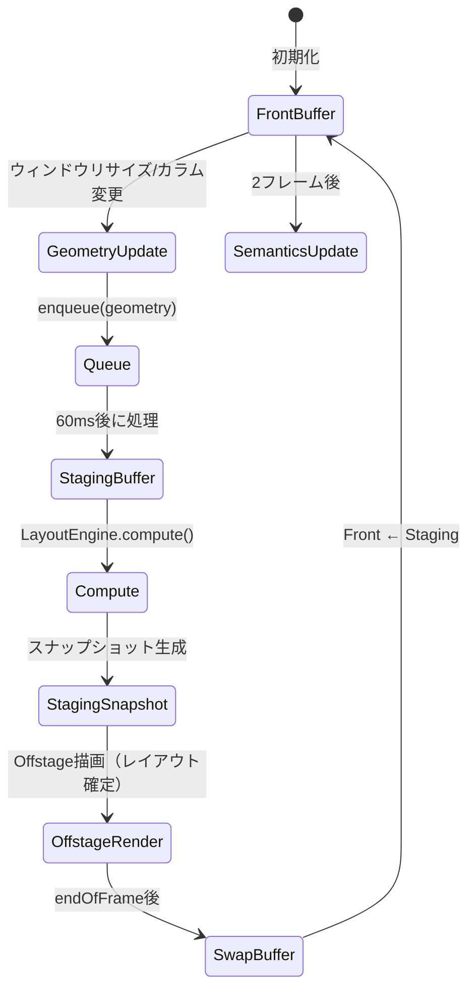
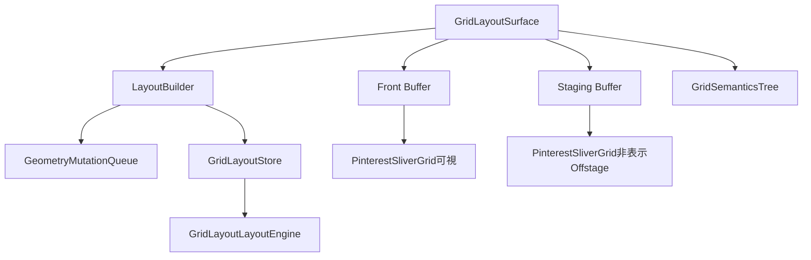
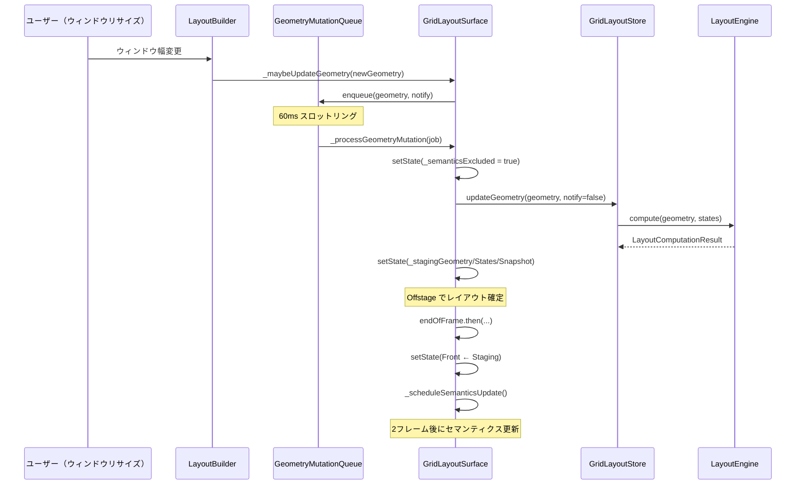
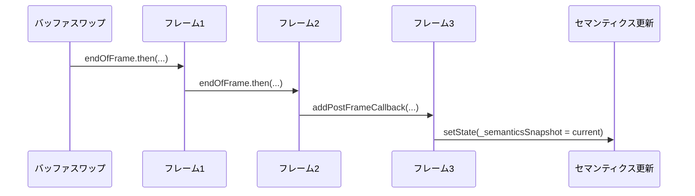
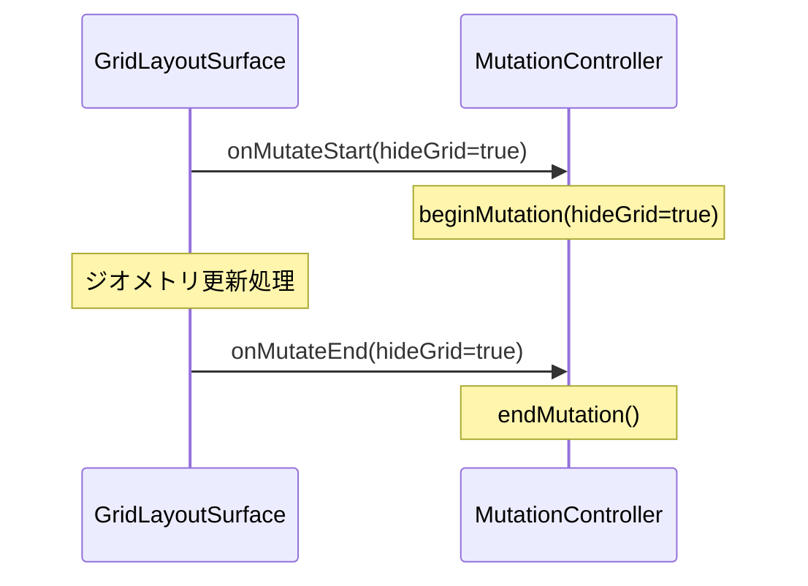

# GridLayoutSurface

**実装ファイル**: `lib/ui/widgets/grid_layout_surface.dart`
**作成日**: 2025-10-28
**最終更新**: 2025-11-02
**ステータス**: 実装完了

## 概要

`GridLayoutSurface` は、グリッドレイアウトのレンダリングを管理するSurfaceレイヤーのウィジェットです。Front/Backダブルバッファアーキテクチャを採用し、ジオメトリ変更時のスムーズな遷移とセマンティクスアサーションの防止を実現しています。

> **Recent Updates (2025-11-02)**: スナップショット再生成はSurface層ではなく、GridLayoutStore層（`lib/system/state/grid_layout_store.dart`）で実施されます。`updateCard()`および`updateGeometry()`メソッドが新しいスナップショットを生成し、Surfaceはそれを受け取ってレンダリングします。詳細は`docs/system/grid_layout_store_migration.md#snapshot-regeneration-pattern-2025-11-02`を参照してください。

### 設計原則

1. **ダブルバッファリング**: Front/Stagingバッファによるスムーズなレイアウト更新
2. **セマンティクス管理**: レイアウト更新中のセマンティクスツリー破損を防止
3. **スロットリング**: 60msのスロットリングでウィンドウリサイズ時のパフォーマンス最適化
4. **ステートレスレンダリング**: スナップショットベースの純粋な描画

### 解決した問題

このアーキテクチャは以下の問題を解決します：

- **セマンティクスアサーション**: `!_needsLayout`、`parentDataDirty` エラー
- **ウィンドウリサイズ時のパフォーマンス**: 連続的なジオメトリ更新の最適化
- **レイアウトのちらつき**: バッファスワップによるスムーズな遷移

## アーキテクチャ概要

### ダブルバッファパターン



### コンポーネント構成



## 主要API

### コンストラクタ

```dart
const GridLayoutSurface({
  Key? key,
  required GridLayoutSurfaceStore store,
  required GridLayoutChildBuilder childBuilder,
  required double columnGap,
  required EdgeInsets padding,
  required GridColumnCountResolver resolveColumnCount,
  void Function(bool hideGrid)? onMutateStart,
  void Function(bool hideGrid)? onMutateEnd,
  bool semanticsOverlayEnabled = true,
  bool geometryQueueEnabled = true,
})
```

#### パラメータ

- **store**: `GridLayoutStore` インスタンス（状態管理）
- **childBuilder**: グリッドコンテンツをビルドするコールバック
- **columnGap**: カード間のギャップ（ピクセル）
- **padding**: グリッド全体のパディング
- **resolveColumnCount**: 利用可能幅からカラム数を決定する関数
- **onMutateStart**: ジオメトリ変更開始時のコールバック
- **onMutateEnd**: ジオメトリ変更終了時のコールバック
- **semanticsOverlayEnabled**: セマンティクスオーバーレイの有効化（デフォルト: true）
- **geometryQueueEnabled**: ジオメトリキュー（スロットリング）の有効化（デフォルト: true）

### GridLayoutChildBuilder

```dart
typedef GridLayoutChildBuilder = Widget Function(
  BuildContext context,
  GridLayoutGeometry geometry,
  List<GridCardViewState> states,
  LayoutSnapshot? snapshot,
  {bool isStaging}
);
```

**役割**: Front/StagingバッファそれぞれでPinterestSliverGridをビルド

### GridColumnCountResolver

```dart
typedef GridColumnCountResolver = int Function(double availableWidth);
```

**役割**: ウィンドウ幅に応じたカラム数の動的決定

## Front/Backバッファシステム

### バッファ変数

#### Frontバッファ（表示中）

```dart
GridLayoutGeometry? _frontGeometry;
List<GridCardViewState>? _frontStates;
LayoutSnapshot? _frontSnapshot;
```

**用途**: 現在ユーザーに表示されているレイアウト

#### Stagingバッファ（準備中）

```dart
GridLayoutGeometry? _stagingGeometry;
List<GridCardViewState>? _stagingStates;
LayoutSnapshot? _stagingSnapshot;
```

**用途**: 次フレームでスワップする準備中のレイアウト（Offstageで描画）

#### Semanticsバッファ

```dart
LayoutSnapshot? _semanticsSnapshot;
```

**用途**: セマンティクスツリーオーバーレイ用（GridSemanticsTreeで描画）

### バッファスワップフロー



## ジオメトリ更新処理

### _maybeUpdateGeometry()

ウィンドウリサイズ時にジオメトリ変更を検知し、キューに追加します。

#### 処理フロー

```dart
void _maybeUpdateGeometry(GridLayoutGeometry geometry) {
  final previous = _lastReportedGeometry;
  if (previous != null && _geometryEquals(previous, geometry)) {
    return;  // 変更なし
  }

  _lastReportedGeometry = geometry;

  // カラム数変更時は notify=true、幅のみ変更時は notify=false
  final shouldNotify = previous == null ||
                       previous.columnCount != geometry.columnCount;

  _geometryQueue.enqueue(geometry, notify: shouldNotify);
}
```

#### geometryQueueEnabled = false の場合

テスト環境やデバッグ時には、キューを無効化して即座に更新できます。

```dart
if (!widget.geometryQueueEnabled) {
  WidgetsBinding.instance.addPostFrameCallback((_) {
    _store.updateGeometry(geometry, notify: false);
    setState(() {
      _frontGeometry = geometry;
      _frontStates = _cloneStates(_store.viewStates);
      _frontSnapshot = _store.latestSnapshot;
    });
    _scheduleSemanticsUpdate();
  });
  return;
}
```

### GeometryMutationQueue

ジオメトリ更新のスロットリングとシーケンシャル処理を担当。

#### 主要メソッド

```dart
void enqueue(GridLayoutGeometry geometry, {required bool notify})
```

- 最新のジオメトリのみ保持（古いリクエストは破棄）
- 60ms スロットリング（`_throttle` パラメータで設定可能）
- `GeometryMutationTicket` でキャンセル検出

#### チケットシステム

```dart
class GeometryMutationTicket {
  bool get isCancelled => _queue._latestSequence != _id;
}
```

**目的**: 古いジョブが実行中に新しいジョブがエンキューされた場合、古いジョブをスキップ

### _processGeometryMutation()

エンキューされたジオメトリ更新を実際に処理します。

#### 処理ステップ

1. **セマンティクス除外**: `_semanticsExcluded = true`
2. **未完了のセマンティクス待機**: `_hasPendingSemanticsUpdates()` で確認
3. **onMutateStart コールバック**: `widget.onMutateStart?.call(notify)`
4. **Storeに反映**: `_store.updateGeometry(geometry, notify: notify)`
5. **Stagingバッファ設定**: `setState(_stagingGeometry/States/Snapshot)`
6. **Mutation終了スケジュール**: `_scheduleMutationEnd()`
7. **バッファスワップ**: `setState(Front ← Staging)`
8. **セマンティクス更新**: `_scheduleSemanticsUpdate()`

#### コード構造

```dart
Future<void> _processGeometryMutation(GeometryMutationJob job) async {
  // 1. セマンティクス除外
  setState(() {
    _semanticsExcluded = true;
  });

  // 2. 未完了のセマンティクス待機
  if (_hasPendingSemanticsUpdates()) {
    await _waitForSemantics();
  }

  // 3. 変更開始通知
  widget.onMutateStart?.call(notify);
  _mutationInProgress = true;

  // 4. postFrameCallbackでストア更新
  WidgetsBinding.instance.addPostFrameCallback((_) {
    _store.updateGeometry(geometry, notify: notify);
    setState(() {
      _stagingGeometry = geometry;
      _stagingStates = _cloneStates(_store.viewStates);
      _stagingSnapshot = _store.latestSnapshot;
    });

    // 5. mutation終了スケジュール
    _scheduleMutationEnd(notify, job.ticket).whenComplete(() {
      setState(() {
        // 6. バッファスワップ
        _frontGeometry = _stagingSnapshot?.geometry ?? _stagingGeometry;
        _frontStates = _stagingStates;
        _frontSnapshot = _stagingSnapshot;
        _stagingGeometry = null;
        _stagingStates = null;
        _stagingSnapshot = null;
      });
      _scheduleSemanticsUpdate();
    });
  });
}
```

## セマンティクス管理

### セマンティクスアサーション問題

**問題**: PinterestSliverGrid のレイアウト中にセマンティクスツリー更新が発生すると、以下のアサーションが発生：

- `!_needsLayout`: レイアウト未完了のRenderObjectにセマンティクス更新
- `parentDataDirty`: ParentDataが未確定の状態でセマンティクス参照

**解決策**: 3段階のセマンティクス管理

1. **Exclude during mutation**: 変更中は `ExcludeSemantics(excluding: true)`
2. **Deferred overlay**: 独立した `GridSemanticsTree` オーバーレイ
3. **2-frame delay**: レイアウト完了を保証する2フレーム遅延

### _scheduleSemanticsUpdate()

セマンティクスツリーオーバーレイの更新をスケジュールします。

#### 更新条件

```dart
if (!widget.semanticsOverlayEnabled) return;

final target = _frontSnapshot;
if (target == null) return;

if (_semanticsSnapshot?.id == target.id || _semanticsUpdateScheduled) {
  return;  // 既に同じスナップショットまたはスケジュール済み
}
```

#### 2フレーム遅延パターン



#### 実装

```dart
void _scheduleNextFrameSemanticsUpdate(VoidCallback updateCallback) {
  // 1フレーム目の終わりまで待つ
  SchedulerBinding.instance.endOfFrame.then((_) {
    // 2フレーム目の終わりまで待つ
    SchedulerBinding.instance.endOfFrame.then((_) {
      // 3フレーム目のpostFrameCallbacksで実行
      WidgetsBinding.instance.addPostFrameCallback((_) {
        _semanticsUpdateScheduled = false;
        updateCallback();
      });
    }).catchError((error) {
      _debugLog('endOfFrame(2nd) error: $error');
      _semanticsUpdateScheduled = false;
    });
  }).catchError((error) {
    _debugLog('endOfFrame(1st) error: $error');
    _semanticsUpdateScheduled = false;
  });
}
```

**タイムアウト**: 3秒（異常時の保険）

### _hasPendingSemanticsUpdates()

未完了のセマンティクス更新があるか確認します。

#### チェック項目

```dart
bool _hasPendingSemanticsUpdates() {
  // 1. PipelineOwner.semanticsOwnerNeedsUpdate (Flutter 3.22+)
  final needsUpdate = pipelineOwner.semanticsOwnerNeedsUpdate;
  if (needsUpdate) return true;

  // 2. SemanticsOwner の存在とリスナー
  final semanticsOwner = pipelineOwner.semanticsOwner;
  if (semanticsOwner == null || !semanticsOwner.hasListeners) {
    return false;
  }

  // 3. SemanticsBinding.hasScheduledSemanticsUpdate
  final hasScheduled = semanticsBinding.hasScheduledSemanticsUpdate;
  if (hasScheduled) return true;

  return false;
}
```

**互換性**: Flutter 3.22以前のバージョンでは一部プロパティが存在しない可能性あり（try-catchでガード）

### GridSemanticsTree オーバーレイ

セマンティクスツリーを独立したウィジェットとして描画します。

#### build() での配置

```dart
final stackChildren = [frontChild];

// Stagingバッファ（Offstage）
if (_stagingGeometry != null && _stagingStates != null) {
  stackChildren.add(
    Offstage(
      offstage: true,
      child: _buildGridContent(/* staging */, isStaging: true),
    ),
  );
}

// セマンティクスオーバーレイ
if (semanticsSnapshot != null) {
  stackChildren.add(
    IgnorePointer(
      child: GridSemanticsTree(
        snapshot: semanticsSnapshot,
        textDirection: textDirection,
      ),
    ),
  );
}

return Stack(children: stackChildren);
```

**利点**:
- グリッド本体のレイアウトと独立
- `IgnorePointer` で入力イベントを通過
- スナップショットベースで不変

## ミューテーションライフサイクル

### onMutateStart / onMutateEnd

ジオメトリ変更の開始・終了を外部に通知します（`GridLayoutMutationController` と連携）。

#### 呼び出しタイミング



#### hideGrid パラメータ

- **true**: カラム数変更時（グリッド全体を一時非表示）
- **false**: カラム幅のみ変更時（グリッドは表示したまま）

### _scheduleMutationEnd()

ミューテーション終了のスケジューリングを行います。

#### セマンティクス待機ロジック

```dart
final shouldWaitForSemantics = _semanticsExcluded && hideGrid;
if (!shouldWaitForSemantics) {
  // 即座に終了
  WidgetsBinding.instance.addPostFrameCallback((_) => finish());
  return;
}

// セマンティクス待機
void scheduleNextWait() {
  SchedulerBinding.instance.endOfFrame.then((_) {
    if (_hasPendingSemanticsUpdates()) {
      retries += 1;
      if (retries >= maxRetries) {
        finish();  // 最大8回リトライ
        return;
      }
      scheduleNextWait();
      return;
    }
    finish();
  });
}
```

**タイムアウト**:
- **相対タイムアウト**: 最大8回リトライ（各フレーム16.6ms × 8 = 約133ms）
- **絶対タイムアウト**: 5秒

## ビルド処理

### build() メソッド

```dart
Widget build(BuildContext context) {
  return LayoutBuilder(
    builder: (context, constraints) {
      // 1. ジオメトリ計算
      final geometry = _calculateGeometry(constraints);

      // 2. ジオメトリ更新エンキュー
      _maybeUpdateGeometry(geometry);

      // 3. Frontバッファでコンテンツビルド
      final frontChild = _buildGridContent(
        frontGeometry, frontStates, frontSnapshot,
        excludeSemantics: _semanticsExcluded,
      );

      // 4. Stagingバッファ（Offstage）
      final stagingChild = _stagingGeometry != null
          ? Offstage(child: _buildGridContent(staging...))
          : null;

      // 5. セマンティクスオーバーレイ
      final semanticsOverlay = _semanticsSnapshot != null
          ? GridSemanticsTree(snapshot: _semanticsSnapshot)
          : null;

      // 6. Stack合成
      return Stack(children: [frontChild, stagingChild, semanticsOverlay]);
    },
  );
}
```

### _buildGridContent()

個別バッファのコンテンツをビルドします。

```dart
Widget _buildGridContent(
  BuildContext context,
  GridLayoutGeometry geometry,
  List<GridCardViewState> states, {
  LayoutSnapshot? snapshot,
  required bool excludeSemantics,
  required bool isStaging,
}) {
  Widget child = widget.childBuilder(
    context, geometry, states, snapshot,
    isStaging: isStaging,
  );

  if (widget.padding != EdgeInsets.zero) {
    child = Padding(padding: widget.padding, child: child);
  }

  return ExcludeSemantics(
    excluding: excludeSemantics,
    child: child,
  );
}
```

## デバッグとログ

### ログイベント

以下のイベントがデバッグログに記録されます：

- `front_snapshot_updated id=layout_snapshot_000001` - Frontバッファ更新
- `staging_snapshot_ready id=layout_snapshot_000002` - Stagingバッファ準備完了
- `front_snapshot_swapped id=layout_snapshot_000002` - バッファスワップ完了
- `geometry_enqueued prev=... next=...` - ジオメトリキュー追加
- `geometry_commit geometry=... notify=...` - ジオメトリコミット

### セマンティクスステータスログ

```dart
void _logSemanticsStatus(String label) {
  final semanticsOwner = pipelineOwner.semanticsOwner;
  final needsUpdate = pipelineOwner.semanticsOwnerNeedsUpdate;
  final semanticsEnabled = SemanticsBinding.instance?.semanticsEnabled;
  final phase = SchedulerBinding.instance.schedulerPhase;

  debugPrint(
    '[GridLayoutSurface] semantics $label '
    'hasOwner=$hasOwner needsUpdate=$needsUpdate '
    'semanticsEnabled=$semanticsEnabled schedulerPhase=$phase',
  );
}
```

**ログポイント**:
- `commit_start notify=true/false`
- `schedule_end_immediate` - セマンティクス待機なし
- `schedule_end_soft` - 軽量待機
- `schedule_end_hard` - セマンティクス待機あり
- `mutate_end hide=true/false`

## パフォーマンス特性

### スロットリング効果

#### ウィンドウリサイズ時

- **スロットリングなし**: 毎フレーム更新（60fps → 60回/秒のレイアウト計算）
- **60ms スロットリング**: 最大16.6回/秒のレイアウト計算
- **削減率**: 約72%のレイアウト計算削減

#### メモリフットプリント

- **Frontバッファ**: カード数に比例（viewStates + snapshot）
- **Stagingバッファ**: 変更中のみ（通常はnull）
- **Semanticsバッファ**: snapshot参照のみ（コピーなし）

### レンダリングコスト

- **Offstage**: レイアウトは実行されるがペイントはスキップ（コスト低）
- **ダブルバッファ**: メモリ使用は2倍だが、スムーズな遷移を実現

## エラーハンドリング

### タイムアウト保護

すべての非同期処理にタイムアウトを設定：

- **セマンティクス更新**: 3秒
- **ミューテーション終了待機**: 5秒（絶対タイムアウト）

### キャンセル検出

```dart
if (!mounted || job.ticket.isCancelled) {
  return;  // 処理中止
}
```

**タイミング**:
- 各非同期処理の前後
- フレームコールバック内
- タイマーコールバック内

### エラーキャッチ

```dart
try {
  updateCallback();
} catch (error, stackTrace) {
  _debugLog('semantics update error: $error');
  debugPrintStack(stackTrace: stackTrace);
}
```

**対象**:
- `setState()` の例外
- `endOfFrame` Future のエラー
- セマンティクス更新の例外

## テストガイドライン

### ユニットテストの観点

1. **ジオメトリ更新**:
   - カラム数変更時に `notify=true`
   - 幅のみ変更時に `notify=false`
   - 同じジオメトリでは更新なし

2. **バッファスワップ**:
   - Staging → Front の正しい移行
   - スナップショットIDの一致

3. **セマンティクス**:
   - 変更中は `_semanticsExcluded = true`
   - 終了後に `_semanticsExcluded = false`
   - オーバーレイの正しい更新

4. **エッジケース**:
   - ウィジェット破棄（`!mounted`）時の処理中断
   - ジョブキャンセル時のスキップ
   - タイムアウト時の強制終了

### ウィジェットテスト

```dart
testWidgets('geometry change triggers buffer swap', (tester) async {
  await tester.pumpWidget(GridLayoutSurface(...));

  // ウィンドウリサイズ
  tester.binding.window.physicalSizeTestValue = Size(800, 600);
  await tester.pump();

  // スロットリング待機
  await tester.pump(Duration(milliseconds: 60));

  // バッファスワップ待機
  await tester.pump();
  await tester.pump();

  // セマンティクス更新待機（2フレーム）
  await tester.pump();
  await tester.pump();

  expect(find.byType(PinterestSliverGrid), findsOneWidget);
});
```

## 実装履歴

- **2025-10-26**: 初期実装（セマンティクスアサーション解決）
- **2025-10-27**: ダブルバッファ導入
- **2025-10-28**: 2フレーム遅延セマンティクス、ドキュメント作成

## 関連ドキュメント

- [GridLayoutLayoutEngine](./grid_layout_layout_engine.md) - レイアウト計算エンジン
- [GridLayoutMutationController](./grid_layout_mutation_controller.md) - ミューテーション制御
- [GeometryMutationQueue](#geometrymutationqueue) - ジオメトリキュー
- [Grid Semantics Rebuild Plan](./grid_semantics_rebuild_plan.md) - セマンティクス問題の調査と解決

## 今後の拡張

### 考えられる改善点

1. **適応的スロットリング**: ウィンドウリサイズ速度に応じた動的スロットリング
2. **トランジションアニメーション**: バッファスワップ時のフェードイン/アウト
3. **パフォーマンスモニタリング**: バッファスワップ時間の計測とログ
4. **メモリ最適化**: 大量カード時のStagingバッファの選択的レンダリング

### 破壊的変更の可能性

現時点では、APIは安定しており破壊的変更の予定はありません。内部実装の最適化は継続的に行われます。
