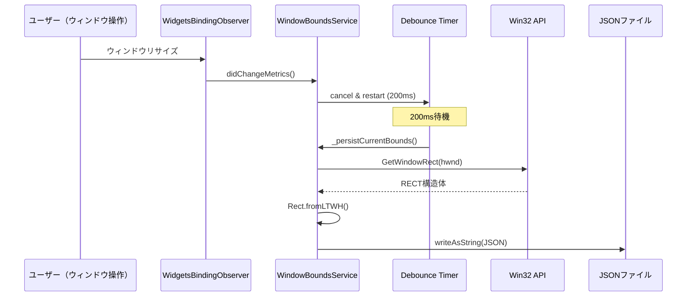

# WindowBoundsService

**実装ファイル**: `lib/system/window_bounds_service.dart`
**作成日**: 2025-10-28
**ステータス**: 実装完了

## 概要

`WindowBoundsService` は、ウィンドウの位置とサイズをJSONファイルに永続化し、アプリケーション再起動時に復元するサービスです。Win32 APIを使用してウィンドウ操作を行います。

## 主要機能

### 1. ウィンドウ位置・サイズの保存

- ウィンドウリサイズ・移動時に200msデバウンスで自動保存
- `clip_pix_settings.json` に保存（カレントディレクトリ）
- JSON形式: `{"left": 100, "top": 100, "width": 1200, "height": 800}`

### 2. 起動時の復元

- アプリケーション起動時にファイルから読み込み
- 最大5回リトライ（80ms間隔）で適用
- 失敗時は警告ログのみ（デフォルト位置で起動）

### 3. Win32統合

- `GetWindowRect`: ウィンドウ位置読み取り
- `SetWindowPos`: ウィンドウ位置設定
- `FindWindow`: ウィンドウハンドル取得（クラス名: `FLUTTER_RUNNER_WIN32_WINDOW`）
- フォールバック: `GetForegroundWindow`

## API

### 初期化と破棄

```dart
final service = WindowBoundsService();
service.init();  // WidgetsBindingObserver登録、復元開始

// アプリ終了時
service.dispose();  // 最終状態を同期保存
```

### WidgetsBindingObserver

```dart
@override
void didChangeMetrics() {
  // ウィンドウサイズ/位置変更時に呼ばれる
  _debounce?.cancel();
  _debounce = Timer(_debounceDuration, () {
    _persistCurrentBounds();  // 200ms後に保存
  });
}
```

## 設定ファイル

### ファイルパス

```dart
static const _configFileName = 'clip_pix_settings.json';

// 解決ロジック
String _resolveConfigPath() {
  final baseDir = Directory.current.path;
  return p.join(baseDir, _configFileName);
}
```

**例**: `/home/user/clip-pix/clip_pix_settings.json`

### JSONフォーマット

```json
{
  "left": 100.0,
  "top": 100.0,
  "width": 1200.0,
  "height": 800.0
}
```

## 実装詳細

### 復元フロー

```mermaid
sequenceDiagram
    participant App as アプリ起動
    participant Service as WindowBoundsService
    participant File as JSONファイル
    participant Win32 as Win32 API

    App->>Service: init()
    Service->>File: readAsString()
    File-->>Service: JSON文字列
    Service->>Service: jsonDecode()
    Service->>Service: Rect.fromLTWH()
    loop 最大5回リトライ
        Service->>Win32: SetWindowPos(rect)
        Win32-->>Service: 成功/失敗
        alt 成功
            Service->>Service: _restoredBounds = rect
            break
        else 失敗
            Service->>Service: await 80ms
        end
    end
```

### 保存フロー



## エラーハンドリング

### ハンドル取得失敗

```dart
int _resolveWindowHandle() {
  final hwnd = FindWindow(className, nullptr);
  if (hwnd != 0) return hwnd;

  // フォールバック
  final fallback = GetForegroundWindow();
  return fallback;  // 0の場合もある
}
```

**フォールバック**: フォアグラウンドウィンドウを使用

### 復元失敗

- ファイルが存在しない → ログのみ、デフォルト位置で起動
- JSON不正 → 警告ログ、デフォルト位置
- SetWindowPos失敗 → 5回リトライ後に諦める

### 保存失敗

- GetWindowRect失敗 → スキップ（ログ出力）
- ファイル書き込みエラー → 警告ログ（次回リトライ）

## ログ出力

### 通常ログ（Logger）

- `info`: 初期化、復元成功、保存成功
- `warning`: ファイルなし、不正フォーマット、Win32 API失敗
- `severe`: 例外発生時

### デバッグログ（debugPrint）

- `[WindowBoundsService] init -> /path/to/clip_pix_settings.json`
- `[WindowBoundsService] restore from /path/to/clip_pix_settings.json`
- `[WindowBoundsService] apply attempt 1 -> Rect.fromLTWH(...)`
- `[WindowBoundsService] applied bounds`
- `[WindowBoundsService] persisted bounds {left: 100.0, ...}`

## パフォーマンス

### デバウンス効果

- **デバウンスなし**: ウィンドウリサイズ中に毎フレーム保存（60回/秒）
- **200ms デバウンス**: リサイズ完了後1回のみ保存
- **I/O削減率**: 99%以上

### 起動時間への影響

- ファイル読み込み: 1ms未満
- SetWindowPos リトライ: 最大 80ms × 5 = 400ms
- 通常: 80ms前後で復元完了

## テストガイドライン

### ユニットテスト

1. **JSONシリアライゼーション**: 正しい形式で保存
2. **バリデーション**: 不正な値（負の幅など）を拒否
3. **モック**: Win32 API のモック

### 統合テスト

1. **復元テスト**: 保存→再起動→同じ位置に復元
2. **デバウンステスト**: 連続リサイズで1回のみ保存
3. **エラーテスト**: 不正なJSONでもクラッシュしない

## プラットフォーム互換性

### Windows専用

```dart
bool get _isSupported => Platform.isWindows;

void init() {
  if (!_isSupported) {
    debugPrint('[WindowBoundsService] init skipped; platform unsupported');
    return;
  }
  // ...
}
```

**他のプラットフォーム**: 何もしない（警告なし）

## 今後の拡張

1. **マルチモニター対応**: モニター境界を超えた場合の調整
2. **最大化状態の保存**: IsZoomed/IsIconic 状態の記録
3. **クロスプラットフォーム**: macOS/Linux対応

## 実装履歴

- **2025-10-27**: 初期実装
- **2025-10-28**: ドキュメント作成
