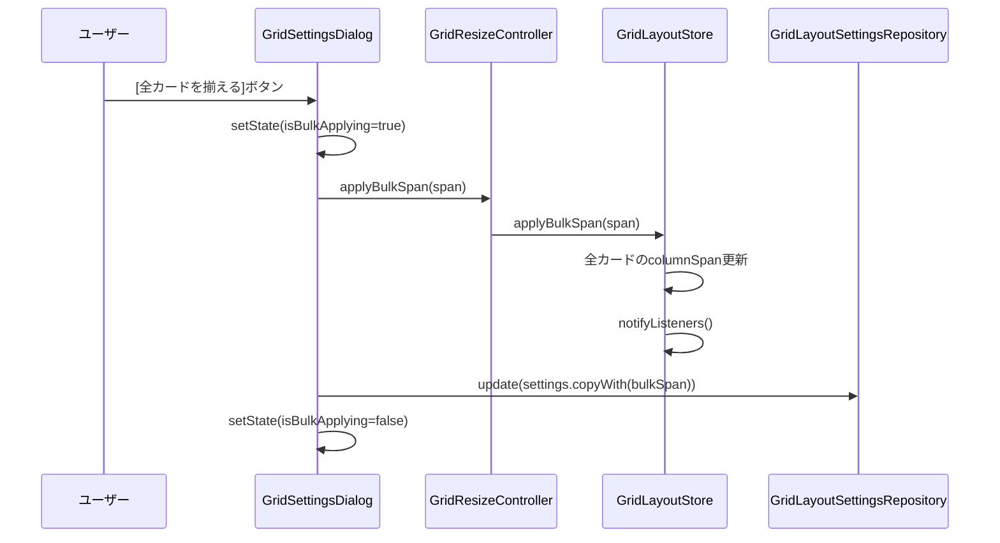

# GridSettingsDialog

**実装ファイル**: `lib/ui/widgets/grid_settings_dialog.dart`
**作成日**: 2025-10-28
**ステータス**: 実装完了

## 概要

`GridSettingsDialog` は、グリッドレイアウトの設定を変更するためのダイアログUIです。カラム数、背景色、一括リサイズ、Undo/Redo機能を提供します。

## UI構成

### セクション

1. **列数設定**: 最大列数、デフォルト列数
2. **背景色**: 4種類のトーン選択（白、明るい灰、暗い灰、黒）
3. **カード一括サイズ調整**: 全カードを指定した列幅に揃える
4. **Undo/Redo**: サイズ変更の取り消し・やり直し

### レイアウト

```
┌─────────────────────────────────┐
│ グリッド設定               ×   │
├─────────────────────────────────┤
│ ┌─── 列数設定 ────────────────┐│
│ │ 最大列数:    [6 列 ▼]       ││
│ │ デフォルト列数: [4 列 ▼]   ││
│ └─────────────────────────────┘│
│                                 │
│ ┌─── 背景色 ──────────────────┐│
│ │ [白] [明るい灰] [暗い灰] [黒]││
│ └─────────────────────────────┘│
│                                 │
│ ┌─── カード一括サイズ調整 ───┐│
│ │ [2 列幅 ▼] [全カードを揃える]││
│ └─────────────────────────────┘│
│                                 │
│ ┌─── Undo/Redo ───────────────┐│
│ │ [⟲ サイズを戻す] [⟳ やり直す]││
│ └─────────────────────────────┘│
├─────────────────────────────────┤
│           [キャンセル] [保存]   │
└─────────────────────────────────┘
```

## 主要機能

### 1. 列数設定

#### 最大列数（maxColumns）

```dart
DropdownButton<int>(
  value: _maxColumns,  // 1〜12
  items: List.generate(12, (i) => i + 1),
  onChanged: (value) {
    _maxColumns = value;
    if (_preferredColumns > _maxColumns) {
      _preferredColumns = _maxColumns;  // 自動調整
    }
  },
)
```

**制約**: デフォルト列数は最大列数以下に自動調整

#### デフォルト列数（preferredColumns）

```dart
DropdownButton<int>(
  value: _preferredColumns,
  items: [1.._maxColumns],  // 最大列数まで
  onChanged: (value) {
    _preferredColumns = value;
  },
)
```

**用途**: グリッド初期表示時のカラム数

### 2. 背景色設定

```dart
enum GridBackgroundTone {
  white,
  lightGray,
  darkGray,
  black,
}
```

#### UI

```dart
Wrap(
  spacing: 12,
  children: GridBackgroundTone.values.map((tone) =>
    ChoiceChip(
      label: Text(_localizedTone(tone)),  // "白", "明るい灰", ...
      selected: _backgroundTone == tone,
      onSelected: (_) {
        setState(() {
          _backgroundTone = tone;
        });
      },
    ),
  ).toList(),
)
```

#### ローカライゼーション

```dart
String _localizedTone(GridBackgroundTone tone) {
  switch (tone) {
    case GridBackgroundTone.white: return '白';
    case GridBackgroundTone.lightGray: return '明るい灰';
    case GridBackgroundTone.darkGray: return '暗い灰';
    case GridBackgroundTone.black: return '黒';
  }
}
```

### 3. カード一括サイズ調整

#### UI

```dart
Row(
  children: [
    DropdownButton<int>(
      value: _bulkSpan,  // 1〜maxColumns
      items: List.generate(_maxColumns, (i) => i + 1),
      onChanged: (value) {
        _bulkSpan = value;
      },
    ),
    ElevatedButton.icon(
      onPressed: _isBulkApplying ? null : () async {
        setState(() { _isBulkApplying = true; });
        await controller.applyBulkSpan(_bulkSpan);
        await repo.update(settings.copyWith(bulkSpan: _bulkSpan));
        setState(() { _isBulkApplying = false; });
      },
      icon: Icon(Icons.grid_view),
      label: Text('全カードを揃える'),
    ),
  ],
)
```

#### 処理フロー



**非同期処理**: ローディングインジケータ表示

### 4. Undo/Redo

```dart
Row(
  children: [
    ElevatedButton.icon(
      onPressed: controller.canUndo ? controller.undo : null,
      icon: Icon(Icons.undo),
      label: Text('サイズを戻す'),
    ),
    ElevatedButton.icon(
      onPressed: controller.canRedo ? controller.redo : null,
      icon: Icon(Icons.redo),
      label: Text('サイズをやり直す'),
    ),
  ],
)
```

**連携**: `GridResizeController` のUndo/Redo履歴を使用

## 状態管理

### ローカルステート

```dart
late int _preferredColumns;
late int _maxColumns;
late GridBackgroundTone _backgroundTone;
late int _bulkSpan;
bool _isSaving = false;
bool _isBulkApplying = false;
```

### 初期化

```dart
@override
void initState() {
  super.initState();
  final settings = context.read<GridLayoutSettingsRepository>().value;
  _preferredColumns = settings.preferredColumns;
  _maxColumns = settings.maxColumns;
  _backgroundTone = settings.background;
  _bulkSpan = settings.bulkSpan.clamp(1, settings.maxColumns);
}
```

### 保存処理

```dart
Future<void> _handleSave() async {
  setState(() { _isSaving = true; });

  final repo = context.read<GridLayoutSettingsRepository>();
  final current = repo.value;
  final next = current.copyWith(
    preferredColumns: _preferredColumns,
    maxColumns: _maxColumns,
    background: _backgroundTone,
    bulkSpan: _bulkSpan,
  );

  await repo.update(next);

  if (mounted) {
    setState(() { _isSaving = false; });
    Navigator.of(context).pop();
  }
}
```

## Provider連携

### 使用するProvider

1. **GridLayoutSettingsRepository**: 設定の読み書き
2. **GridResizeController**: 一括リサイズ、Undo/Redo

### 依存関係

```dart
final settings = context.read<GridLayoutSettingsRepository>();
final controller = context.watch<GridResizeController>();
```

**watch vs read**:
- `watch`: Undo/Redoボタンの有効/無効が動的に変わる
- `read`: 設定の読み書きのみ（再描画不要）

## ユーザーフィードバック

### ローディング表示

#### 保存中

```dart
ElevatedButton(
  onPressed: _isSaving ? null : _handleSave,
  child: _isSaving
      ? SizedBox(
          width: 18, height: 18,
          child: CircularProgressIndicator(strokeWidth: 2),
        )
      : Text('保存'),
)
```

#### 一括適用中

```dart
ElevatedButton.icon(
  onPressed: _isBulkApplying ? null : _handleBulkApply,
  icon: _isBulkApplying
      ? SizedBox(
          width: 16, height: 16,
          child: CircularProgressIndicator(strokeWidth: 2),
        )
      : Icon(Icons.grid_view),
  label: Text('全カードを揃える'),
)
```

### ボタン無効化

- 保存中: キャンセル・保存ボタンを無効化
- 一括適用中: 一括適用ボタンを無効化
- Undo不可: Undoボタンを無効化
- Redo不可: Redoボタンを無効化

## バリデーション

### 列数の整合性

```dart
onChanged: (value) {
  setState(() {
    _maxColumns = value;
    // デフォルト列数を最大列数以下に調整
    if (_preferredColumns > _maxColumns) {
      _preferredColumns = _maxColumns;
    }
    // 一括サイズも最大列数以下に調整
    if (_bulkSpan > _maxColumns) {
      _bulkSpan = _maxColumns;
    }
  });
}
```

**自動調整**: ユーザーが不正な組み合わせを設定できないようにする

## アクセシビリティ

### キーボード操作

- Tab: フォーカス移動
- Enter: 選択中のボタン実行
- Escape: ダイアログを閉じる

### スクリーンリーダー

- ラベルテキストが適切に設定されている
- ボタンの状態（有効/無効）が読み上げられる

## テストガイドライン

### ウィジェットテスト

1. **初期表示**: 設定値が正しく表示される
2. **列数変更**: maxColumnsを変更するとpreferredColumnsが自動調整される
3. **背景色選択**: 選択状態が変わる
4. **保存**: リポジトリが更新される
5. **一括適用**: GridResizeControllerが呼ばれる

### テスト例

```dart
testWidgets('changing maxColumns adjusts preferredColumns', (tester) async {
  await tester.pumpWidget(MaterialApp(
    home: MultiProvider(
      providers: [
        Provider.value(value: mockRepo),
        Provider.value(value: mockController),
      ],
      child: GridSettingsDialog(),
    ),
  ));

  // 最大列数を6から3に変更
  await tester.tap(find.text('6 列'));
  await tester.pumpAndSettle();
  await tester.tap(find.text('3 列'));
  await tester.pumpAndSettle();

  // デフォルト列数が4から3に自動調整されるはず
  expect(find.text('3 列'), findsNWidgets(2));  // max + preferred
});
```

## UI/UXの改善案

1. **プレビュー**: 設定変更をリアルタイムでプレビュー
2. **リセットボタン**: デフォルト値に戻す
3. **カスタムカラー**: 背景色の自由選択
4. **レスポンシブ**: モバイル向けレイアウト

## 実装履歴

- **2025-10-26**: 初期実装（列数設定、背景色）
- **2025-10-27**: 一括リサイズ、Undo/Redo追加
- **2025-10-28**: ドキュメント作成

## 関連ドキュメント

- [GridLayoutSettingsRepository](../data/repositories.md#gridlayoutsettingsrepository) - 設定の永続化
- [GridResizeController](./state_management.md#gridresizecontroller) - リサイズ制御
- [MainScreen](./main_screen.md) - ダイアログを開くUI
