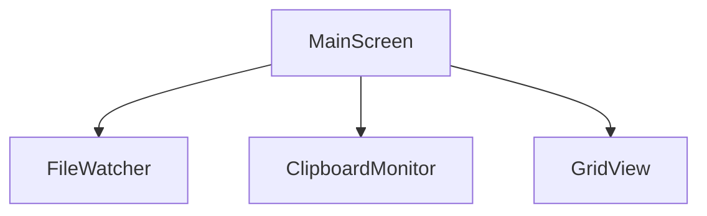

# MainScreen 詳細設計

**最終更新**: 2025-12-07

## 1. 概要
アプリのルート画面。フォルダ選択・タブ表示・GridView呼び出しを管理。

## 2. 責務
- 選択フォルダを保持し、ルート直下のコンテンツ（画像・テキスト・PDF）とサブフォルダを切り替え表示。
- 表示フェーズ（ルートギャラリー／サブフォルダ）変更時に該当フォルダのコンテンツをロード。
- FileWatcher, ClipboardMonitor の起動管理。
- AppBar・メニューバー操作からフォルダ選択モーダルを呼び出し、結果を状態に反映。
- 選択履歴を Provider 状態と Hive に同期し、未選択時はプレースホルダを表示。
- プレビューウィンドウプロセスの管理（ImagePreviewProcessManager, TextPreviewProcessManager, PdfPreviewProcessManager）。
- 一括削除モードの管理（DeletionModeNotifier）。

## 3. 入出力
| 種別 | 名称 | 型 | 説明 |
|------|------|----|------|
| 入力 | selectedFolder | `Directory` | ユーザー選択フォルダ |
| 出力 | currentView | `FolderViewMode` | `root` or `subfolder` |
| 出力 | currentTab | `String?` | 選択中のサブフォルダ名（ルート表示時は null） |
| 出力 | onFolderChange | `Function(Directory)` | 子Widgetへ通知 |

## 4. 依存関係
- GridViewModule
- FileWatcher
- ClipboardMonitor
- FolderPickerService(file_selector)
- Provider(StateNotifier)
- ImagePreviewProcessManager（画像プレビューウィンドウ管理）
- TextPreviewProcessManager（テキストプレビューウィンドウ管理）
- PdfPreviewProcessManager（PDFプレビューウィンドウ管理）
- DeletionModeNotifier（一括削除モード管理）

## 5. エラーハンドリング
- フォルダアクセス拒否時：エラーダイアログ表示。
- ClipboardMonitor異常：リトライ3回後にログ出力。
- フォルダ選択キャンセル時：状態変更なし、UIは直前のフォルダを維持。
- ログ書き込み失敗時：`./logs/app.log` 再生成を試行し、不可なら SnackBar で通知。
- **PathAccessException対策** (2025-12-06): `_buildTabs()` でのサブディレクトリ列挙時、macOSサンドボックス環境でセキュリティブックマーク解決前にアクセスした場合、空リストを返してUIをブロックしない。
- **isBookmarkResolvedチェック** (2025-12-07): `_ensureDirectorySync()` で `SelectedFolderState.isBookmarkResolved` を確認し、`false` の場合はディレクトリ同期をスキップして `_lastSyncedFolder` を `null` にリセット。ブックマーク解決完了後に自動的に再同期がトリガーされる。

## 6. 状態永続化
- 最後に選択したフォルダ・サブフォルダ、表示モード、および直近3件のフォルダ履歴を Hive に保存。
- Provider 初期化時に Hive からフォルダ情報を復元し、未選択ならフォルダ選択プレースホルダを表示。
- フォルダ変更イベント毎に Hive を更新し、FileWatcher へ監視ディレクトリを再購読させる。
- ルート表示中のスクロール位置は UI 側で `ScrollController` を用いて保持し、サブフォルダに切り替えて戻る際に復元。

## 7. 呼び出し関係


## 8. AppBar UI要素 🆕
`AppBar` には以下の要素が配置されています：

### 左側
- **タイトル**: "ClipPix"（アプリケーション名）
- **パンくず表示**: 現在選択中のフォルダパス（クリックでエクスプローラを開く）

### 右側（右から左へ）
1. **フォルダを選択…** ボタン: `file_selector` のフォルダダイアログを起動
2. **更新** ボタン（リロード）: 現在のフォルダを再読み込み
3. **グリッド設定** ボタン（歯車アイコン）: `GridSettingsDialog` を開く
   - カラム数設定（最大列数、デフォルト列数）
   - 背景色選択（白、明るい灰、暗い灰、黒）
   - カード一括サイズ調整
   - Undo/Redo
4. **クリップボード監視 ON/OFF スイッチ** 🆕:
   - ON（緑）: クリップボード監視が有効
   - OFF（灰色）: クリップボード監視を一時停止
   - 状態は`WatcherStatusNotifier`で管理
   - トグル時に`ClipboardMonitor.resume()/pause()`を呼び出し

### フォルダ選択UI
- メイン領域はフォルダ未選択時にガイダンスカードを表示し、「フォルダを選択」ボタンを配置。
- フォルダ確定後にルート画像とサブフォルダ一覧を読み込み、表示モードを `root` に初期化。

## 9. メニューバー・ショートカット
- `File > フォルダを開く… (Ctrl+O)` メニューを用意し、AppBar ボタンと同じ `pickDirectory` アクションを呼び出す。
- `File > 最近使用したフォルダ` に Hive 管理の履歴をリスト表示し、選択で即切替。
- `View > ルート画像に戻る` と、`View > サブフォルダを表示` サブメニュー（内部でサブフォルダ名を動的列挙）で切替を補完。サブフォルダが無い場合はメニューを非活性化。
- ショートカットは Command 呼び出しのみ行い、UI 状態は Provider が一元管理。

## 10. 監視制御との連携
- フォルダ未選択時は FileWatcher と ClipboardMonitor を停止し、選択後に対象パスで再開する。
- FileWatcher からサブフォルダ構造変更通知を受け取った際は、ルート画像の再読み込みとタブリスト再構築を行う。
- 変更検知は Provider の `onFolderChanged` 内で統一し、UI 側は状態購読のみに留める。

## 11. UI ステート
- `NoFolder` : ガイダンスカード＋「フォルダを選択」ボタンのみ表示。
- `RootGallery` : ルート直下のコンテンツを PinterestGrid で表示し、上部にサブフォルダ一覧と最近保存した画像の履歴ストリップを水平リストで表示。履歴ストリップのChipクリックで該当カードにジャンプ＆ハイライト。
- `SubFolder` : 選択したサブフォルダのコンテンツのみを表示。戻る操作で `RootGallery` に復帰。
- 各ビュー切替時はロードインジケータを表示し、読み込み完了後にグリッドへ差し替え。

## 12. 一括削除モード (2025-11-27追加)

### 12.1 概要
複数のカードを選択して一括削除する機能。`DeletionModeNotifier` で状態を管理。

### 12.2 UI要素
- **AppBar**: 削除モード時に「削除を実行」「キャンセル」ボタンを表示
- **カード**: 削除モード時にチェックボックスオーバーレイを表示
- **選択数表示**: AppBarに選択中のカード数を表示

### 12.3 状態
```dart
class DeletionModeState {
  final bool isActive;              // 削除モードが有効
  final Set<String> selectedCardIds;  // 選択中のカードID
  final bool isDeleting;            // 削除処理実行中
}
```

### 12.4 操作フロー
1. ユーザーが削除モードを有効化（メニューまたはショートカット）
2. カードをタップして選択/解除
3. 「削除を実行」で確認ダイアログ表示
4. 確認後、選択されたファイルを削除
5. ImageLibraryNotifierに削除通知 → グリッド更新

## 13. プレビューウィンドウ管理 (2025-11-27追加、2025-12-06更新)

### 13.1 概要
画像・テキスト・PDFプレビューは別プロセスとして起動し、常に最前面表示が可能。

### 13.2 コンポーネント
| マネージャー | 対象 | プレビューウィンドウ |
|-------------|------|---------------------|
| `ImagePreviewProcessManager` | `ImageItem` | `ImagePreviewWindow` |
| `TextPreviewProcessManager` | `TextContentItem` | `TextPreviewWindow` |
| `PdfPreviewProcessManager` | `PdfContentItem` | `PdfPreviewWindow` |

### 13.3 起動方法
- `ImageCard` / `TextCard` / `PdfCard` のダブルクリック
- Enter キー
- コンテキストメニュー「プレビューを開く」

### 13.4 永続化
`OpenPreviewsRepository` でオープン中のプレビュー情報を保存し、アプリ再起動時に復元可能。

## 14. ミニマップオーバーレイ (2025-11-29追加)

### 14.1 概要
グリッドの全体像とビューポート位置を表示するミニマップ機能。右下に常時表示可能。

### 14.2 コンポーネント
| クラス | 責務 |
|--------|------|
| `MinimapOverlayService` | オーバーレイの表示・非表示管理 |
| `_MinimapWidget` | ミニマップのUI描画 |
| `_MinimapPainter` | カード位置とビューポートの描画 |

### 14.3 状態管理
- `_minimapService`: ミニマップオーバーレイサービスのインスタンス
- `_lastMinimapViewMode`: ミニマップ作成時のviewMode（コントローラー選択に使用）

### 14.4 viewMode変更時の再作成
ルート⇔サブフォルダ切り替え時、異なるScrollControllerを使用するためミニマップを再作成:

```dart
final viewModeChanged = _lastMinimapViewMode != null &&
    _lastMinimapViewMode != selectedState.viewMode;

if (viewModeChanged) {
  _hideMinimap();  // 古いミニマップを破棄
}
_lastMinimapViewMode = selectedState.viewMode;
_showMinimap(context, selectedState);  // 正しいコントローラーで再作成
```

### 14.5 ScrollController選択
- `FolderViewMode.root`: `_rootScrollController`
- `FolderViewMode.subfolder`: `_gridSubfolderScrollController`

### 14.6 hasClients リトライ
ScrollControllerにクライアントがまだアタッチされていない場合、次フレームでリトライ。

```dart
if (!scrollController.hasClients) {
  WidgetsBinding.instance.addPostFrameCallback((_) {
    if (mounted) {
      setState(() {}); // 再ビルドをトリガー
    }
  });
  return const SizedBox.shrink();
}
```

### 14.7 ミニマップ機能
- カード位置の縮小表示（お気に入りは色分け・ハートアイコン付き）
- ビューポート位置の黄色ボックス表示
- クリック/ドラッグでスクロール位置変更
- ホイールスクロール対応

## 15. 履歴ストリップ (_HistoryStrip) (2025-11-30追加)

### 15.1 概要
最近保存したコンテンツを水平に表示するChip列。クリックで該当カードにジャンプ＆ハイライト。

### 15.2 データソース
`ImageHistoryNotifier`が管理する`ImageHistoryState.entries`（最大5件、FIFO、永続化なし）。

### 15.3 UI要素
- **Chip**: 各保存コンテンツのファイル名を表示
- **アイコン**: 画像は`Icons.image`、テキストは`Icons.text_snippet`
- **水平スクロール**: コンテンツが多い場合は水平スクロール可能

### 15.4 クリック動作
1. Chipクリック → `_gridViewKey.currentState?.scrollToAndHighlight(filePath)`
2. `GridViewModule`が該当カードの位置を取得
3. スクロール位置を調整してカードを画面中央付近に表示
4. 該当カードの`isHighlighted`をtrueに設定
5. パルスアニメーション（青枠が約667msで3回明滅、合計2秒）

### 15.5 自動ジャンプ
新規保存時、`_reconcileEntries`内で新規アイテムを検知し、自動的に`scrollToAndHighlight`を呼び出す。

```dart
// GridViewModule._reconcileEntries内
if (newlyAddedIds.isNotEmpty) {
  final latestNewId = newlyAddedIds.last;
  WidgetsBinding.instance.addPostFrameCallback((_) {
    WidgetsBinding.instance.addPostFrameCallback((_) {
      scrollToAndHighlight(latestNewId);
    });
  });
}
```

### 15.6 パルスアニメーション
- **対象**: `ImageCard`/`TextCard`の`isHighlighted`プロパティ
- **効果**: 青いボーダー（`Colors.blue.withOpacity(0.8)`）が明滅
- **AnimationController**: `duration: 667ms`, `repeat(reverse: true)`
- **自動停止**: 2秒後に`_highlightController.reset()`で解除

## 16. サブディレクトリ作成機能 (2025-12-03追加)

### 16.1 概要
タブバー右端の「＋」ボタンから新規サブフォルダを作成できる機能。

### 16.2 UI要素
- **＋ボタン (`_AddFolderTab`)**: サブフォルダタブの右端に配置されたActionChip
- **CreateFolderDialog**: フォルダ名入力ダイアログ

### 16.3 ダイアログ仕様
| 要素 | 説明 |
|------|------|
| フォルダ名入力欄 | TextField（autofocus有効） |
| キャンセルボタン | ダイアログを閉じる（nullを返す） |
| OKボタン | フォルダ作成＆移動（フォルダ名を返す） |

### 16.4 バリデーション
| 条件 | 結果 |
|------|------|
| 空文字 | OKボタン無効化 |
| 既存フォルダ名と重複 | エラーメッセージ「同じ名前のフォルダが既に存在します」 |
| `/` または `\` を含む | エラーメッセージ「フォルダ名に / や \\ は使用できません」 |

### 16.5 操作フロー
1. ＋ボタンをタップ
2. `CreateFolderDialog`が表示される
3. フォルダ名を入力（リアルタイムバリデーション）
4. OKボタンをタップ（またはEnterキー）
5. `Directory.create()`でフォルダを作成
6. `SelectedFolderNotifier.switchToSubfolder()`で新しいフォルダへ移動

### 16.6 関連ファイル
- `lib/ui/widgets/create_folder_dialog.dart`: ダイアログウィジェット
- `lib/ui/main_screen.dart`:
  - `_AddFolderTab`: ＋ボタンウィジェット
  - `_showCreateFolderDialog()`: ダイアログ表示＆フォルダ作成ロジック
  - `_buildTabs()`: タブリスト構築（末尾に＋ボタン追加）
