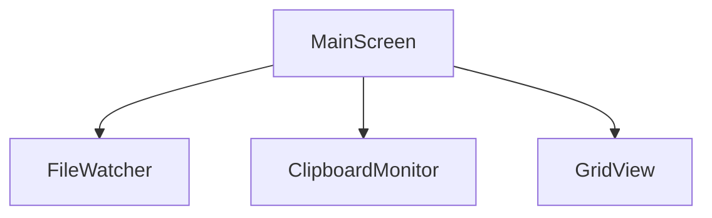

# MainScreen 詳細設計

## 1. 概要
アプリのルート画面。フォルダ選択・タブ表示・GridView呼び出しを管理。

## 2. 責務
- 選択フォルダを保持し、ルート直下の画像とサブフォルダを切り替え表示。
- 表示フェーズ（ルートギャラリー／サブフォルダ）変更時に該当フォルダの画像をロード。
- FileWatcher, ClipboardMonitor の起動管理。
- AppBar・メニューバー操作からフォルダ選択モーダルを呼び出し、結果を状態に反映。
- 選択履歴を Provider 状態と Hive に同期し、未選択時はプレースホルダを表示。

## 3. 入出力
| 種別 | 名称 | 型 | 説明 |
|------|------|----|------|
| 入力 | selectedFolder | `Directory` | ユーザー選択フォルダ |
| 出力 | currentView | `FolderViewMode` | `root` or `subfolder` |
| 出力 | currentTab | `String?` | 選択中のサブフォルダ名（ルート表示時は null） |
| 出力 | onFolderChange | `Function(Directory)` | 子Widgetへ通知 |

## 4. 依存関係
- GridViewModule
- FileWatcher
- ClipboardMonitor
- FolderPickerService(file_selector)
- Provider(StateNotifier)

## 5. エラーハンドリング
- フォルダアクセス拒否時：エラーダイアログ表示。
- ClipboardMonitor異常：リトライ3回後にログ出力。
- フォルダ選択キャンセル時：状態変更なし、UIは直前のフォルダを維持。
- ログ書き込み失敗時：`./logs/app.log` 再生成を試行し、不可なら SnackBar で通知。

## 6. 状態永続化
- 最後に選択したフォルダ・サブフォルダ、表示モード、および直近3件のフォルダ履歴を Hive に保存。
- Provider 初期化時に Hive からフォルダ情報を復元し、未選択ならフォルダ選択プレースホルダを表示。
- フォルダ変更イベント毎に Hive を更新し、FileWatcher へ監視ディレクトリを再購読させる。
- ルート表示中のスクロール位置は UI 側で `ScrollController` を用いて保持し、サブフォルダに切り替えて戻る際に復元。

## 7. 呼び出し関係

## 8. フォルダ選択UI
- `AppBar` 右端に「フォルダを選択…」ボタンを常設。押下で `file_selector` のフォルダダイアログを起動。
- ボタン左に現在のフォルダをパンくず表示し、クリックでエクスプローラを開く。
- メイン領域はフォルダ未選択時にガイダンスカードを表示し、同じアクションボタンを配置。
- フォルダ確定後にルート画像とサブフォルダ一覧を読み込み、表示モードを `root` に初期化。

## 9. メニューバー・ショートカット
- `File > フォルダを開く… (Ctrl+O)` メニューを用意し、AppBar ボタンと同じ `pickDirectory` アクションを呼び出す。
- `File > 最近使用したフォルダ` に Hive 管理の履歴をリスト表示し、選択で即切替。
- `View > ルート画像に戻る` と、`View > サブフォルダを表示` サブメニュー（内部でサブフォルダ名を動的列挙）で切替を補完。サブフォルダが無い場合はメニューを非活性化。
- ショートカットは Command 呼び出しのみ行い、UI 状態は Provider が一元管理。

## 10. 監視制御との連携
- フォルダ未選択時は FileWatcher と ClipboardMonitor を停止し、選択後に対象パスで再開する。
- FileWatcher からサブフォルダ構造変更通知を受け取った際は、ルート画像の再読み込みとタブリスト再構築を行う。
- 変更検知は Provider の `onFolderChanged` 内で統一し、UI 側は状態購読のみに留める。

## 11. UI ステート
- `NoFolder` : ガイダンスカード＋「フォルダを選択」ボタンのみ表示。
- `RootGallery` : ルート直下の画像を MasonryGridView で表示し、上部にサブフォルダ一覧と最近保存した画像の履歴ストリップを水平リストで表示。
- `SubFolder` : 選択したサブフォルダの画像のみを表示。戻る操作で `RootGallery` に復帰。
- 各ビュー切替時はロードインジケータを表示し、読み込み完了後にグリッドへ差し替え。
